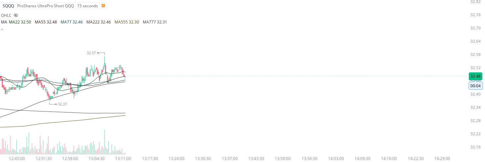
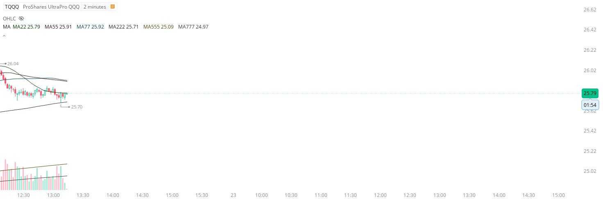
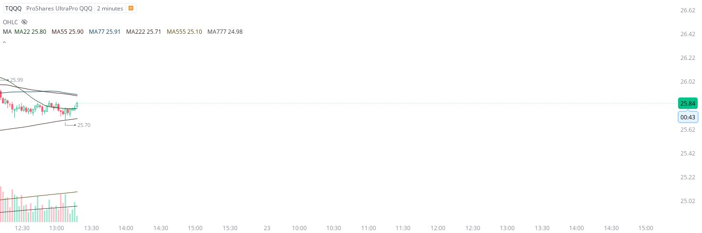
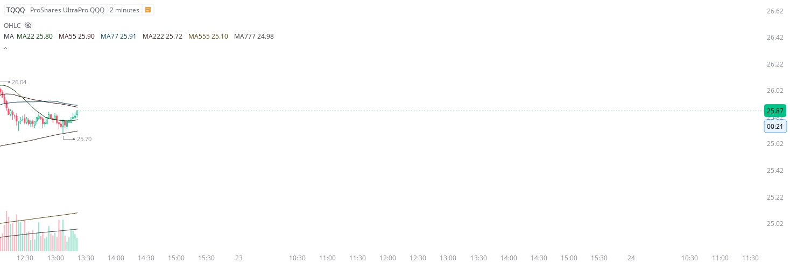

# Case Study #8 - Precision Buy Algorithm

**Archived from:** https://x.com/rauItrades/status/1638591891926315008  
**Post ID:** `1638591891926315008`  
**Posted:** 2023-03-22T17:22:05.000Z  
**Author:** @UnfairMarket (Unfair Market)  
**Thread posts captured:** 3  
**Status:** COMPLETE

---

### 1. `1638589747525472257` - 2023-03-22T17:13:33.000Z

There are two trades right now. Both are operating on the 22/55. The Sqqq 15s ma222. The Tqqq 2m ma222. https://t.co/SwsTxk4aMV

likes @capture 4

---

### 2. `1638590730485784577` - 2023-03-22T17:17:28.000Z

https://t.co/R5taLYeCRA

likes @capture 3

---

### 3. `1638591891926315008` - 2023-03-22T17:22:05.000Z

So we can see now which they selected here at least on the short term.
That 2m ma222 at 25.70 . https://t.co/UyeNn8gGRm

likes @capture 6

---
