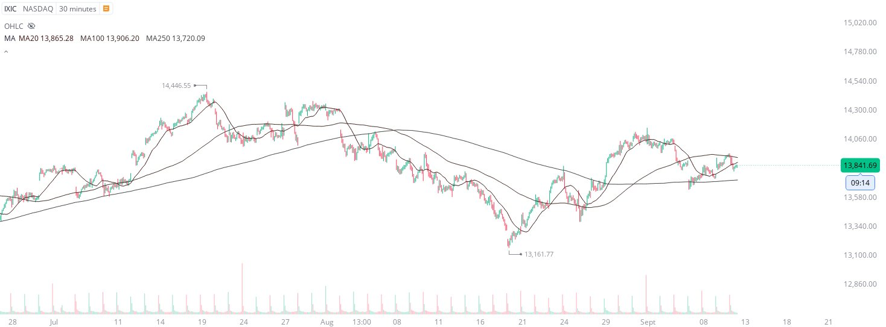
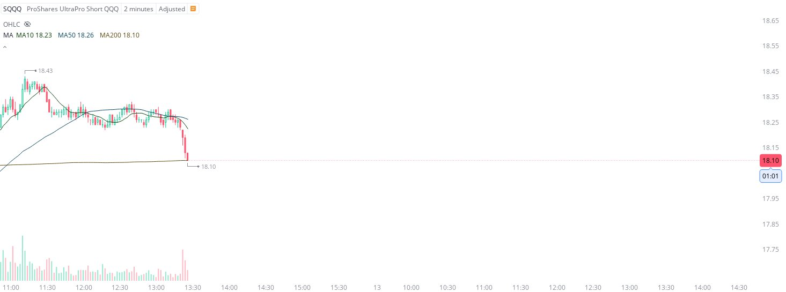

# Case Study #18 - Precision Buy Algorithm

**Archived from:** https://x.com/rauItrades/status/1701648625942823328  
**Post ID:** `1701648625942823328`  
**Posted:** 2023-09-12T17:27:02.000Z  
**Author:** @UnfairMarket (Unfair Market)  
**Thread posts captured:** 2  
**Status:** COMPLETE

---

### 1. `1701640009382780956` - 2023-09-12T16:52:47.000Z

The market's dynamic has altered dramatically since July 19th and the NASDAQ went negative. After 14446 everything changed. That reversal following FED. The break of the MA250. 
Then Billionaires squeezed just to short 1st of the month cash and Jobs data. Now? Negative again. https://t.co/aKTv2Lj7ZH

likes @capture 9

---

### 2. `1701648625942823328` - 2023-09-12T17:27:02.000Z

Looks like the 2m ma200. The HFT https://t.co/rLw3C49JrO

likes @capture 2

---
