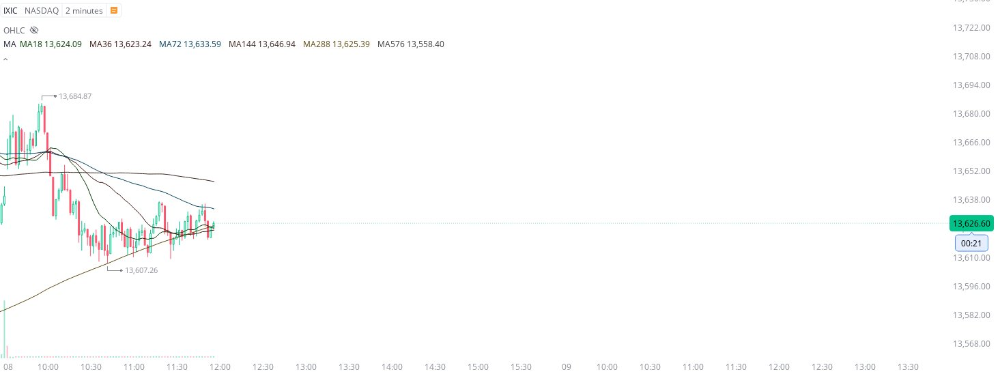
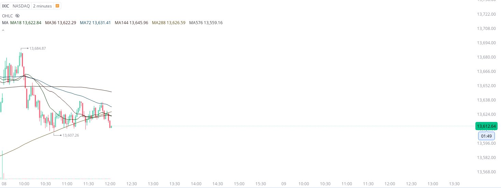
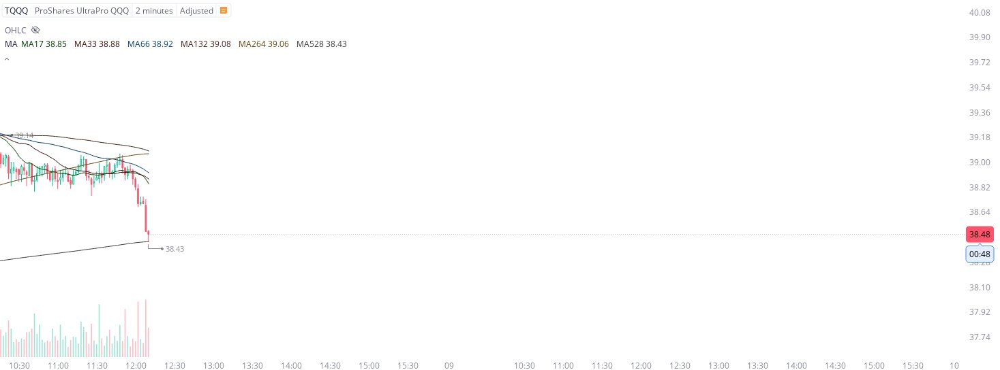

# Case Study #5 - Precision Buy Algorithm

**Archived from:** https://x.com/rauItrades/status/1722300546579906918  
**Post ID:** `1722300546579906918`  
**Posted:** 2023-11-08T17:10:23.000Z  
**Author:** @UnfairMarket (Unfair Market)  
**Thread posts captured:** 3  
**Status:** COMPLETE

---

### 1. `1722297166969123137` - 2023-11-08T16:56:57.000Z

The NASDAQ keeps shooting higher then going back to lows/weak on each pop.
Which isn't great.
To me a strong NASDAQ would have shot higher by now.
But that's why one has to identify these operations, secure some profit on the pops higher, and have a hard stop order on the break. https://t.co/H1OW7CAD1k

likes @capture 3

---

### 2. `1722298165783859240` - 2023-11-08T17:00:56.000Z

So that hour long operation looks about over.
At least I shared how market makers kept the NASDAQ treading lows while it lasted.
This is ALL computer work. https://t.co/Jv7UzwlD8V

likes @capture 1

---

### 3. `1722300546579906918` - 2023-11-08T17:10:23.000Z

2m ma528 .
The 33rd Day outfit.
That's where the MASSIVE flash was. https://t.co/bvaQ3yjnzM

likes @capture 4

---
