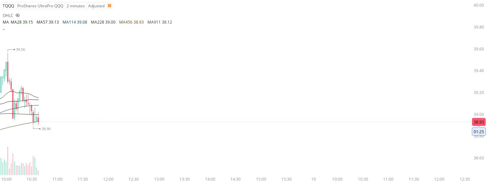

# Case Study #4 - Precision Buy Algorithm

**Archived from:** https://x.com/rauItrades/status/1722639754444112000  
**Post ID:** `1722639754444112000`  
**Posted:** 2023-11-09T15:38:17.000Z  
**Author:** @UnfairMarket (Unfair Market)  
**Thread posts captured:** 1  
**Status:** PARTIAL - conversation reports 3 replies; the public embed endpoint exposes a post's ancestors but not its descendants, so the forward reply chain is not archived.

---

### 1. `1722639754444112000` - 2023-11-09T15:38:17.000Z

11/9/23 . 
119 . Play on 911? World Trade Outfit.
Think that 38.90 is risk if that's a candle close below operation. At least that's where the HFT has been striking. Advanced work. They liquidate on a penny break. https://t.co/XMOBhhaBdf

likes @capture 10

---
