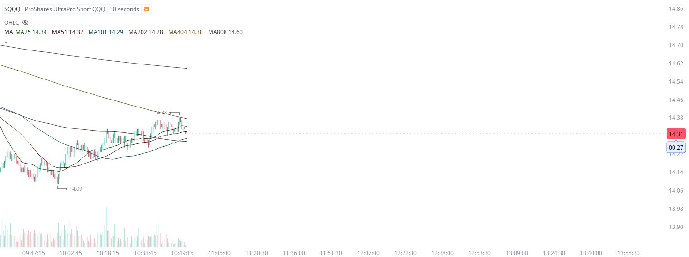
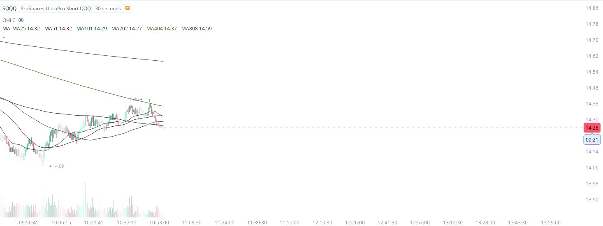
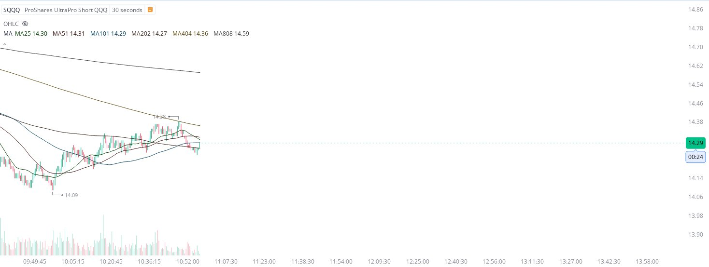
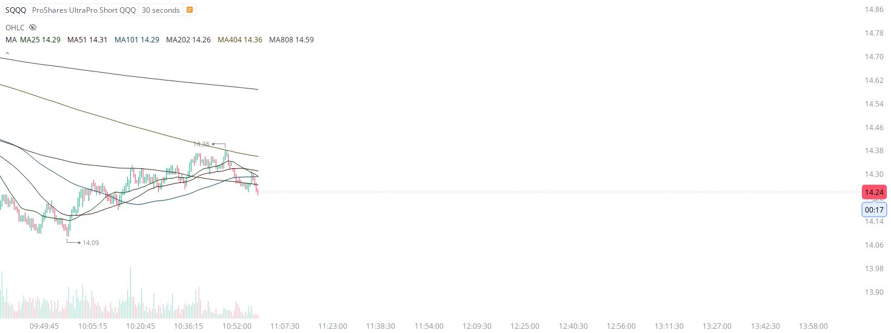

# Case Study #1 - Optimized Buying Algorithms

**Archived from:** https://x.com/rauItrades/status/1735328921116434754  
**Post ID:** `1735328921116434754`  
**Posted:** 2023-12-14T16:00:30.000Z  
**Author:** @UnfairMarket (Unfair Market)  
**Thread posts captured:** 4  
**Status:** COMPLETE

---

### 1. `1735327533837713790` - 2023-12-14T15:54:59.000Z

Just so everyone is up to date on real time price action operating the NASDAQ right now, firms operated a coexecution buy algo on resistance of that sqqq ma404.
So good for those who knew to coexecute a long position on that operation. https://t.co/PcfMp966Du

likes @capture 8

---

### 2. `1735327912726028407` - 2023-12-14T15:56:29.000Z

Those are the kind of operations wall street has been executing lately.
Complicated parameters like coexecutions on inverse ETFs are how they get the NASDAQ to have stable price action. 
Now the NASDAQ off lows again. https://t.co/WdVWbwPjWv

likes @capture 1

---

### 3. `1735328461538173146` - 2023-12-14T15:58:40.000Z

Firms are able to figure out when precision price action is operating on a trading vehicle like $SQQQ .
That's how they control every single point move of price action. It requires precision and the ability of a top of the line bid/ask/SMA detection system. https://t.co/tpqdigmQZy

likes @capture 1

---

### 4. `1735328921116434754` - 2023-12-14T16:00:30.000Z

You can see them controlling the float, live and in real time.
It was at that moment, the selection of the MA404, where they knew to bid long the NASDAQ for a Trade. That's how it works. Knowing only to cut on a singular penny break of that selection. https://t.co/ddwSEH3ZAc

likes @capture 4

---
