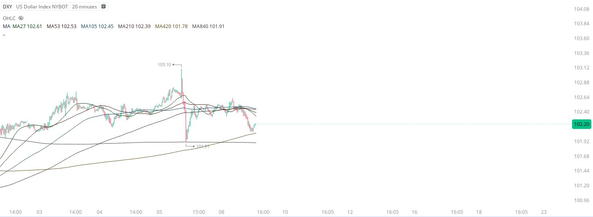

# Case Study #14 - Precision Buy Algorithm

**Archived from:** https://x.com/rauItrades/status/1744426109792637303  
**Post ID:** `1744426109792637303`  
**Posted:** 2024-01-08T18:29:29.000Z  
**Author:** @UnfairMarket (Unfair Market)  
**Thread posts captured:** 1  
**Status:** PARTIAL - conversation reports 6 replies; the public embed endpoint exposes a post's ancestors but not its descendants, so the forward reply chain is not archived.

---

### 1. `1744426109792637303` - 2024-01-08T18:29:29.000Z

For whatever reason they've operated the Dollar using Elon's outfit. 
You can see on the 20m DXY how the high frequency operators bid on that flash down to the 840.
It's all very organized. The weakness in the dollar today is what struck the Nasdaq higher and the SP500 positive. https://t.co/me6I5A4Emw

likes @capture 70

---
