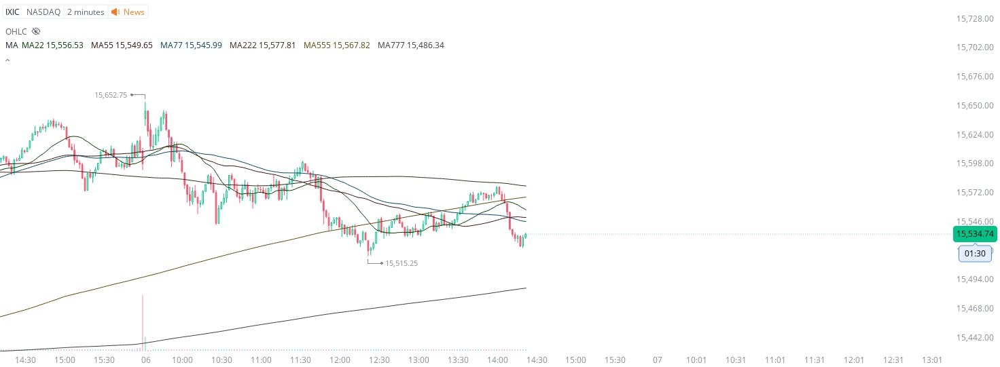

# Case Study #15 - Precision Buy Algorithm

**Archived from:** https://x.com/rauItrades/status/1754948852875133242  
**Post ID:** `1754948852875133242`  
**Posted:** 2024-02-06T19:23:06.000Z  
**Author:** @UnfairMarket (Unfair Market)  
**Thread posts captured:** 1  
**Status:** PARTIAL - conversation reports 7 replies; the public embed endpoint exposes a post's ancestors but not its descendants, so the forward reply chain is not archived.

---

### 1. `1754948852875133242` - 2024-02-06T19:23:06.000Z

I was explaining to my trading friends about how they operate the NASDAQ like this.
The 22/55 sma outfit. You can see that precision touch on the yellow ma555. Then the 1551525 selection where billionaires bet long.
Why? (22/55 outfit). https://t.co/ao1lK5v85K

likes @capture 28

---
