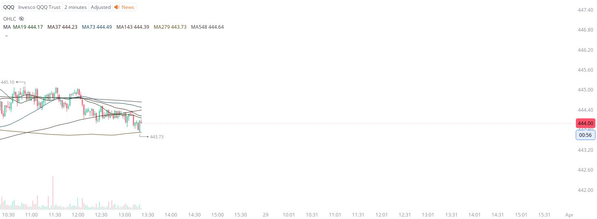

# Case Study #12 - Precision Buy Algorithm

**Archived from:** https://x.com/rauItrades/status/1773401391211680189  
**Post ID:** `1773401391211680189`  
**Posted:** 2024-03-28T17:26:54.000Z  
**Author:** @UnfairMarket (Unfair Market)  
**Thread posts captured:** 1  
**Status:** PARTIAL - conversation reports 4 replies; the public embed endpoint exposes a post's ancestors but not its descendants, so the forward reply chain is not archived.

---

### 1. `1773401391211680189` - 2024-03-28T17:26:54.000Z

This is the Invesco QQQ operating on an arbitrage selection using QQQ 2m ma279, at 443.73.
That's the Waring's Problem outfit and that's all I see operating at this very moment. https://t.co/XoAyLGiJ5l

likes @capture 34

---
