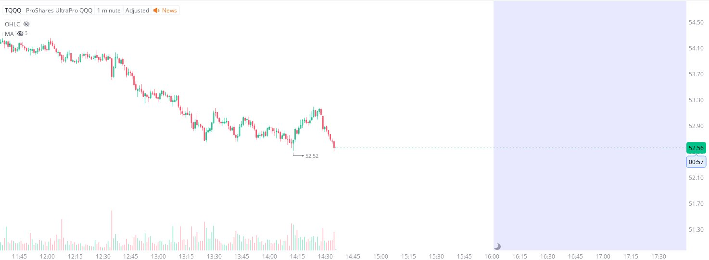

# Case Study #11 - Precision Buy Algorithm

**Archived from:** https://x.com/rauItrades/status/1781030313558446458  
**Post ID:** `1781030313558446458`  
**Posted:** 2024-04-18T18:41:31.000Z  
**Author:** @UnfairMarket (Unfair Market)  
**Thread posts captured:** 1  
**Status:** PARTIAL - conversation reports 4 replies; the public embed endpoint exposes a post's ancestors but not its descendants, so the forward reply chain is not archived.

---

### 1. `1781030313558446458` - 2024-04-18T18:41:31.000Z

1- palindrome
0 - palindromes semordnilap
04202024 = 1
04200240 = 0

but there's no linguistic term for a repetition or mirroring around a sequence that would be 0420.0420.
It's technically a mirrored number.

That would make sense for anyone in intelligence looking for https://t.co/iXGGhncNSe

likes @capture 26

---
