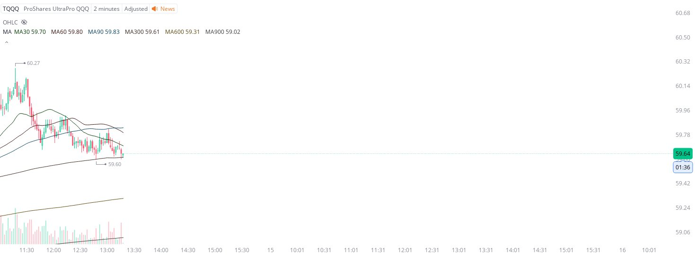

# Case Study #19 - Precision Buy Algorithm

**Archived from:** https://x.com/rauItrades/status/1790431830908477912  
**Post ID:** `1790431830908477912`  
**Posted:** 2024-05-14T17:19:47.000Z  
**Author:** @UnfairMarket (Unfair Market)  
**Thread posts captured:** 1  
**Status:** COMPLETE

---

### 1. `1790431830908477912` - 2024-05-14T17:19:47.000Z

The entire equity markets are edging on a few things, that apex at 60.30, and now the HFTs at 59.60, triggering the 30/60 SMA outfit, 2m TQQQ.
If they weren't manipulating small caps like $GME  , this would be their operation. Only high frequency arbitrage detection like this can https://t.co/ZCtFxg09Nc

metrics @capture - likes 0 / replies 0 / reposts 0 / quotes 0 / views 0

---
