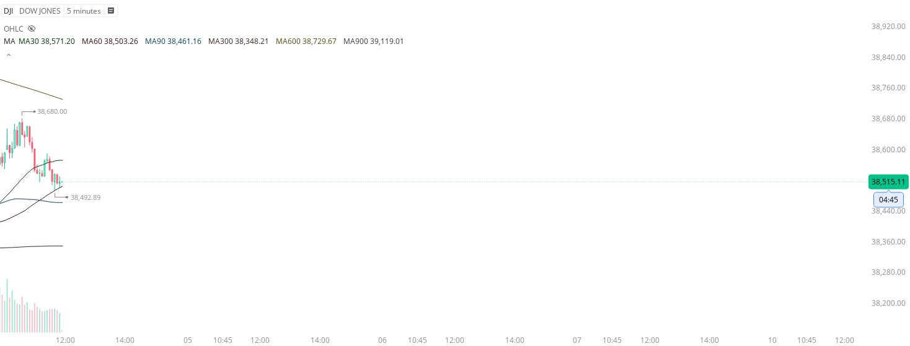
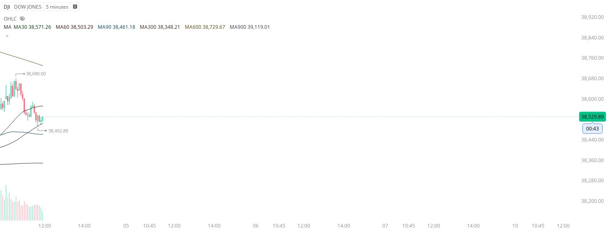
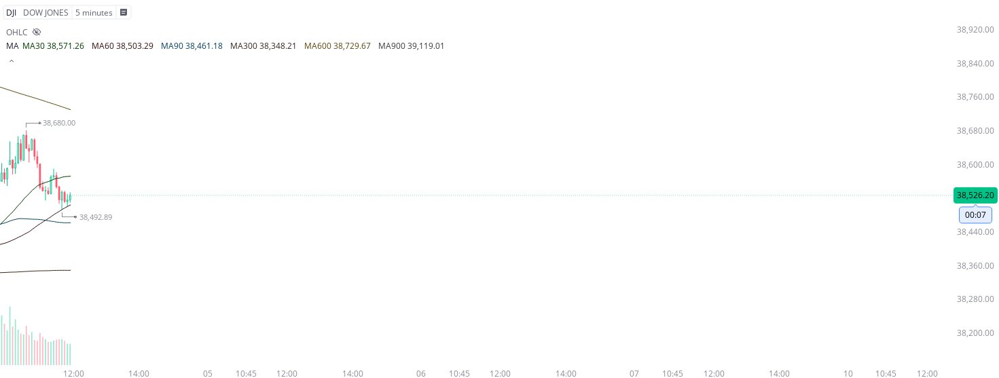
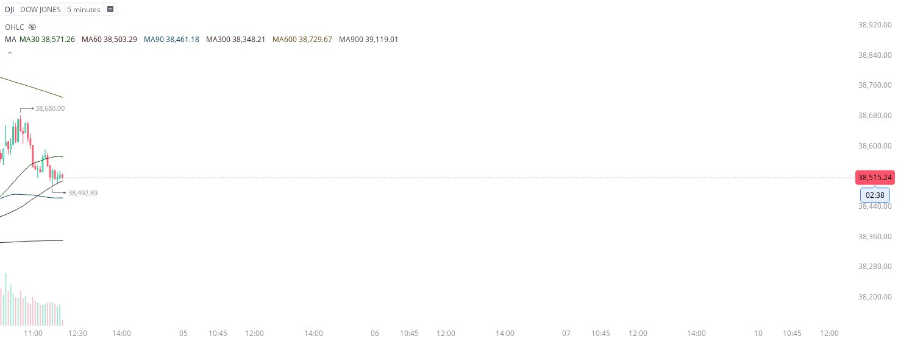
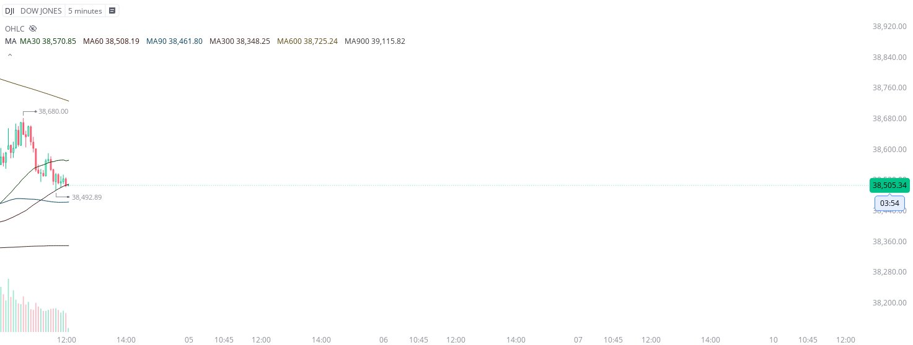
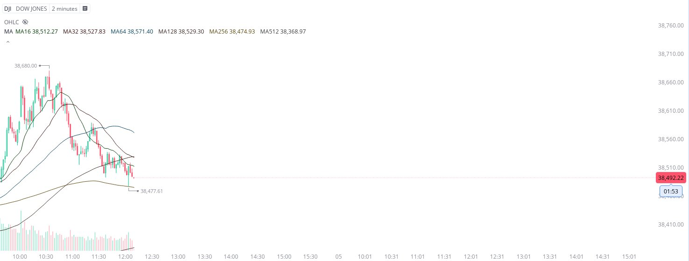
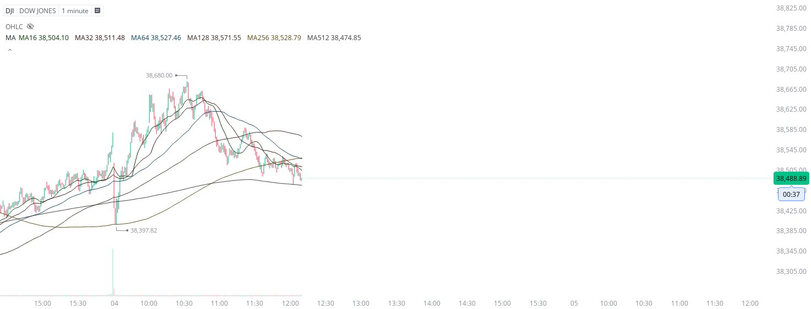
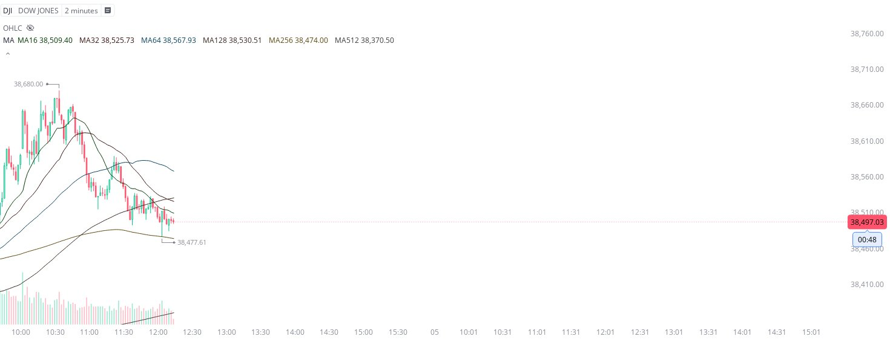

# Case Study #20 - Precision Buy Algorithm

**Archived from:** https://x.com/rauItrades/status/1798025296303812840  
**Post ID:** `1798025296303812840`  
**Posted:** 2024-06-04T16:13:30.000Z  
**Author:** @UnfairMarket (Unfair Market)  
**Thread posts captured:** 11  
**Status:** COMPLETE

---

### 1. `1798020566072672763` - 2024-06-04T15:54:43.000Z

I'm sharing this threaded and in real time for others to contextualize. This operation at 38,492.89 on the dow jones, it's purely the result of this 5m ma60. The high frequency nature of this work is what makes it so difficult to share the minutiae in real time. https://t.co/HpPi5Pg266

metrics @capture - likes 0 / replies 1 / reposts 0 / quotes 0 / views 0

---

### 2. `1798020567892918348` - 2024-06-04T15:54:43.000Z

More specifically because this arbitrage works requires a tremendous amount of computing power and capital to navigate in any meaningful way, meaning - yes. Only the elite firms with like unlimited capital get to make any use of this work. https://t.co/cFkqOanIy6

metrics @capture - likes 0 / replies 1 / reposts 0 / quotes 0 / views 0

---

### 3. `1798020569855820050` - 2024-06-04T15:54:44.000Z

Truth is this work is only intelligible to anyone watching the high frequency work operating in real time, knowing they have unlimited capital and can cut their trade at any moment. https://t.co/CqkrYMYeoB

metrics @capture - likes 0 / replies 0 / reposts 0 / quotes 0 / views 0

---

### 4. `1798020818905219179` - 2024-06-04T15:55:43.000Z

This is PURELY to have in the repertoire. Do not follow the threaded work here as trades. It's to pinpoint historical use of these operations that happen live. https://t.co/k22rV6HFPP

metrics @capture - likes 0 / replies 0 / reposts 0 / quotes 0 / views 0

---

### 5. `1798021134107267354` - 2024-06-04T15:56:58.000Z

Something I have to share to contextualize this a bit. The SMA outfits are not always buy algorithms. They are often purely to control the bid/ask spread of the major market with precision and that's how they get away with this work. It's technically "market making". https://t.co/Axb9pZUbep

likes @capture 3

---

### 6. `1798021824934199315` - 2024-06-04T15:59:43.000Z

The only reason the equity markets treaded there for the past five minutes, is indeed because of the arbitrage working the dow jones. I need to make that clear. It's this work that enables firms to capitalize on even the smallest percent moves in equities. It's indeed fast work. https://t.co/Y7oKBnA714

metrics @capture - likes 0 / replies 0 / reposts 0 / quotes 0 / views 0

---

### 7. `1798022492508090735` - 2024-06-04T16:02:22.000Z

So that operation is about over and the reason for that is because it was purely arbitrage on the dow jones, firms controlling the spread with that SMA while the volatility indices are much higher. They literally work it all together like a machine. Hope that adds context! https://t.co/7cK9CdsQd3

metrics @capture - likes 0 / replies 0 / reposts 0 / quotes 0 / views 0

---

### 8. `1798023182739534220` - 2024-06-04T16:05:07.000Z

Here's one last image for the arbitrageurs that asked me to add context about high frequency work on the SMA outfits. The data is operating on the OHLC candles, so in real time, firms can see this operation flashing down and careening back to that exact same 5m ma60. https://t.co/FtSwRj6fx7

metrics @capture - likes 0 / replies 0 / reposts 0 / quotes 0 / views 0

---

### 9. `1798024428238053427` - 2024-06-04T16:10:04.000Z

For those who are data freaks. You can see that the flash down on the 30/60 sma outfit is because of a coordinated dash down to the 2m ma256.

You know that true because of the 1m ma512. See the precision? It's arbitrage. This is live and in real time. https://t.co/t9LE5ODgv6

metrics @capture - likes 0 / replies 0 / reposts 0 / quotes 0 / views 0

---

### 10. `1798024904690045149` - 2024-06-04T16:11:57.000Z

It's high frequency amalgamation of data that create operations like what you see here now on the 2m ma258 at 38,477.61.  The fact that Day's Low on the DJI was that 1m ma512, now there's a precision flash here at the DJI's 2m MA256.
That "to the hundreth" precision is arbitrage. https://t.co/AG23I6wuij

metrics @capture - likes 0 / replies 0 / reposts 0 / quotes 0 / views 0

---

### 11. `1798025296303812840` - 2024-06-04T16:13:30.000Z

I picked up the DJI with 38,477.61 as risk. https://t.co/cmNXHLPrx7

metrics @capture - likes 0 / replies 0 / reposts 0 / quotes 0 / views 0

---
