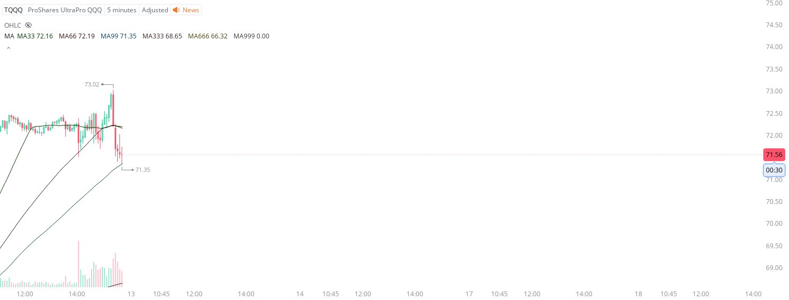

# Case Study #21 - Precision Buy Algorithm

**Archived from:** https://x.com/rauItrades/status/1800979221155881206  
**Post ID:** `1800979221155881206`  
**Posted:** 2024-06-12T19:51:21.000Z  
**Author:** @UnfairMarket (Unfair Market)  
**Thread posts captured:** 1  
**Status:** PARTIAL - conversation reports 7 replies; the public embed endpoint exposes a post's ancestors but not its descendants, so the forward reply chain is not archived.

---

### 1. `1800979221155881206` - 2024-06-12T19:51:21.000Z

Earlier there was a ridiculous amount of arbitrage operating on the 47 SMA outfit. But that operation is exactly what drew the equity markets away from highs.

So now the drawdown is here at 71.35 TQQQ 5m MA99. https://t.co/5AXHtIw7XL

metrics @capture - likes 0 / replies 1 / reposts 0 / quotes 0 / views 0

---
