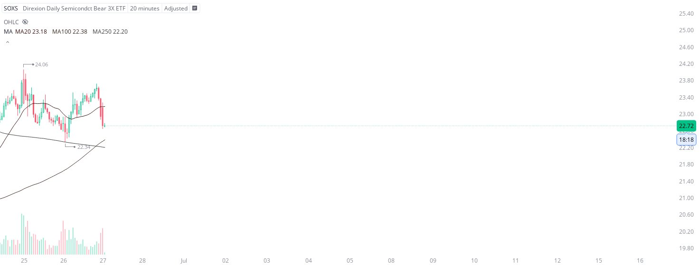

# Case Study #22 - Precision Buy Algorithm

**Archived from:** https://x.com/rauItrades/status/1806322176234278947  
**Post ID:** `1806322176234278947`  
**Posted:** 2024-06-27T13:42:21.000Z  
**Author:** @UnfairMarket (Unfair Market)  
**Thread posts captured:** 1  
**Status:** PARTIAL - conversation reports 2 replies; the public embed endpoint exposes a post's ancestors but not its descendants, so the forward reply chain is not archived.

---

### 1. `1806322176234278947` - 2024-06-27T13:42:21.000Z

I picked up SOXS with 22.34 as support. I'll cut the trade on a singular penny break of that operation. https://t.co/mjgANbYHes

metrics @capture - likes 0 / replies 0 / reposts 0 / quotes 0 / views 0

---
