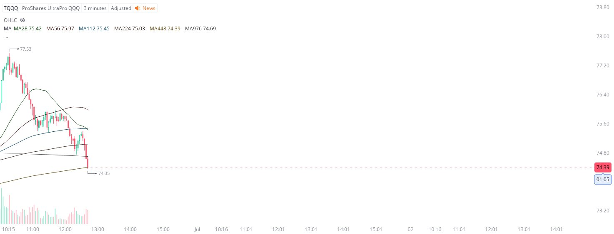

# Case Study #1 - Singular Point Hard Stop Order

**Archived from:** https://x.com/rauItrades/status/1806729697952465164  
**Post ID:** `1806729697952465164`  
**Posted:** 2024-06-28T16:41:42.000Z  
**Author:** @UnfairMarket (Unfair Market)  
**Thread posts captured:** 1  
**Status:** PARTIAL - conversation reports 4 replies; the public embed endpoint exposes a post's ancestors but not its descendants, so the forward reply chain is not archived.

---

### 1. `1806729697952465164` - 2024-06-28T16:41:42.000Z

I picked up TQQQ here at 74.35 because I believe there is a buy algo here on the 3m MA448. https://t.co/PrNWK0xJ1L

metrics @capture - likes 0 / replies 0 / reposts 0 / quotes 0 / views 0

---
