# Case Study #1 - Automated Short Orders

**Archived from:** https://x.com/rauItrades/status/1806754622008389809  
**Post ID:** `1806754622008389809`  
**Posted:** 2024-06-28T18:20:44.000Z  
**Author:** @UnfairMarket (Unfair Market)  
**Thread posts captured:** 74  
**Status:** COMPLETE

---

### 1. `1806729697952465164` - 2024-06-28T16:41:42.000Z

I picked up TQQQ here at 74.35 because I believe there is a buy algo here on the 3m MA448. https://t.co/PrNWK0xJ1L

metrics @capture - likes 0 / replies 0 / reposts 0 / quotes 0 / views 0

---

### 2. `1806729783587569982` - 2024-06-28T16:42:02.000Z

I will cut the trade on a penny break of the selection. https://t.co/fd6241ty9g

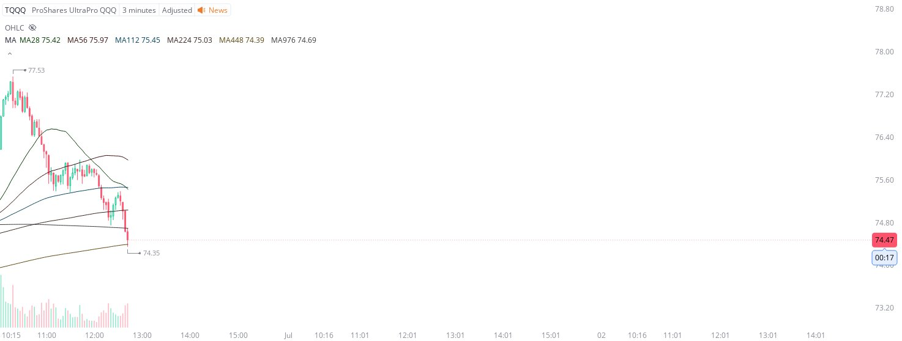

metrics @capture - likes 0 / replies 0 / reposts 0 / quotes 0 / views 0

---

### 3. `1806729945730945160` - 2024-06-28T16:42:41.000Z

Here's my $TQQQ at 74.35 operating on an aggressive buy algo on the 3m MA448. https://t.co/TqRsF7tR5Z

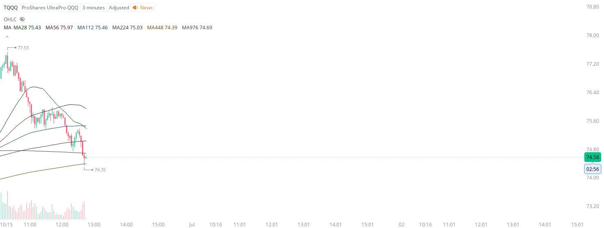

likes @capture 1

---

### 4. `1806730115768058263` - 2024-06-28T16:43:21.000Z

It's rapid but I need to thread and document this all live and in real time.
My $TQQQ at 74.35 . https://t.co/oZIxtSsQm6

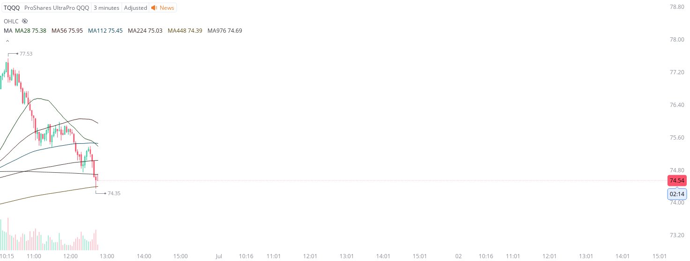

likes @capture 1

---

### 5. `1806730217681195497` - 2024-06-28T16:43:45.000Z

Here's my 3m 74.35 TQQQ. https://t.co/obEUGkfPjG

likes @capture 1

---

### 6. `1806730481498751262` - 2024-06-28T16:44:48.000Z

Just please understand I am a rapid and aggressive trader I will 100% cut and liquidate this trade on the break. I have seen them operate equities all day on this 28/56/112/224/448/976 SMA outfit and I know they have been liquidating all day but I thought it was worth it. https://t.co/Jzefo17QOd

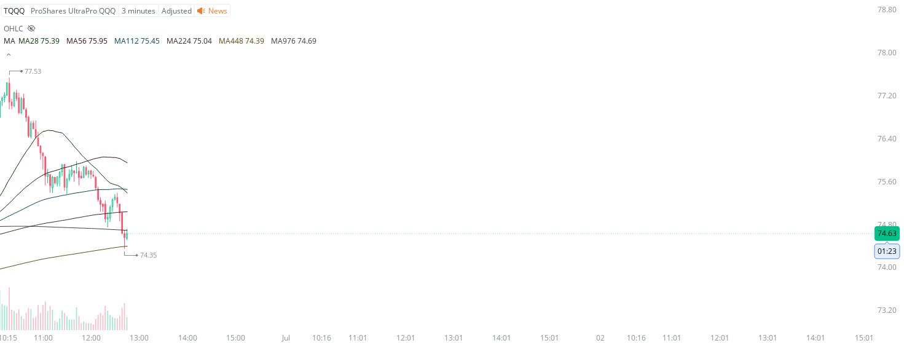

metrics @capture - likes 0 / replies 0 / reposts 0 / quotes 0 / views 0

---

### 7. `1806730605725679971` - 2024-06-28T16:45:18.000Z

My $TQQQ at 74.35 . https://t.co/T30AERlUYr

metrics @capture - likes 0 / replies 0 / reposts 0 / quotes 0 / views 0

---

### 8. `1806730674000560493` - 2024-06-28T16:45:34.000Z

This is my $TQQQ at 74.35 . https://t.co/Bc4QhZXHad

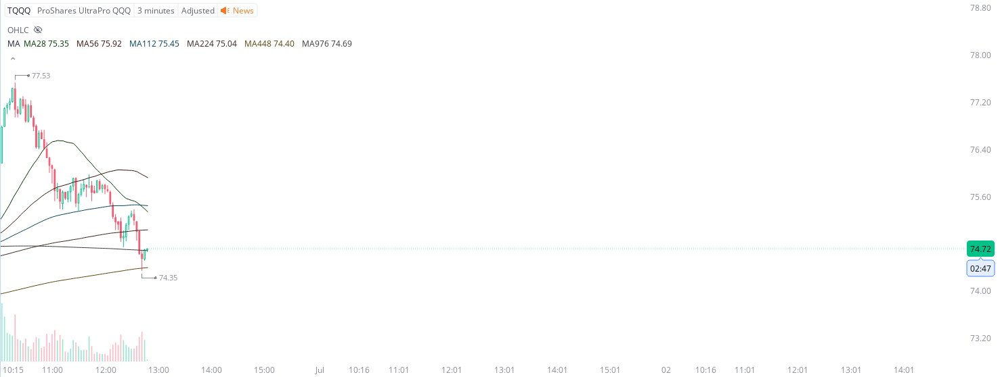

metrics @capture - likes 0 / replies 0 / reposts 0 / quotes 0 / views 0

---

### 9. `1806730896504193409` - 2024-06-28T16:46:27.000Z

This is what happens when you have optimized systems that detect when they are using arbitrage programs for profit. https://t.co/AwP67lvSx5

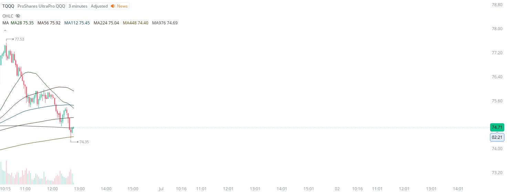

metrics @capture - likes 0 / replies 0 / reposts 0 / quotes 0 / views 0

---

### 10. `1806731144299221141` - 2024-06-28T16:47:26.000Z

I've been in this game long enough to know what's up.
My $TQQQ at 74.35 . https://t.co/NxPgev2DVv

metrics @capture - likes 0 / replies 0 / reposts 0 / quotes 0 / views 0

---

### 11. `1806731221516591321` - 2024-06-28T16:47:45.000Z

Here's my $TQQQ at 74.35 . https://t.co/7Dz99X3q8J

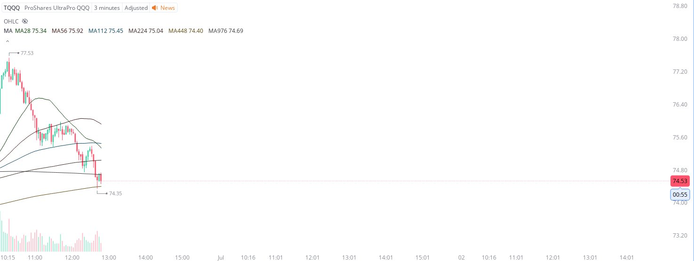

metrics @capture - likes 0 / replies 0 / reposts 0 / quotes 0 / views 0

---

### 12. `1806731279481843922` - 2024-06-28T16:47:59.000Z

My $TQQQ at 74.35 .
live and in real time. https://t.co/NUNIJP7GIb

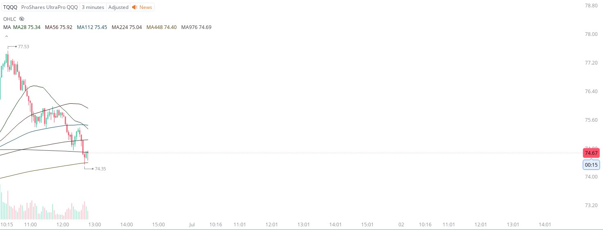

metrics @capture - likes 0 / replies 0 / reposts 0 / quotes 0 / views 0

---

### 13. `1806731559204225258` - 2024-06-28T16:49:05.000Z

Now look at that precision arbitrage.
My $TQQQ at 74.35 .
This is what OPTIMIZED trading systems look like.
Yes it went a penny below that 3m MA448 but that's because they only wanted aggressive firms to capitalize on it. Happens. Trading.

My $TQQQ at 74.34 . https://t.co/0FeJDAVELw

metrics @capture - likes 0 / replies 0 / reposts 0 / quotes 0 / views 0

---

### 14. `1806731657829089479` - 2024-06-28T16:49:29.000Z

My real time threaded $TQQQ at 74.35 . https://t.co/dVYtZtm056

metrics @capture - likes 0 / replies 0 / reposts 0 / quotes 0 / views 0

---

### 15. `1806731769355571647` - 2024-06-28T16:49:55.000Z

This is my threaded $TQQQ at 74.35 being threaded live and in real time. https://t.co/AVckgmvNx8

metrics @capture - likes 0 / replies 0 / reposts 0 / quotes 0 / views 0

---

### 16. `1806731881137967383` - 2024-06-28T16:50:22.000Z

Scroll up and you will see why I bought $TQQQ at 74.35 . https://t.co/bDnUsQhHkP

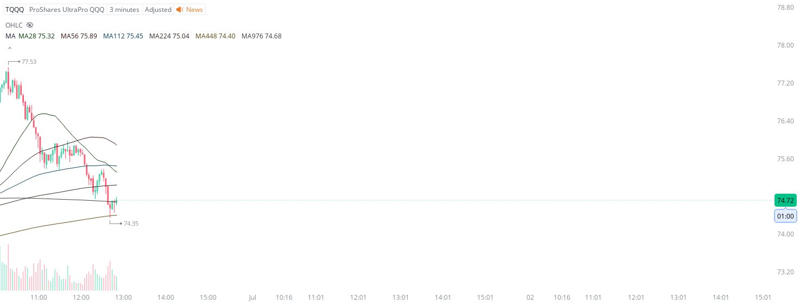

metrics @capture - likes 0 / replies 0 / reposts 0 / quotes 0 / views 0

---

### 17. `1806732137493889125` - 2024-06-28T16:51:23.000Z

This is my $TQQQ at the 3m MA448, a protocol GOLDMAN BLACKROCK CITADEL optimized for profit at 74.35 . FACT! https://t.co/QjRtlsybeY

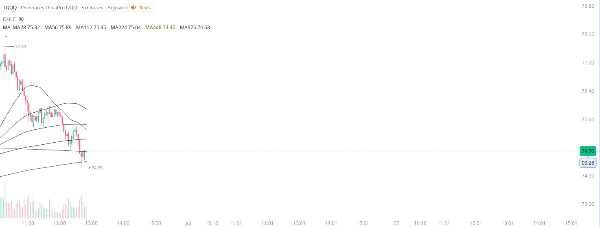

metrics @capture - likes 0 / replies 0 / reposts 0 / quotes 0 / views 0

---

### 18. `1806732410140426557` - 2024-06-28T16:52:28.000Z

Goldman Blackrock JPM Citadel etc. 
They ALL have intel teams that tell their trading divisions what to do.
On the drawdown they were ciphering the TQQQ working on the 28/56/112/224/448/976 SMA outfit and I'm threaded what the buying program looks like now. https://t.co/Cy25snVhts

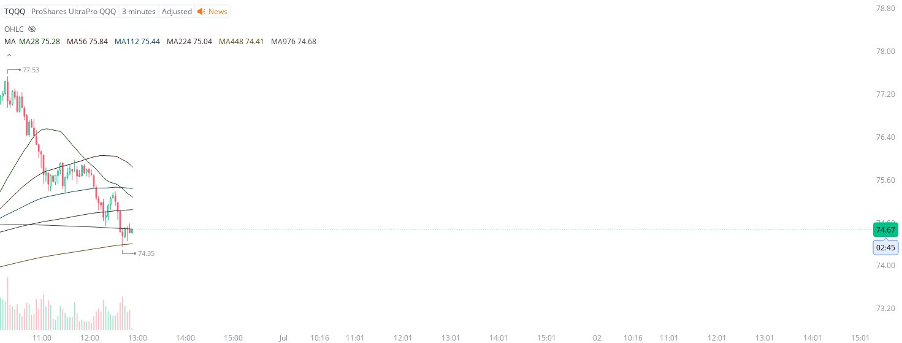

metrics @capture - likes 0 / replies 0 / reposts 0 / quotes 0 / views 0

---

### 19. `1806732646783058278` - 2024-06-28T16:53:25.000Z

Looks like I called the bottom.
My $TQQQ bet at 74.35 , threaded live and in real time all because of an optimized trade firms programmed at this 3m MA448. FACT! https://t.co/TxNRPh4V0M

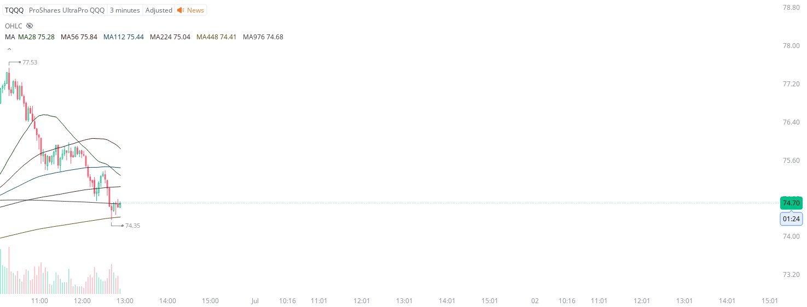

metrics @capture - likes 0 / replies 0 / reposts 0 / quotes 0 / views 0

---

### 20. `1806732891117981875` - 2024-06-28T16:54:23.000Z

This is my $TQQQ at 74.35 .
Firms were cipphering the (7) SMA outfit all day into this buying program where I picked the Nasdaq up.
That's how this trading game works. https://t.co/Wo2uXEJXbW

metrics @capture - likes 0 / replies 0 / reposts 0 / quotes 0 / views 0

---

### 21. `1806733195054088534` - 2024-06-28T16:55:35.000Z

Wow pretty clear.
"I picked up TQQQ here at 74.35 because I believe there is a buy algo here on the 3m MA448." https://t.co/BjGcr641Y8

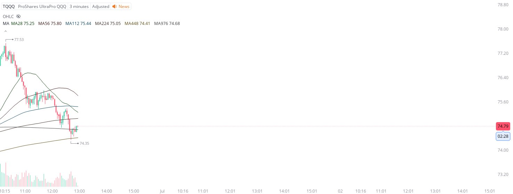

metrics @capture - likes 0 / replies 0 / reposts 0 / quotes 0 / views 0

---

### 22. `1806733580523147637` - 2024-06-28T16:57:07.000Z

This is what utter and blatant wealth transfer looks like.
If you didn't see them liquidating the NASDAQ all morning on the Xi Jinping SMA outfit you wouldn't have seen them bid on the drawdown to this program.
It's fast paced high grade HFT work.
That's it.

My $TQQQ at 74.35 . https://t.co/GkNyXr8UDD

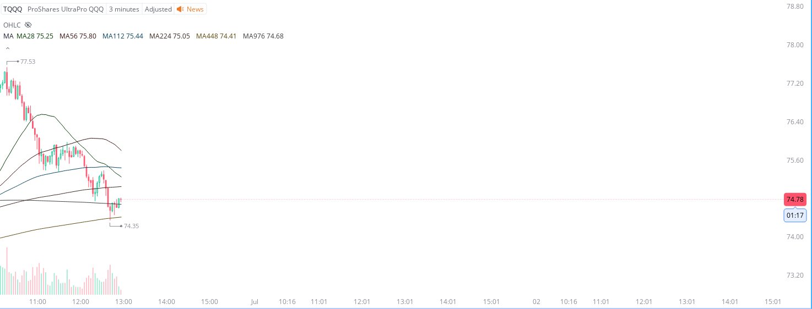

metrics @capture - likes 0 / replies 0 / reposts 0 / quotes 0 / views 0

---

### 23. `1806733920349851692` - 2024-06-28T16:58:28.000Z

This is my $TQQQ at 74.35 where global wealth operators halted the Nasdaq's drawdown for profit using an optimized trading operation on the 3m MA448.
That's the work here folks. Automation and smart pants traders. https://t.co/f1ZF4F932H

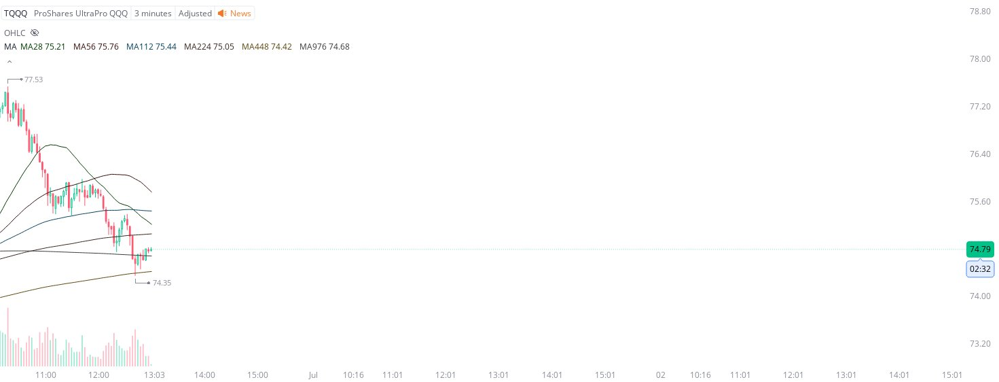

metrics @capture - likes 0 / replies 0 / reposts 0 / quotes 0 / views 0

---

### 24. `1806734064281649657` - 2024-06-28T16:59:03.000Z

There you have it.
My THREADED $TQQQ at 74.35 . https://t.co/zwtq0donk3

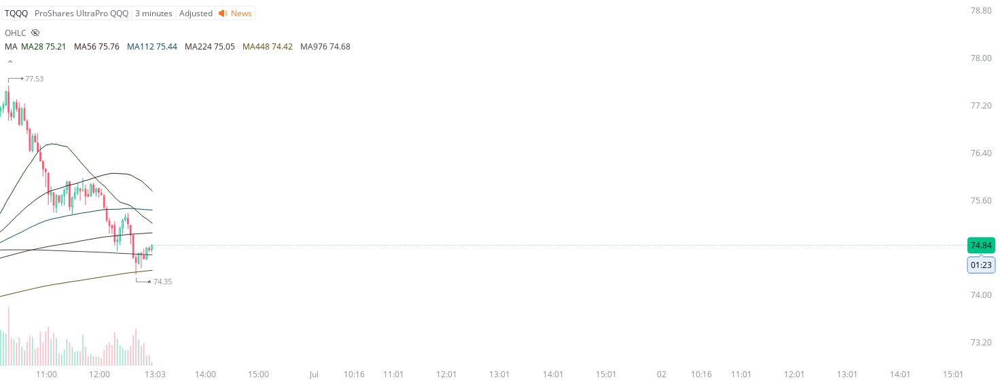

metrics @capture - likes 0 / replies 0 / reposts 0 / quotes 0 / views 0

---

### 25. `1806734176290537582` - 2024-06-28T16:59:29.000Z

Fingers crossed we get new all time highs now.
My $TQQQ at 74.35 . https://t.co/XnQiTpkmJv

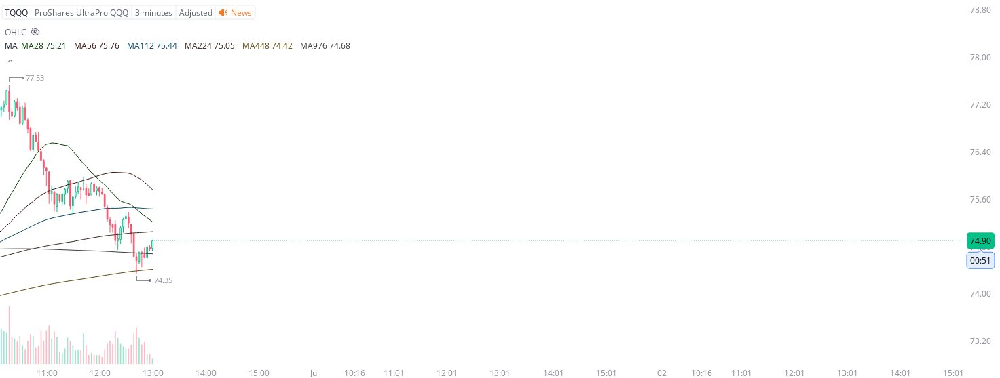

metrics @capture - likes 0 / replies 0 / reposts 0 / quotes 0 / views 0

---

### 26. `1806734542210007181` - 2024-06-28T17:00:57.000Z

"I picked up TQQQ here at 74.35 because I believe there is a buy algo here on the 3m MA448."
"I will cut the trade on a penny break of the selection." https://t.co/izn5fEIs8r

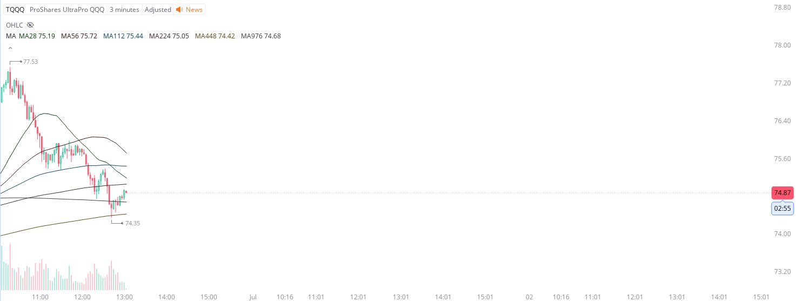

metrics @capture - likes 0 / replies 0 / reposts 0 / quotes 0 / views 0

---

### 27. `1806734624443531496` - 2024-06-28T17:01:16.000Z

$TQQQ at 74.35 . https://t.co/9VxRFTkuml

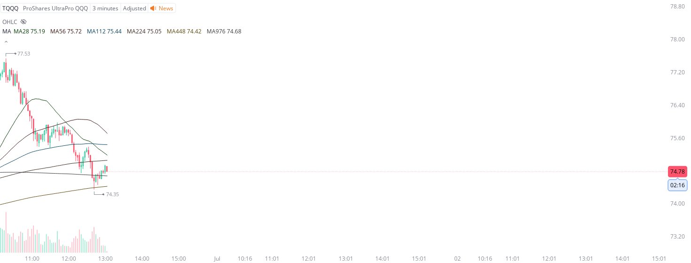

metrics @capture - likes 0 / replies 0 / reposts 0 / quotes 0 / views 0

---

### 28. `1806734975242473943` - 2024-06-28T17:02:40.000Z

My $TQQQ at 74.35. https://t.co/g9KGrAzCrq

metrics @capture - likes 0 / replies 0 / reposts 0 / quotes 0 / views 0

---

### 29. `1806735072042840287` - 2024-06-28T17:03:03.000Z

This is my real time and threaded $TQQQ call and bet at 74.35 . https://t.co/ReaNDBLD0e

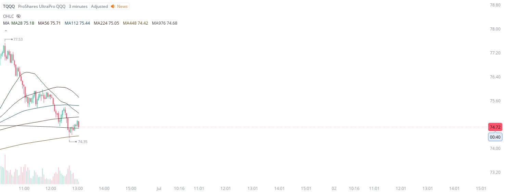

metrics @capture - likes 0 / replies 0 / reposts 0 / quotes 0 / views 0

---

### 30. `1806735287516856592` - 2024-06-28T17:03:54.000Z

Someone asked "Is it going higher?"
Well if I start a thread saying I picked up TQQQ at 74.35, and this is what you see, then yes. haha https://t.co/ZWLmLjcTBe

metrics @capture - likes 0 / replies 0 / reposts 0 / quotes 0 / views 0

---

### 31. `1806735822047347144` - 2024-06-28T17:06:02.000Z

That's the thing though it only goes higher for FIRMS/aggressive traders who have optimized their trading protocols because everyone picks up the trade at 74.35 give or take and can liquidate on a singular penny break of that selection.
It's professional trading. https://t.co/kzyTWC1ogD

metrics @capture - likes 0 / replies 0 / reposts 0 / quotes 0 / views 0

---

### 32. `1806735927336898895` - 2024-06-28T17:06:27.000Z

Here's my threaded real time call of the NASDAQ's $TQQQ operating on my bid at 74.35 . https://t.co/G30B8HxTeP

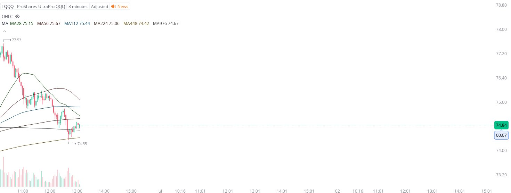

metrics @capture - likes 0 / replies 0 / reposts 0 / quotes 0 / views 0

---

### 33. `1806736173672566803` - 2024-06-28T17:07:25.000Z

This is my threaded NASDAQ call of the 3m TQQQ getting selected on that 3m MA448, on a highly optimized protocol and buy algo at exactly 74.35 . https://t.co/FzqIJ2a1sh

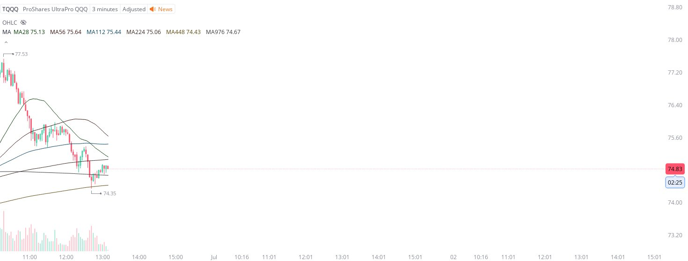

metrics @capture - likes 0 / replies 0 / reposts 0 / quotes 0 / views 0

---

### 34. `1806736296293106164` - 2024-06-28T17:07:55.000Z

BOOM! $$$$$$$$$$$$$$
My $TQQQ at 74.35 . $$$$$$$$$$$$$$$ https://t.co/1rV1pSTjZL

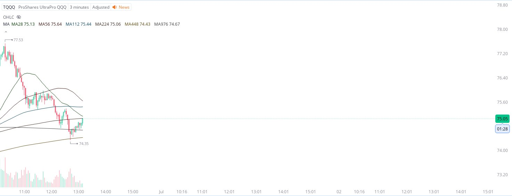

metrics @capture - likes 0 / replies 0 / reposts 0 / quotes 0 / views 0

---

### 35. `1806736405785456913` - 2024-06-28T17:08:21.000Z

This is all threaded live and in real time.
My $TQQQ at 74.35 . https://t.co/TsEiJoSbWV

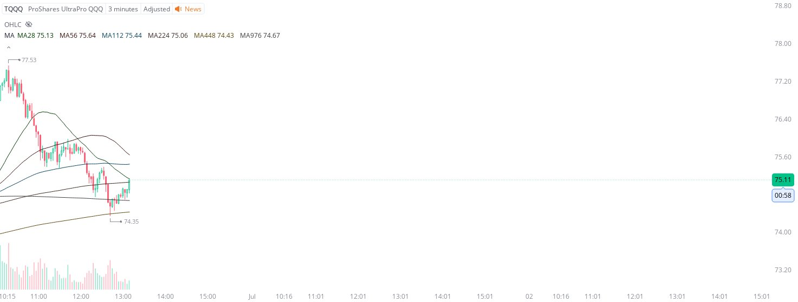

metrics @capture - likes 0 / replies 0 / reposts 0 / quotes 0 / views 0

---

### 36. `1806736562450993230` - 2024-06-28T17:08:58.000Z

My $TQQQ at 74.35 . https://t.co/8KD1KEuODq

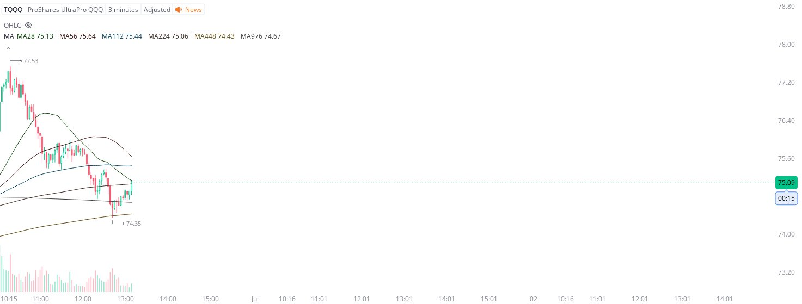

metrics @capture - likes 0 / replies 0 / reposts 0 / quotes 0 / views 0

---

### 37. `1806736847827345418` - 2024-06-28T17:10:06.000Z

My $TQQQ bid at 74.35 ?
Now on its way to new all time highs hahaha https://t.co/Vz8ruJiBUr

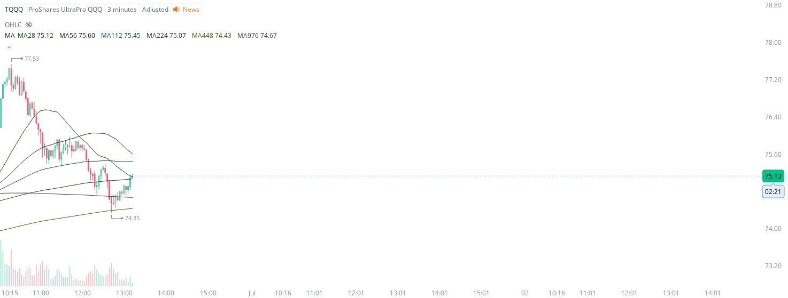

likes @capture 2

---

### 38. `1806737047329321268` - 2024-06-28T17:10:54.000Z

Best part about these threads is I start them the moment they all go in and feed on the Stock Market like piranhas.
My $TQQQ at 74.35 . https://t.co/s7utkLfSLx

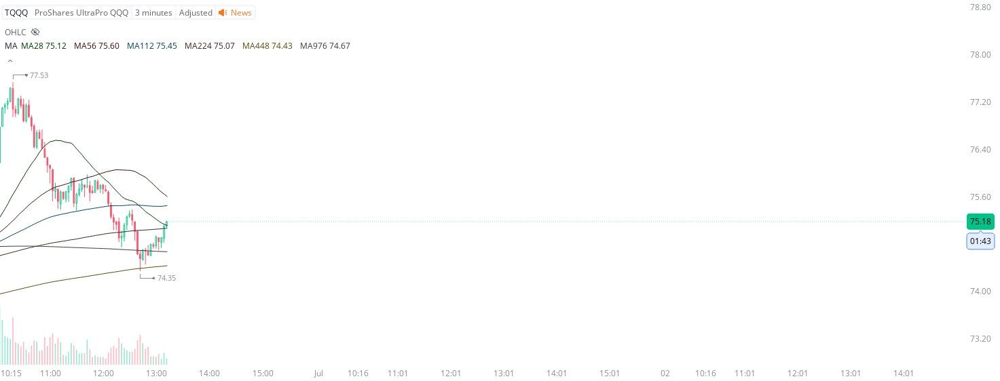

metrics @capture - likes 0 / replies 0 / reposts 0 / quotes 0 / views 0

---

### 39. `1806738021355860023` - 2024-06-28T17:14:46.000Z

My blowout $TQQQ bet at 74.35 . https://t.co/1If8asv62t

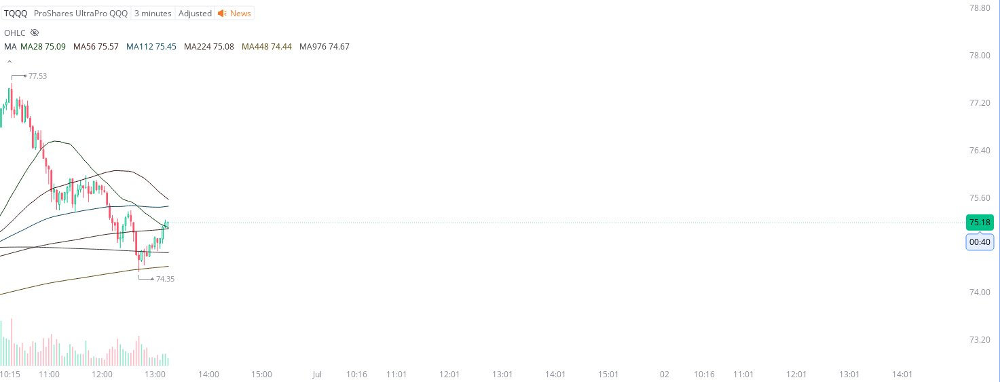

metrics @capture - likes 0 / replies 0 / reposts 0 / quotes 0 / views 0

---

### 40. `1806738437095215501` - 2024-06-28T17:16:25.000Z

I would like to think I do a great job providing context.
I say where I bet. I say where banks and hedge funds go in to reward aggressive trading divisions, and then this happens. 
It's called gaming and manufacturing wealth distribution.
Starts here. https://t.co/VeooGLzasq

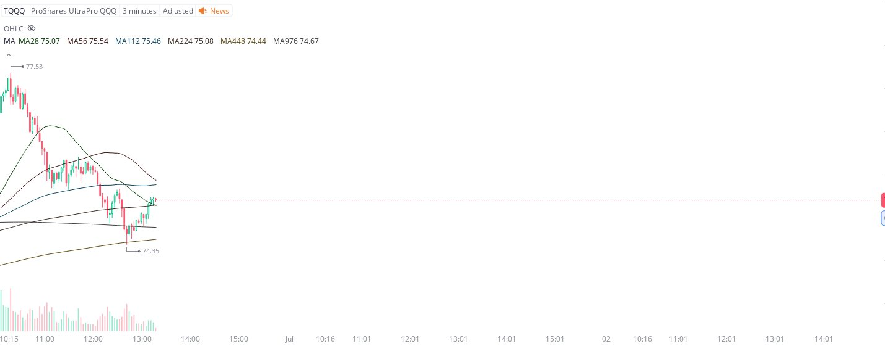

metrics @capture - likes 0 / replies 0 / reposts 0 / quotes 0 / views 0

---

### 41. `1806738817635979647` - 2024-06-28T17:17:56.000Z

I wouldn't be able to share all of this if it weren't for crooked politicians, lobbyists, asshole wealthy computer scientists, and global capitalism operating succinctly so don't thank me. I'm just a mirror of what I see. https://t.co/Ac9ebWbf2r

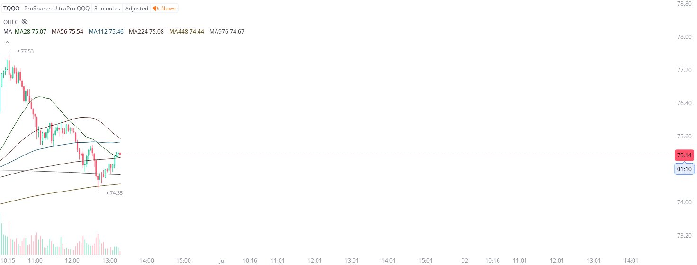

metrics @capture - likes 0 / replies 0 / reposts 0 / quotes 0 / views 0

---

### 42. `1806739689803747421` - 2024-06-28T17:21:24.000Z

Paint the picture a little better here for folks paying attention.

The reason the move higher stalled? Well everyone at these firms use the same tools. So right now it's the SAME sma outfit, just the 30 second chart. Information overload sorry but it's trained in the systems! https://t.co/4X20ht5viu

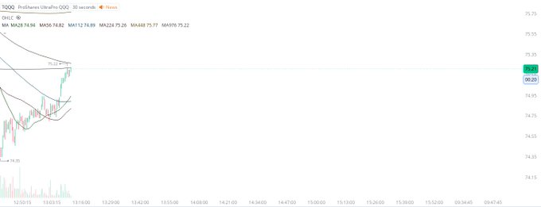

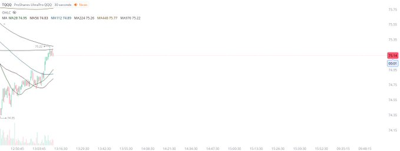

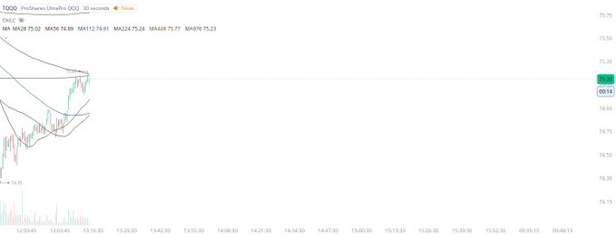

metrics @capture - likes 0 / replies 0 / reposts 0 / quotes 0 / views 0

---

### 43. `1806740054641180716` - 2024-06-28T17:22:51.000Z

Those last four images are just part of the optimization process firms have to ensure they meet budgets at the end of the day and use TIME!!!!!! as a tool to safeguard the integrity of public equity markets.
In this case the NASDAQ.
Regulators know! Obviously haha! https://t.co/t09MOBRVdc

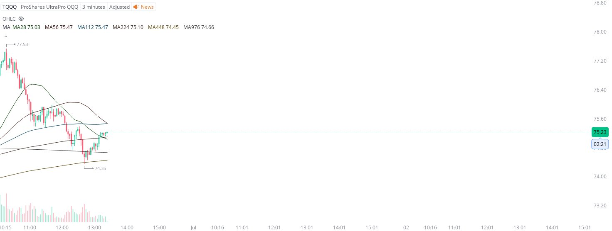

metrics @capture - likes 0 / replies 0 / reposts 0 / quotes 0 / views 0

---

### 44. `1806740358644252803` - 2024-06-28T17:24:03.000Z

Cheers to the FINAL day of Q2 where I get to add another blowout case study to the SMA outfit operations.
Yes they get a little complicated I know but I am really contextual so just take it step by step. https://t.co/paQ7eoAlVA

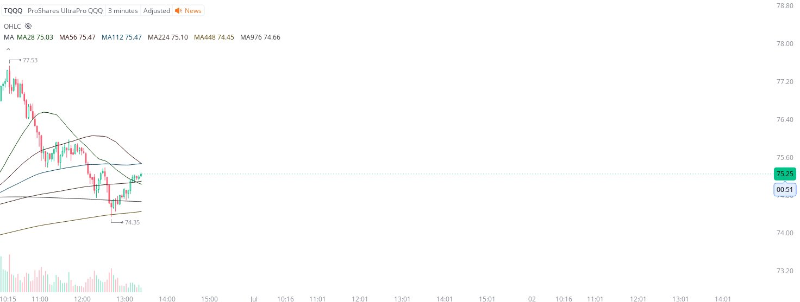

metrics @capture - likes 0 / replies 0 / reposts 0 / quotes 0 / views 0

---

### 45. `1806740650840445280` - 2024-06-28T17:25:13.000Z

My $TQQQ at 74.35. https://t.co/yUtw4opNES

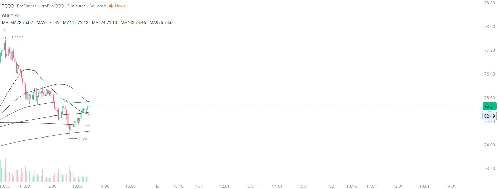

metrics @capture - likes 0 / replies 0 / reposts 0 / quotes 0 / views 0

---

### 46. `1806741164319744016` - 2024-06-28T17:27:15.000Z

I haven't seen the NASDAQ perform a technical short squeeze on a single chart in a minute so I'm hoping they get this over with before the close. I'm not in charge of that though. I'm just one little person at a desk doing what I can with the information that exists. https://t.co/E795Z2j7z2

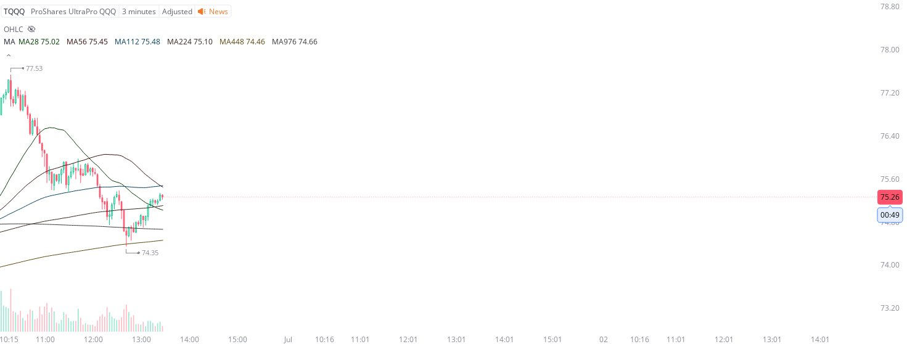

metrics @capture - likes 0 / replies 0 / reposts 0 / quotes 0 / views 0

---

### 47. `1806741976035041619` - 2024-06-28T17:30:29.000Z

This whole operation commenced purely because of the fact that there was a real time buying protocol on the NASDAQ's 3m MA448 but that's what aggressive trading looks like. It's rapid and only suited for fast and aggressive traders. https://t.co/h0Osh5po4T

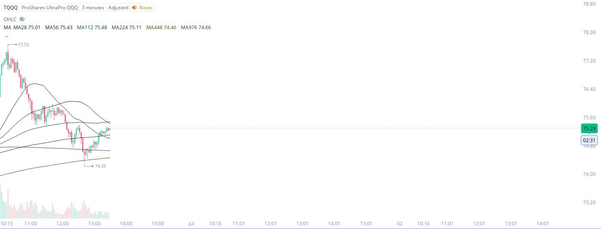

metrics @capture - likes 0 / replies 0 / reposts 0 / quotes 0 / views 0

---

### 48. `1806742615901249694` - 2024-06-28T17:33:01.000Z

For the data oriented people, there was a massive flash to that 3m MA28. It will wipe away as other trading systems take control and budgets throughout the major market shift and cause volatility but it's that [very linear] data that allows for aggressive firms to see what's up! https://t.co/fyBeurJq7d

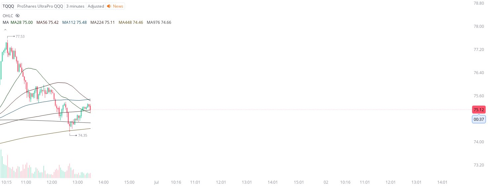

metrics @capture - likes 0 / replies 0 / reposts 0 / quotes 0 / views 0

---

### 49. `1806743127761522735` - 2024-06-28T17:35:03.000Z

So now there is a ridiculous amount of volatility as the major market adjusts from bets around the US Dollar, Gold XAUUSD, and fwiw bitcoin and other FX trades.
Should you wonder about what happened today in the markets, thank the traders who made their days worth on the NASDAQ. https://t.co/dUkzG8ThVF

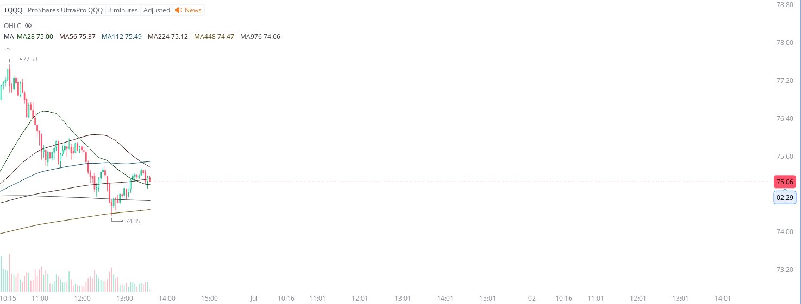

metrics @capture - likes 0 / replies 0 / reposts 0 / quotes 0 / views 0

---

### 50. `1806743698228851109` - 2024-06-28T17:37:19.000Z

Trades like this make sense to folks who have been trading the HK Hang Seng index. They have to deal with 10-fold the volatility of US markets for profit. I presume equity trading will only get more complicated as tension ensues and there's pressure from China about tariffs. https://t.co/Ks9yGfRksk

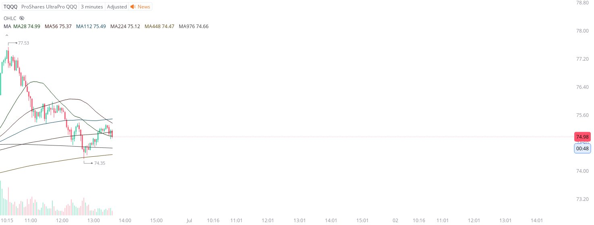

metrics @capture - likes 0 / replies 0 / reposts 0 / quotes 0 / views 0

---

### 51. `1806744194440196577` - 2024-06-28T17:39:18.000Z

I was really hoping they'd blast the NASDAQ higher into the close so that the S&amp;P 500 could record a final good scratch for the session and quarter but again. That's not up to me. I can only work with what I got. https://t.co/banUGr2v3f

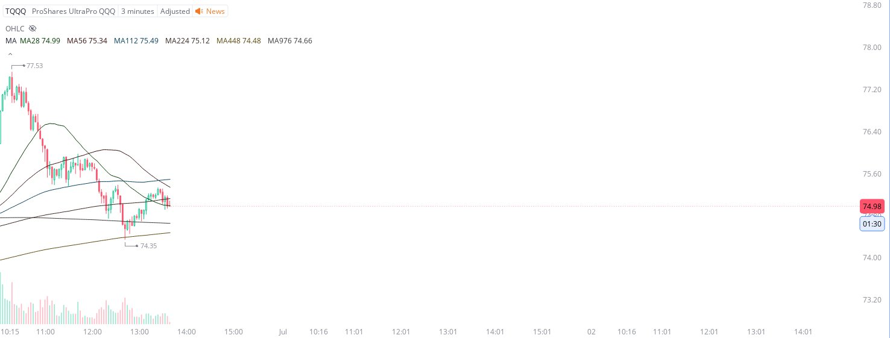

metrics @capture - likes 0 / replies 0 / reposts 0 / quotes 0 / views 0

---

### 52. `1806744559663337772` - 2024-06-28T17:40:45.000Z

Here's my $TQQQ at 74.35 . https://t.co/qMGme6Viqn

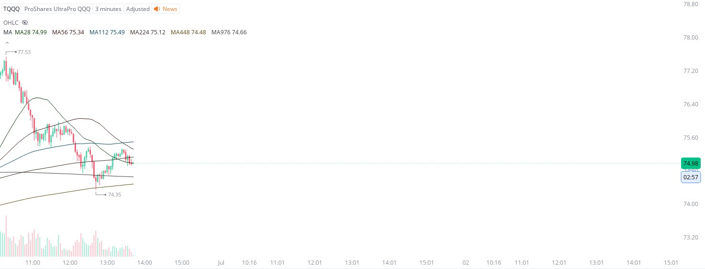

metrics @capture - likes 0 / replies 0 / reposts 0 / quotes 0 / views 0

---

### 53. `1806745795775037533` - 2024-06-28T17:45:40.000Z

$TQQQ at 74.35 .
The other thing that caused pressure today and the reason the NASDAQ got shorted at highs was because of a whipsaw trade for semiconductors.
Some bank bought the dip on [SOXS 20m 20/100/250] because of China/Taiwan and that caused issue for the tech heavy NASDAQ. https://t.co/Revzs2VSTb

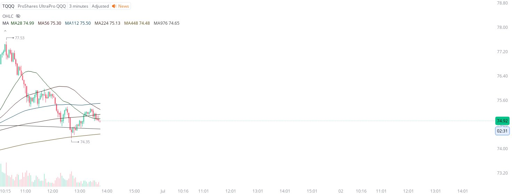

metrics @capture - likes 0 / replies 0 / reposts 0 / quotes 0 / views 0

---

### 54. `1806746369589489825` - 2024-06-28T17:47:56.000Z

Even though I start these threads at the start of their protocol I like to give context for what's going on around the market so the public gets an idea about how/why trades are budgeted. It's all linear! https://t.co/1Xwo9BRRhM

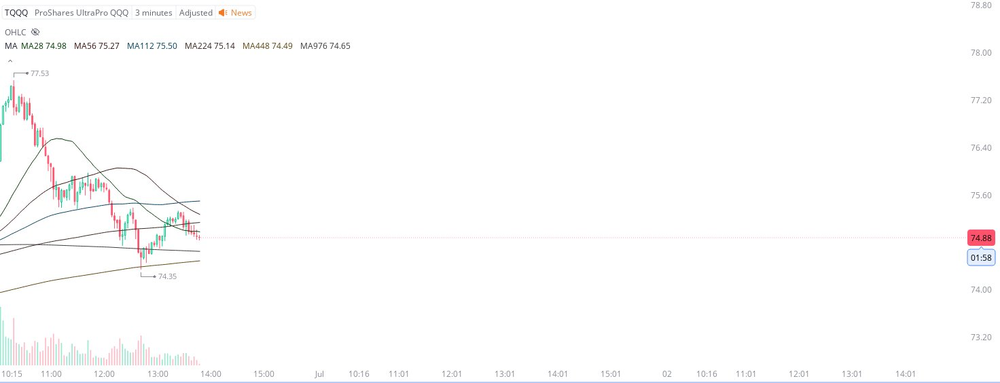

metrics @capture - likes 0 / replies 0 / reposts 0 / quotes 0 / views 0

---

### 55. `1806746911787135069` - 2024-06-28T17:50:06.000Z

I know this chart seems scary but all one needs to grasp is that there was a very expensive multibillion dollar buying algorithm on the TQQQ at 74.35 because of advanced algorithms triggering that 3m ma448.
Scary string of words maybe but hey! https://t.co/icmGhE9BoK

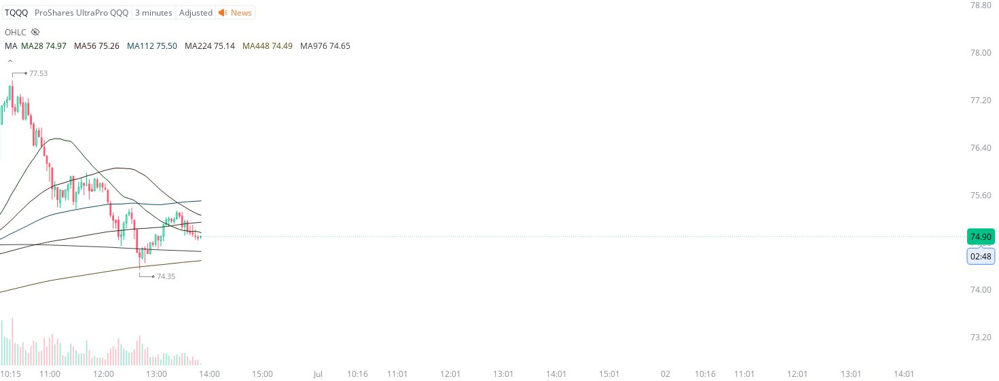

metrics @capture - likes 0 / replies 0 / reposts 0 / quotes 0 / views 0

---

### 56. `1806747361718538458` - 2024-06-28T17:51:53.000Z

Only live and in real time can the OHLC candles (open high low close) be seen operating the SMA outfit.
Those flashes you see to specific SMAs are the result of firms using those parameters to wash trades for profit and it is effectively what the public knows as "market making". https://t.co/DtNDJZzQME

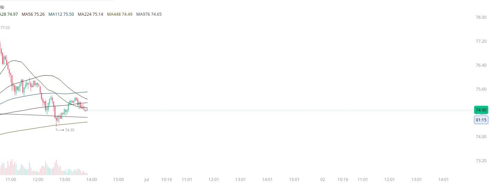

metrics @capture - likes 0 / replies 0 / reposts 0 / quotes 0 / views 0

---

### 57. `1806747896307691848` - 2024-06-28T17:54:00.000Z

My $TQQQ at 74.35 . https://t.co/zaxB7rNzEO

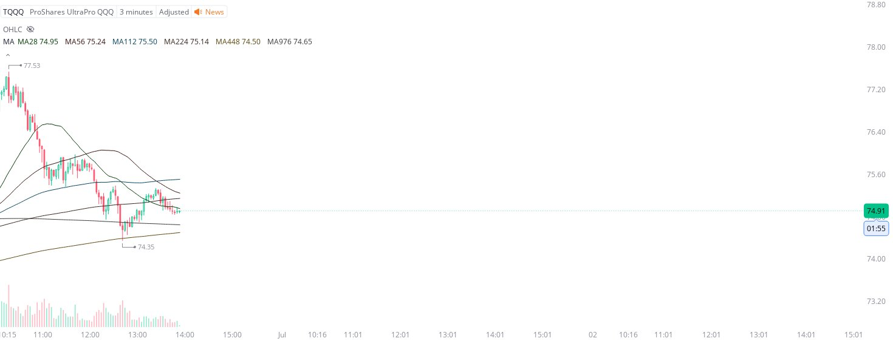

metrics @capture - likes 0 / replies 0 / reposts 0 / quotes 0 / views 0

---

### 58. `1806747952163217749` - 2024-06-28T17:54:14.000Z

My $TQQQ at 74.35 . https://t.co/zBRQ1JJ3og

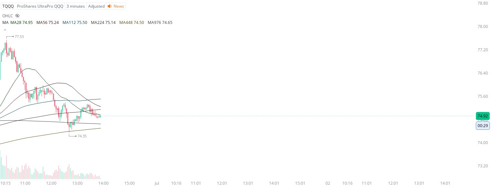

metrics @capture - likes 0 / replies 0 / reposts 0 / quotes 0 / views 0

---

### 59. `1806748757662511599` - 2024-06-28T17:57:26.000Z

The NASDAQ has sort of just stalled and that sort of sucks but remember, the NASDAQ rewards everyone who can intellectualize wealth as long as it's supporting future economic objectives. That's its whole purpose. https://t.co/5v19dGQ1rw

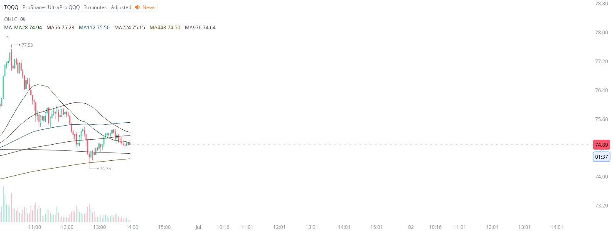

metrics @capture - likes 0 / replies 0 / reposts 0 / quotes 0 / views 0

---

### 60. `1806749322744324198` - 2024-06-28T17:59:40.000Z

https://t.co/qq4guxh4iJ

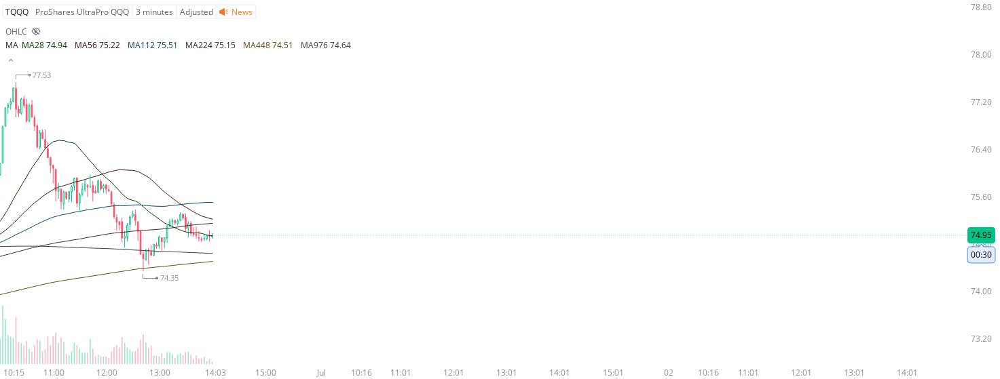

metrics @capture - likes 0 / replies 0 / reposts 0 / quotes 0 / views 0

---

### 61. `1806749602064015665` - 2024-06-28T18:00:47.000Z

My $TQQQ at 74.35 . https://t.co/rSZzWuUyxh

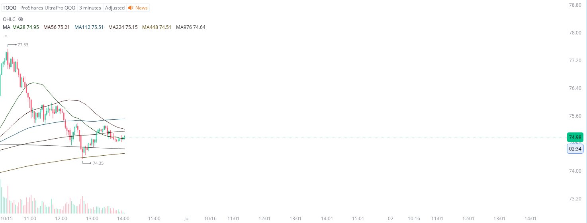

metrics @capture - likes 0 / replies 0 / reposts 0 / quotes 0 / views 0

---

### 62. `1806750491415814561` - 2024-06-28T18:04:19.000Z

The SMA outfits are the direct line between fact and fiction. This is what effectively controls the Stock Market making "trends" or Billionaires accruing billions.
Starts here.
Watch this.

My $TQQQ at 74.35 . https://t.co/lc1hJPuBXI

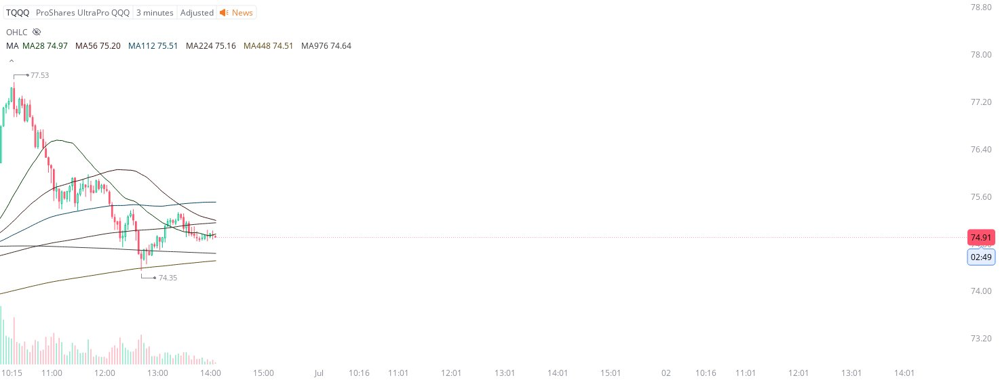

metrics @capture - likes 0 / replies 0 / reposts 0 / quotes 0 / views 0

---

### 63. `1806750631186854175` - 2024-06-28T18:04:52.000Z

My real time $TQQQ at 74.35 .
BOOM!!!!!!!!!!!!! $$$$$$$$$$$$$$$$$$$$$ https://t.co/WOyscSWum0

metrics @capture - likes 0 / replies 0 / reposts 0 / quotes 0 / views 0

---

### 64. `1806751150009704537` - 2024-06-28T18:06:56.000Z

It's no wonder firms decided the manipulate "gamestop" and create the world of meme stocks back in 2021. It's really just a game. Game! Gamification.
That's all this work is. Advanced, locked in, pattern recognition by grade A computers. https://t.co/slGgBpmRW7

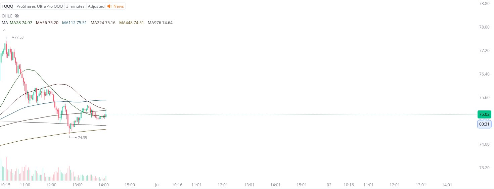

metrics @capture - likes 0 / replies 0 / reposts 0 / quotes 0 / views 0

---

### 65. `1806751562926297359` - 2024-06-28T18:08:35.000Z

I'm glad I'm sharing the protocol that strikes the NASDAQ higher. This is as complicated as it gets folks. A few SMAs, enough amalgamated data, and enough media misinformation to get the public thinking it's anything other than this.
Precision wealth transfer. https://t.co/yNn52ynsem

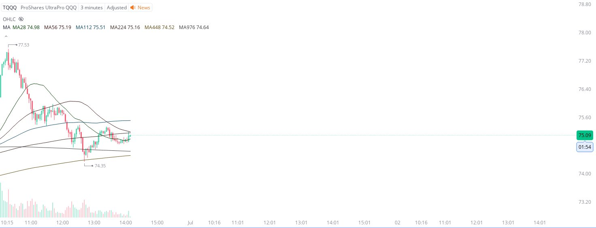

metrics @capture - likes 0 / replies 0 / reposts 0 / quotes 0 / views 0

---

### 66. `1806751905600897223` - 2024-06-28T18:09:56.000Z

All morning Firms were liquidating the NASDAQ and using really advanced signal generation to tell firms they were using this specific SMA outfit to buy the flash/drop.
Only live and in real time could anyone have delineated that information (which I did) and share the buy algo. https://t.co/94l34wROcN

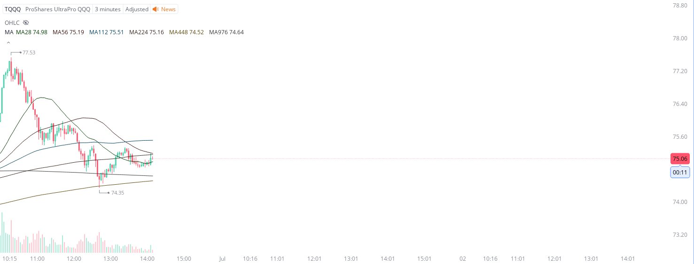

metrics @capture - likes 0 / replies 0 / reposts 0 / quotes 0 / views 0

---

### 67. `1806752161721901253` - 2024-06-28T18:10:57.000Z

I think I really need to emphasize that ALL!!!!!! of these threads literally start at the commencement of their selection in real time. This is a linear and threaded collection of Stock Manipulation happening in real time! https://t.co/0d8uVgrIwX

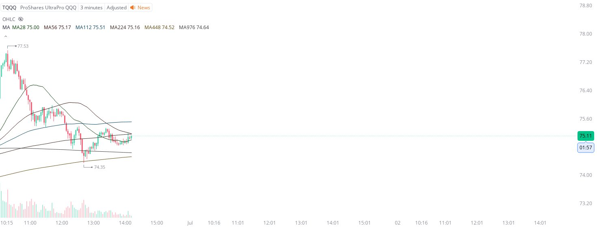

metrics @capture - likes 0 / replies 0 / reposts 0 / quotes 0 / views 0

---

### 68. `1806752608805388660` - 2024-06-28T18:12:44.000Z

I told everyone that Blackrock Citadel Bloomberg etc. have this page on a roster. So just keep that in mind. None of this comes out of thin air, this is advanced signaling work only able to be threaded live, the moment it's happening. https://t.co/MoNpUpWgXh

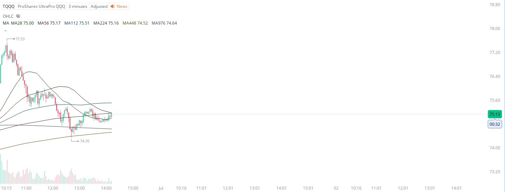

metrics @capture - likes 0 / replies 0 / reposts 0 / quotes 0 / views 0

---

### 69. `1806752900888371310` - 2024-06-28T18:13:54.000Z

So the TQQQ is hitting all of these SMAs on the move higher which means that for every short order laggard firms try to place there, Blackrock Citadel GS will short squeeze them and force them to cover. That's how it works. It's technical and in real time you can see it happen. https://t.co/Wl9MNFTrCl

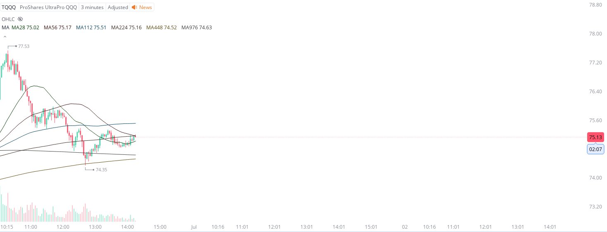

metrics @capture - likes 0 / replies 0 / reposts 0 / quotes 0 / views 0

---

### 70. `1806753104236630496` - 2024-06-28T18:14:42.000Z

My real time threaded $TQQQ at 74.35 . https://t.co/SmClBumnFU

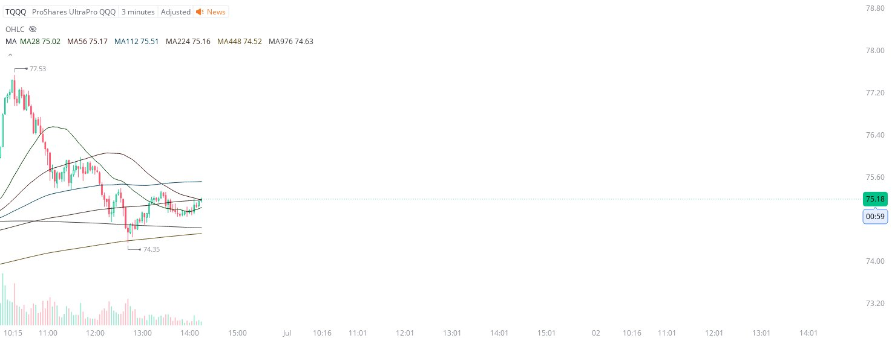

metrics @capture - likes 0 / replies 0 / reposts 0 / quotes 0 / views 0

---

### 71. `1806753231760183774` - 2024-06-28T18:15:12.000Z

My blowout $TQQQ at 74.35 . https://t.co/mktmkejkAr

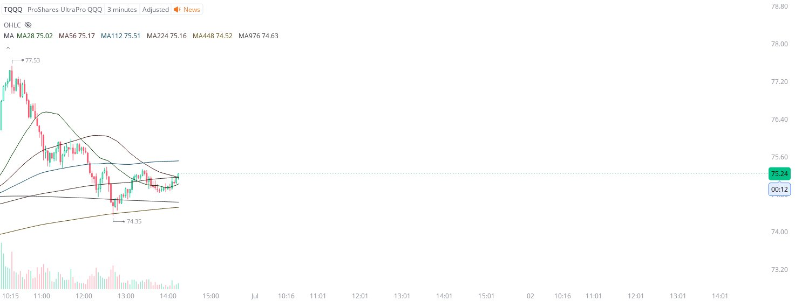

metrics @capture - likes 0 / replies 0 / reposts 0 / quotes 0 / views 0

---

### 72. `1806753472077074672` - 2024-06-28T18:16:10.000Z

This is the final Q2 blowout trading program operated by Citadel Blackrock GS etc. big banks with aggressive trading divisions that maximize on real time intel and budgets and near unlimited capital. https://t.co/YEpW4rRXcs

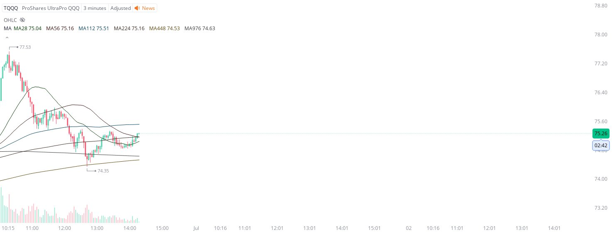

metrics @capture - likes 0 / replies 0 / reposts 0 / quotes 0 / views 0

---

### 73. `1806753735953252650` - 2024-06-28T18:17:13.000Z

My $TQQQ at 74.35 . https://t.co/epMyA4Dc5W

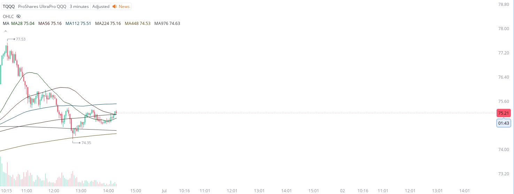

metrics @capture - likes 0 / replies 0 / reposts 0 / quotes 0 / views 0

---

### 74. `1806754622008389809` - 2024-06-28T18:20:44.000Z

I'm going to step aside here and add more context now. Remember that SAME sma outfit operating on the 30s chart I shared earlier? ^ There are four images linked and it was a real time optimization trade? Well take a look at this.  Same outfit/timeframe. The last image is now. https://t.co/jYCulKbInB

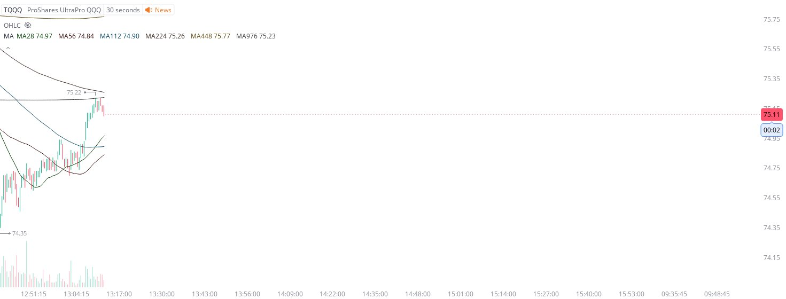

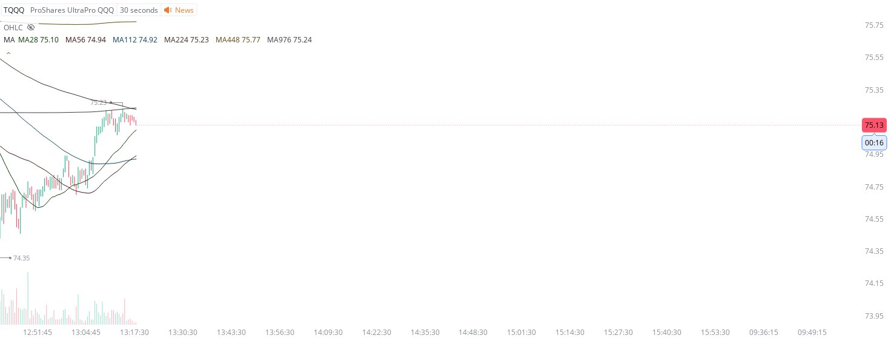

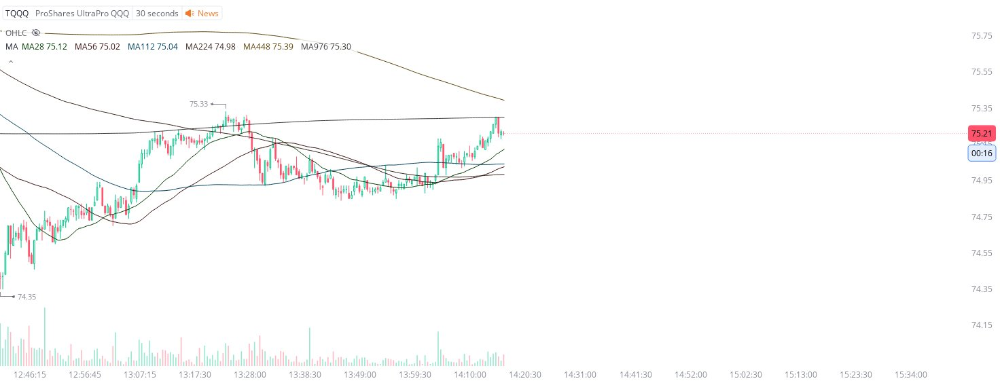

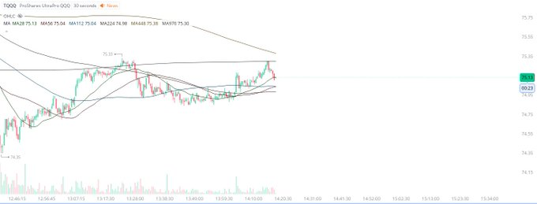

metrics @capture - likes 0 / replies 0 / reposts 0 / quotes 0 / views 0

---
