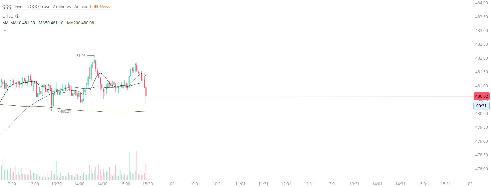

# Case Study #23 - Precision Buy Algorithm

**Archived from:** https://x.com/rauItrades/status/1807859031392018829  
**Post ID:** `1807859031392018829`  
**Posted:** 2024-07-01T19:29:16.000Z  
**Author:** @UnfairMarket (Unfair Market)  
**Thread posts captured:** 1  
**Status:** PARTIAL - conversation reports 2 replies; the public embed endpoint exposes a post's ancestors but not its descendants, so the forward reply chain is not archived.

---

### 1. `1807859031392018829` - 2024-07-01T19:29:16.000Z

Earlier there was precision arbitrage at QQQ's 2m MA200 at 480.21 and those traders are capitalizing on the operation. I'd like to share it here live. It flashed down because of semiconductors taking fire on their daily chart. https://t.co/eDqQgyYQ0g

metrics @capture - likes 0 / replies 0 / reposts 0 / quotes 0 / views 0

---
