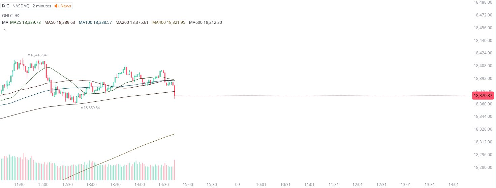
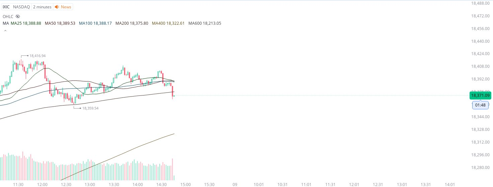

# Case Study #24 - Precision Buy Algorithm

**Archived from:** https://x.com/rauItrades/status/1810385042373480462  
**Post ID:** `1810385042373480462`  
**Posted:** 2024-07-08T18:46:44.000Z  
**Author:** @UnfairMarket (Unfair Market)  
**Thread posts captured:** 3  
**Status:** PARTIAL - conversation reports 2 replies; the public embed endpoint exposes a post's ancestors but not its descendants, so the forward reply chain is not archived.

---

### 1. `1810384461462384758` - 2024-07-08T18:44:25.000Z

They ran out of the NASDAQ once that strike down hit. 
That's how rapid fire arbitrage actually works. https://t.co/cKEiHAcd8F

metrics @capture - likes 0 / replies 0 / reposts 0 / quotes 0 / views 0

---

### 2. `1810384751787934203` - 2024-07-08T18:45:34.000Z

Once their (giant wealth firms) entry breaches, they transition the budgets they have out of public equities and only reward aggressive trading systems that can keep up.
So keep that in mind. It's all about active and rapid real time risk management. https://t.co/rEX3ALjiZV

metrics @capture - likes 0 / replies 0 / reposts 0 / quotes 0 / views 0

---

### 3. `1810385042373480462` - 2024-07-08T18:46:44.000Z

I picked up the NASDAQ, 18,359.54 as risk for a rapid fire trade as it strikes lower here. https://t.co/L9aXlsrYrd

likes @capture 7

---
