# Case Study #2 - Automated Short Orders

**Archived from:** https://x.com/rauItrades/status/1811111465740554585  
**Post ID:** `1811111465740554585`  
**Posted:** 2024-07-10T18:53:16.000Z  
**Author:** @UnfairMarket (Unfair Market)  
**Thread posts captured:** 16  
**Status:** COMPLETE

---

### 1. `1811106996160188797` - 2024-07-10T18:35:31.000Z

I don't like sharing small cap equities because they are extremely manipulated and not made to be gamed but the ticker GME is in fact operating on a high frequency arbitrage selection @

25.16 , GME (144 MA outfit), on the MA144. https://t.co/6sTDACGC1A

metrics @capture - likes 0 / replies 1 / reposts 0 / quotes 0 / views 0

---

### 2. `1811106998009876992` - 2024-07-10T18:35:31.000Z

Firm in intelligence game stocks like this purely to ensure they get the dealing hand in and get to make money on an equity as it tickers side to side during the institutional hour session but this is PURELY for a visual repertoire on how firms profit like this. https://t.co/XGpww5IPRT

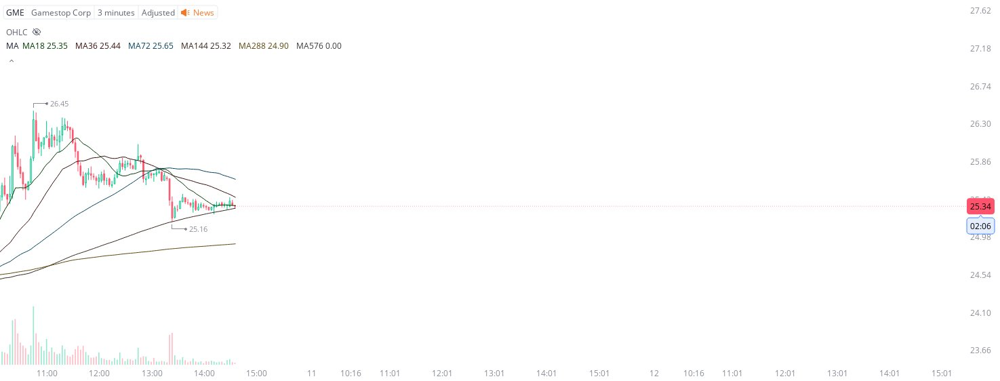

metrics @capture - likes 0 / replies 0 / reposts 0 / quotes 0 / views 0

---

### 3. `1811107168692883549` - 2024-07-10T18:36:12.000Z

The firms who bought Gamestop here?
Already capitalizing on the push.
But I'm documenting $GME live and in real time so everyone can see how. https://t.co/QYvmCdfvkU

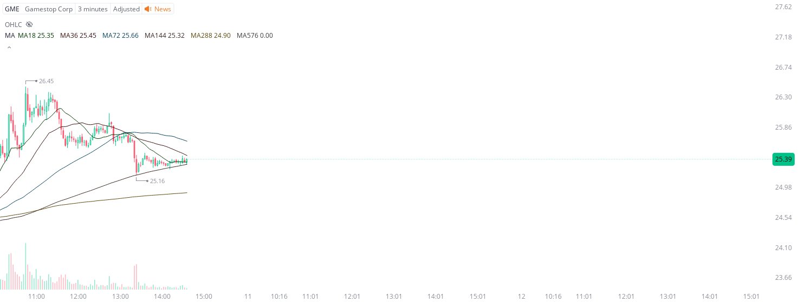

metrics @capture - likes 0 / replies 0 / reposts 0 / quotes 0 / views 0

---

### 4. `1811107506762174583` - 2024-07-10T18:37:33.000Z

I'm NOT here to tell anyone that this is the blowout operation that they are navigating to rip the equity higher. What needs to be observed here is that wealth firms but stocks with to-the-hundredth abject precision and know to liquidate the trade on a penny break.

$GME @ 25.16. https://t.co/ltPAjuiTKX

metrics @capture - likes 0 / replies 0 / reposts 0 / quotes 0 / views 0

---

### 5. `1811107762115670110` - 2024-07-10T18:38:33.000Z

I'm making some here on my real time threaded $GME at exactly 25.16 , but again the difference is that I and other leading financial professionals have all of this work automated, meaning the trade will liquidate on a singular penny break of the operation.
All of this is LIVE. https://t.co/UG8mz0wtlp

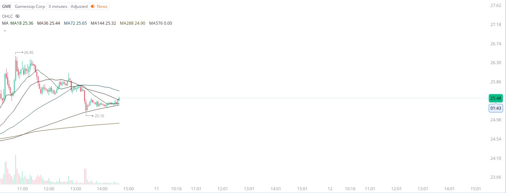

metrics @capture - likes 0 / replies 0 / reposts 0 / quotes 0 / views 2

---

### 6. `1811108079402111028` - 2024-07-10T18:39:49.000Z

I work professionally in a major market division so it's sort of embarrassing threading an equity like Gamestop but I think the clerical aspect of being able to share when precision arbitrage is working like this is core to understand how equities actually work, so, yeah. https://t.co/HxNnVyHhOA

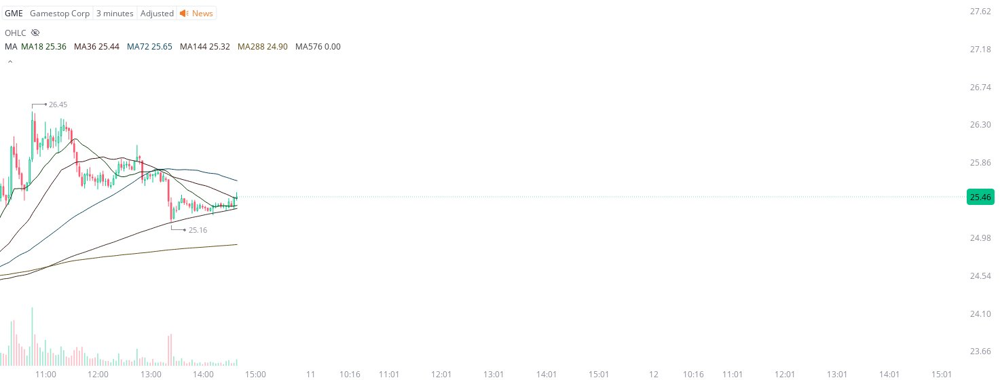

metrics @capture - likes 0 / replies 0 / reposts 0 / quotes 0 / views 0

---

### 7. `1811108615920701905` - 2024-07-10T18:41:57.000Z

There are two things happening right now from this protocol at GME's 3m MA144 @ 25.16 .

The firms who bought at EXACTLY 25.16 are using the SMAs that are trekking down to secure some of the trade, and other firms are hedging it short.
Should be visually clear there. https://t.co/Wpl9rmVtpa

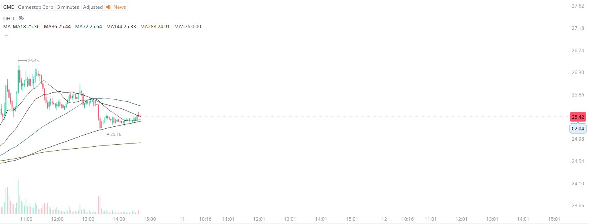

metrics @capture - likes 0 / replies 0 / reposts 0 / quotes 0 / views 0

---

### 8. `1811108913590456458` - 2024-07-10T18:43:08.000Z

Absolutely DO NOT try to replicate these trades. These are professionals and institutionalists at work that have access to darkpool trading platforms and the ability to liquidate a trade on a singular penny break of the entry with zero issue. https://t.co/z5rTFR3jLO

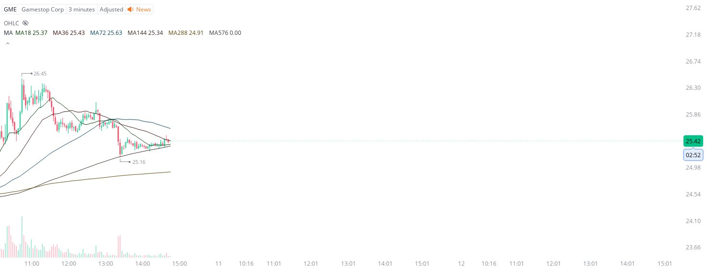

metrics @capture - likes 0 / replies 0 / reposts 0 / quotes 0 / views 0

---

### 9. `1811109333020856460` - 2024-07-10T18:44:48.000Z

The only reason I even considered this operation is because the NASDAQ is skyrocketing and the equity is already up on the institutional hour protocol.  Otherwise you wouldn't catch me dead trying to trade Gamestop. https://t.co/FqqkKOkqPX

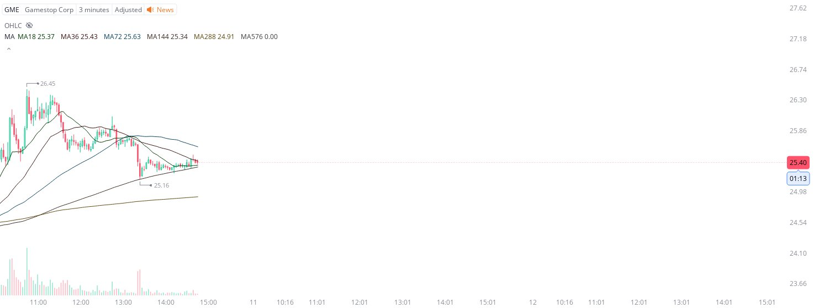

metrics @capture - likes 0 / replies 0 / reposts 0 / quotes 0 / views 0

---

### 10. `1811109891492413920` - 2024-07-10T18:47:01.000Z

This is $GME operating at exactly 25.16 . https://t.co/Va9rdcZSdb

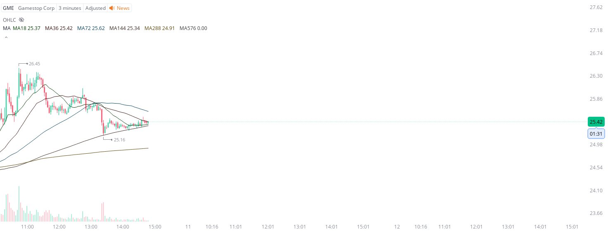

metrics @capture - likes 1 / replies 0 / reposts 0 / quotes 0 / views 39

---

### 11. `1811110395068961072` - 2024-07-10T18:49:01.000Z

When the NASDAQ rips higher like this sometimes they make quick end of session profits on equities already trekking higher for other firms to budget on. It's rare especially at the end of a session but it's just protocol.
Same work year after year. https://t.co/jUPnaKDF0E

metrics @capture - likes 0 / replies 0 / reposts 0 / quotes 0 / views 0

---

### 12. `1811110493953871947` - 2024-07-10T18:49:25.000Z

https://t.co/Ot3JO7i04m

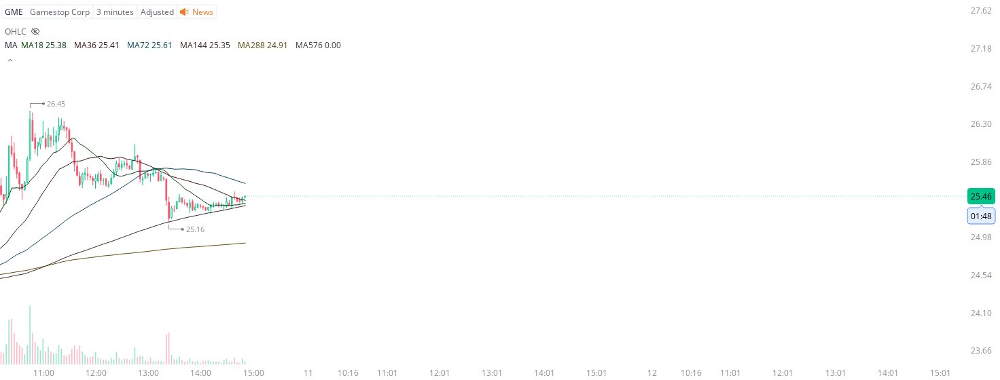

metrics @capture - likes 0 / replies 0 / reposts 0 / quotes 0 / views 2

---

### 13. `1811110841359679718` - 2024-07-10T18:50:48.000Z

Maybe try opening up GME on the [3m MA18 MA36 MA72 MA144 MA288 MA576] and you'd see exactly why this rush higher operated?

It's an organized game that requires astute pattern recognition and the best firms that have the ability to capitalize on it. https://t.co/ZoC9hHpqsg

metrics @capture - likes 0 / replies 0 / reposts 0 / quotes 0 / views 0

---

### 14. `1811111002941050901` - 2024-07-10T18:51:26.000Z

Not in a million years did I think I'd share GME but everyone's detection system was blowing out of the water. https://t.co/ecjmefqSwD

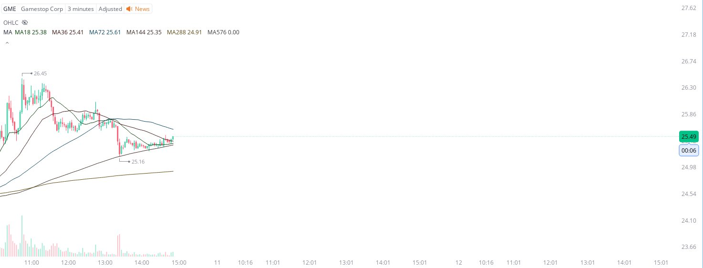

metrics @capture - likes 0 / replies 0 / reposts 0 / quotes 0 / views 0

---

### 15. `1811111061275431297` - 2024-07-10T18:51:40.000Z

My $GME at exactly 25.16 . BOOM! https://t.co/xu5yAmcXLq

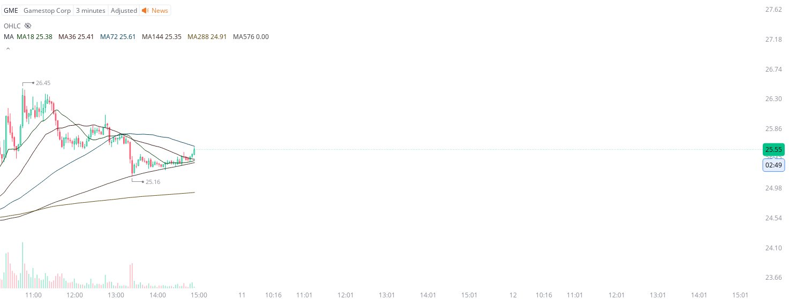

metrics @capture - likes 0 / replies 0 / reposts 0 / quotes 0 / views 0

---

### 16. `1811111465740554585` - 2024-07-10T18:53:16.000Z

Actually incredible. Only LIVE AND IN REAL TIME can you see this [specific equity, specific sma outfit, specific timeframe] operating Gamestop's arbitrage with abject precision.

It just blasted higher to that blue 3m MA72. 
Why? Well there are proper secure profit orders there. https://t.co/Iwyfu0TBMr

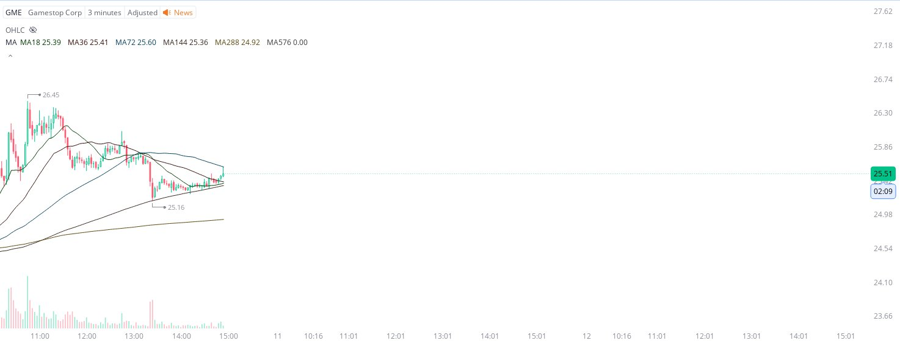

metrics @capture - likes 0 / replies 0 / reposts 0 / quotes 0 / views 0

---
