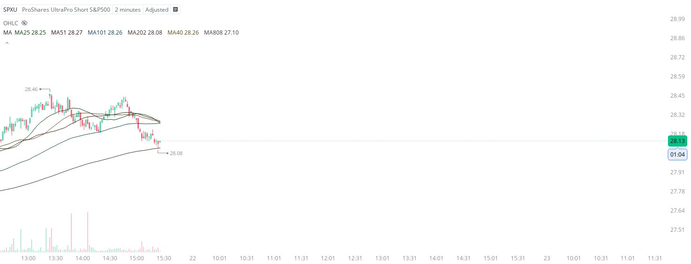

# Case Study #25 - Precision Buy Algorithm

**Archived from:** https://x.com/rauItrades/status/1814382183920050199  
**Post ID:** `1814382183920050199`  
**Posted:** 2024-07-19T19:29:56.000Z  
**Author:** @UnfairMarket (Unfair Market)  
**Thread posts captured:** 1  
**Status:** COMPLETE

---

### 1. `1814382183920050199` - 2024-07-19T19:29:56.000Z

Looks like this is what the final leg consists of.
2m 25 51 101 202 404 808 SPXU
@ MA808, 28.08 .
This is just to document as EOD approaches. https://t.co/JDlYo7dixc

metrics @capture - likes 0 / replies 1 / reposts 0 / quotes 0 / views 0

---
