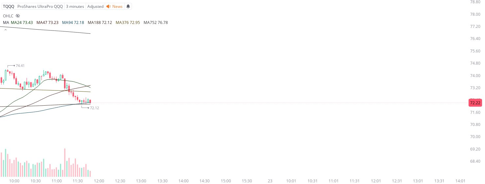

# Case Study #26 - Precision Buy Algorithm

**Archived from:** https://x.com/rauItrades/status/1815414234634977687  
**Post ID:** `1815414234634977687`  
**Posted:** 2024-07-22T15:50:56.000Z  
**Author:** @UnfairMarket (Unfair Market)  
**Thread posts captured:** 1  
**Status:** PARTIAL - conversation reports 2 replies; the public embed endpoint exposes a post's ancestors but not its descendants, so the forward reply chain is not archived.

---

### 1. `1815414234634977687` - 2024-07-22T15:50:56.000Z

TQQQ 72.12 .
3m MA188
47 outfit, it's rapid work here but worth documenting.
Only issue is that the system is negative and it's rapid fire arbitrage. https://t.co/GQJ5nv4iJq

metrics @capture - likes 0 / replies 1 / reposts 0 / quotes 0 / views 0

---
