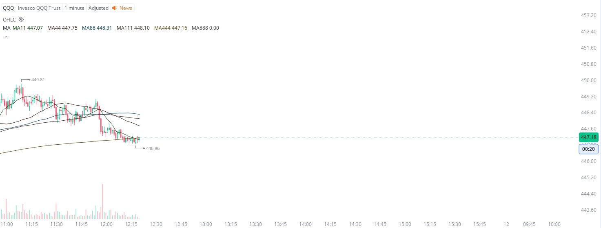

# Case Study #2 - Optimized Buying Algorithms

**Archived from:** https://x.com/rauItrades/status/1821944746127831132  
**Post ID:** `1821944746127831132`  
**Posted:** 2024-08-09T16:20:52.000Z  
**Author:** @UnfairMarket (Unfair Market)  
**Thread posts captured:** 1  
**Status:** PARTIAL - conversation reports 2 replies; the public embed endpoint exposes a post's ancestors but not its descendants, so the forward reply chain is not archived.

---

### 1. `1821944746127831132` - 2024-08-09T16:20:52.000Z

I picked up the NASDAQ.
QQQ at the 1m MA444 has magnetized orders I'm betting on. The operation started at 448.86 .
The parameter adjustment [optimization] is that there are magnetized orders on that parameter. https://t.co/yJSOXSKkje

metrics @capture - likes 0 / replies 0 / reposts 0 / quotes 0 / views 0

---
