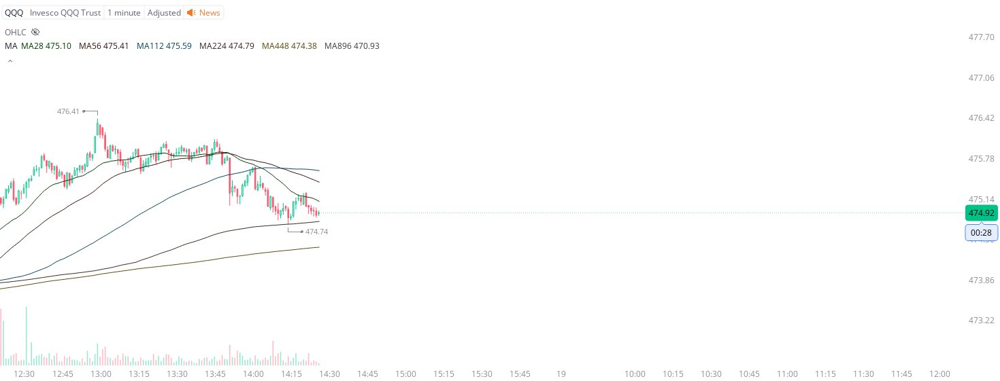

# Case Study #27 - Precision Buy Algorithm

**Archived from:** https://x.com/rauItrades/status/1824513003234226409  
**Post ID:** `1824513003234226409`  
**Posted:** 2024-08-16T18:26:12.000Z  
**Author:** @UnfairMarket (Unfair Market)  
**Thread posts captured:** 1  
**Status:** PARTIAL - conversation reports 4 replies; the public embed endpoint exposes a post's ancestors but not its descendants, so the forward reply chain is not archived.

---

### 1. `1824513003234226409` - 2024-08-16T18:26:12.000Z

I was asked about what's going on with the NASDAQ right now.
It's the 56, Speaker of the House outfit. 
1M MA224, 474.74 .
I'm just sharing this for context. This is what high frequency arbitrage entails after firms have already made massive profit higher in the stock market. https://t.co/HyqYFONChp

metrics @capture - likes 0 / replies 0 / reposts 0 / quotes 0 / views 0

---
