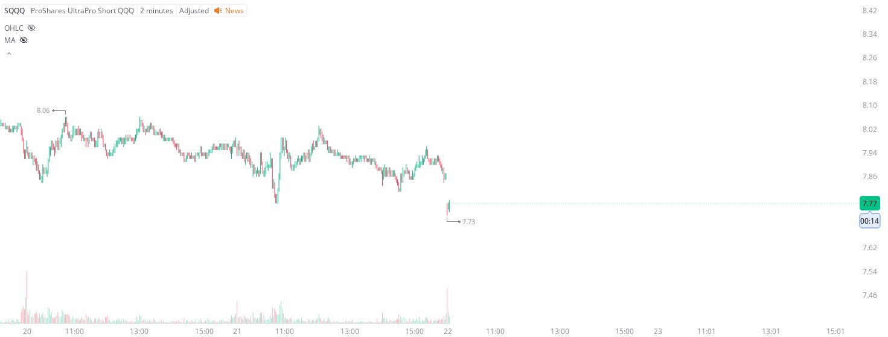

# Case Study #3 - Optimized Buying Algorithms

**Archived from:** https://x.com/rauItrades/status/1826614964129554523  
**Post ID:** `1826614964129554523`  
**Posted:** 2024-08-22T13:38:38.000Z  
**Author:** @UnfairMarket (Unfair Market)  
**Thread posts captured:** 1  
**Status:** PARTIAL - conversation reports 7 replies; the public embed endpoint exposes a post's ancestors but not its descendants, so the forward reply chain is not archived.

---

### 1. `1826614964129554523` - 2024-08-22T13:38:38.000Z

Right here, live and in real time, firms are using their signal generation time-series processing data to signal the integer 7.77 on the SQQQ.
So I went long, $SQQQ with the low as risk.
I will cut/exit the trade on a singular penny break. https://t.co/Fp5FzvQyEH

metrics @capture - likes 0 / replies 0 / reposts 0 / quotes 0 / views 0

---
