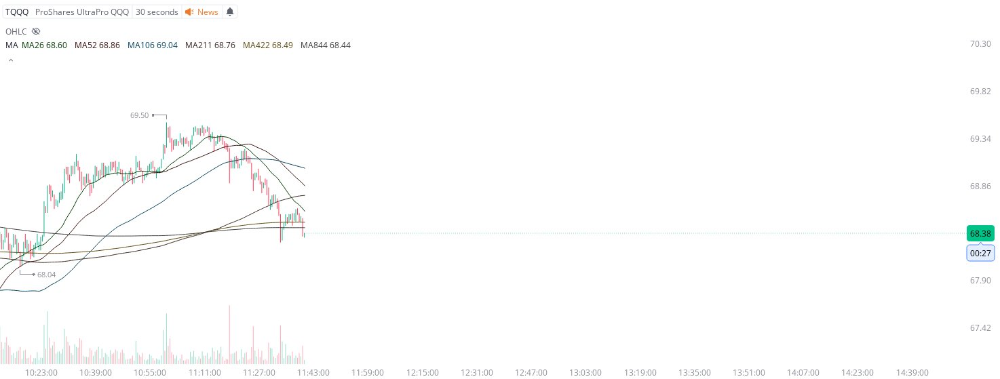

# Case Study #28 - Precision Buy Algorithm

**Archived from:** https://x.com/rauItrades/status/1828458249819140212  
**Post ID:** `1828458249819140212`  
**Posted:** 2024-08-27T15:43:12.000Z  
**Author:** @UnfairMarket (Unfair Market)  
**Thread posts captured:** 3  
**Status:** COMPLETE

---

### 1. `1828454173874303382` - 2024-08-27T15:27:00.000Z

this is a post for those who care to look at the work and information themselves. if you have the tabulated grid to look at sma outfits go ahead and check out the new svix outfit on ixic, 26/52/106/211/422/844, you'll see on multiple timeframes that there is arbitrage operating.

metrics @capture - likes 0 / replies 0 / reposts 0 / quotes 0 / views 0

---

### 2. `1828454968896167993` - 2024-08-27T15:30:10.000Z

sadly it's super skewed [so that other detection systems don't execute on it] but as the ixic made an apex there, at specifically the 211/422/844 it kept stalling-- disproportionate to any other outfit/timeframes [2m/3m] or equity vehicle. just fyi. eventually i'll share it.

metrics @capture - likes 0 / replies 0 / reposts 0 / quotes 0 / views 0

---

### 3. `1828458249819140212` - 2024-08-27T15:43:12.000Z

I picked up the TQQQ. 
68.04 is where some firms picked up the NASDAQ's TQQQ, with 68.04 as risk.

30s MA52 is where the high frequency selection commenced.
I will cut/liquidate/dispose the trade on a singular penny break of the selection of TQQQ @ 68.04 . https://t.co/I73qOKnk3k

metrics @capture - likes 0 / replies 0 / reposts 0 / quotes 0 / views 0

---
