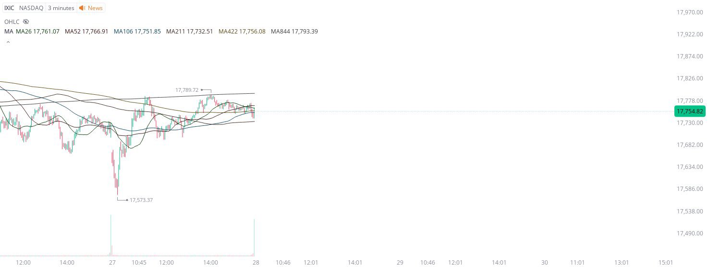

# Case Study #3 - Automated Short Orders

**Archived from:** https://x.com/rauItrades/status/1828533657545638205  
**Post ID:** `1828533657545638205`  
**Posted:** 2024-08-27T20:42:51.000Z  
**Author:** @UnfairMarket (Unfair Market)  
**Thread posts captured:** 1  
**Status:** PARTIAL - conversation reports 4 replies; the public embed endpoint exposes a post's ancestors but not its descendants, so the forward reply chain is not archived.

---

### 1. `1828533657545638205` - 2024-08-27T20:42:51.000Z

Someone who keeps up with this page. 
Wonder how they knew the MA844 on the Nasdaq composite was ‘resistance’ during today’s institutional hour session.
Well that’s just good data analytics. How else could they have called the apex of 17,789 ? Rhetorical.
We all knew in advance. https://t.co/wskhyMPu4H

metrics @capture - likes 0 / replies 0 / reposts 0 / quotes 0 / views 0

---
