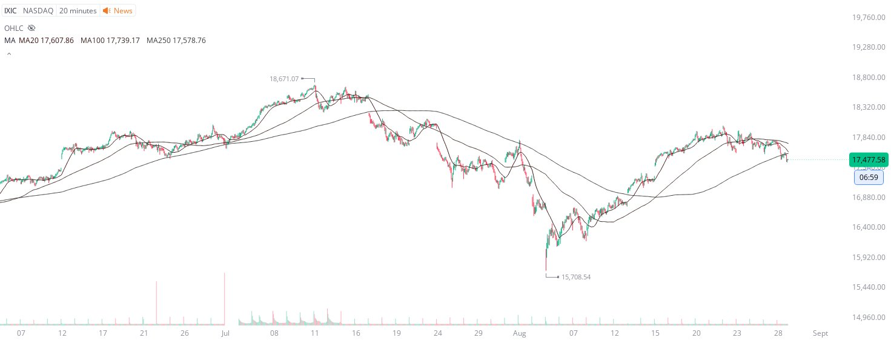

# Case Study #4 - Optimized Buying Algorithms

**Archived from:** https://x.com/rauItrades/status/1828864244819095888  
**Post ID:** `1828864244819095888`  
**Posted:** 2024-08-28T18:36:29.000Z  
**Author:** @UnfairMarket (Unfair Market)  
**Thread posts captured:** 1  
**Status:** PARTIAL - conversation reports 4 replies; the public embed endpoint exposes a post's ancestors but not its descendants, so the forward reply chain is not archived.

---

### 1. `1828864244819095888` - 2024-08-28T18:36:29.000Z

This is the NASDAQ's System.
Since the SVIX is in an uptrend, the parameter set for the [NASDAQ System] is [Buying when ma100 is above the ma250].
Another reason I have bought the TQQQ on the drop going into NVDA's Earnings. https://t.co/PctqOCINr6

likes @capture 39

---
