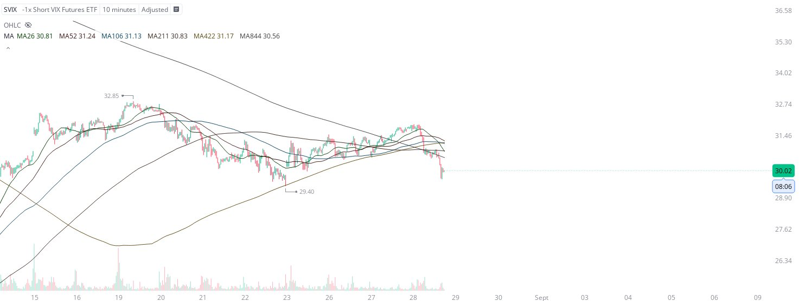
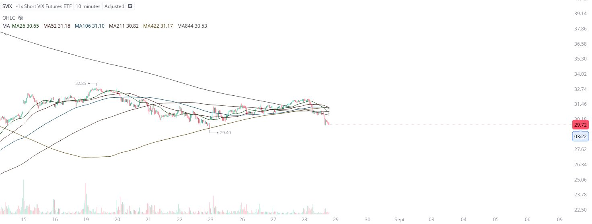
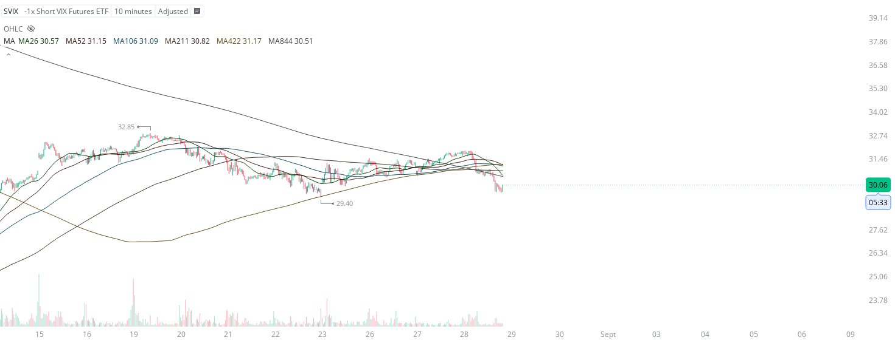

# Case Study #29 - Precision Buy Algorithm

**Archived from:** https://x.com/rauItrades/status/1828868949095883126  
**Post ID:** `1828868949095883126`  
**Posted:** 2024-08-28T18:55:10.000Z  
**Author:** @UnfairMarket (Unfair Market)  
**Thread posts captured:** 3  
**Status:** PARTIAL - conversation reports 2 replies; the public embed endpoint exposes a post's ancestors but not its descendants, so the forward reply chain is not archived.

---

### 1. `1828861037996847259` - 2024-08-28T18:23:44.000Z

I think buying the SVIX on this drop while this SMA outfit is active is going to be one of my best calls of the year.
I plan on holding. This is all in anticipation of NVDA's buy algo after hours.
SVIX @ 29.40 . https://t.co/EgGWtRRQfN

metrics @capture - likes 0 / replies 0 / reposts 0 / quotes 0 / views 0

---

### 2. `1828867095553290689` - 2024-08-28T18:47:48.000Z

This of course, is the SVIX operating at precisely  29.40 .
I have adjusted the price scale for when it blows up higher tomorrow. https://t.co/ylMZWUcx7m

metrics @capture - likes 2 / replies 0 / reposts 1 / quotes 0 / views 30

---

### 3. `1828868949095883126` - 2024-08-28T18:55:10.000Z

I bought the $SVIX on the drop.
This work is all threaded live and in real time.
SVIX @ 29.40 . https://t.co/TK20WgvoSo

likes @capture 4

---
