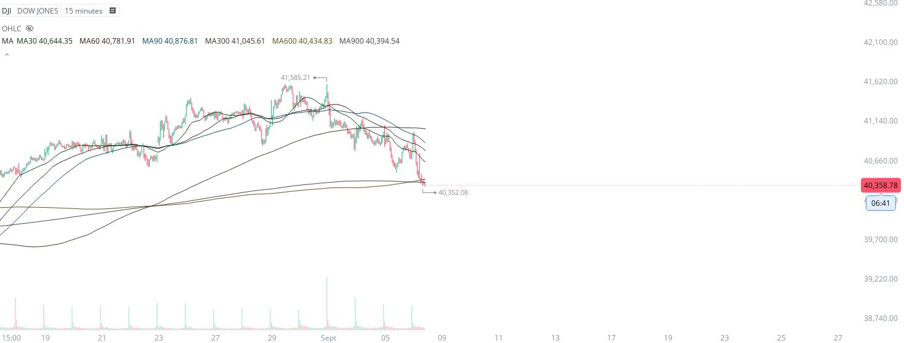

# Case Study #5 - Optimized Buying Algorithms

**Archived from:** https://x.com/rauItrades/status/1832092949821419752  
**Post ID:** `1832092949821419752`  
**Posted:** 2024-09-06T16:26:12.000Z  
**Author:** @UnfairMarket (Unfair Market)  
**Thread posts captured:** 1  
**Status:** PARTIAL - conversation reports 4 replies; the public embed endpoint exposes a post's ancestors but not its descendants, so the forward reply chain is not archived.

---

### 1. `1832092949821419752` - 2024-09-06T16:26:12.000Z

This is the Dow's last shot on its proprietary system. 15M 30/60/90/300/600/900 .
Fingers crossed this is just a DJI System operation controlling equities into the close. https://t.co/iR5i2IcAO2

metrics @capture - likes 0 / replies 0 / reposts 0 / quotes 0 / views 0

---
