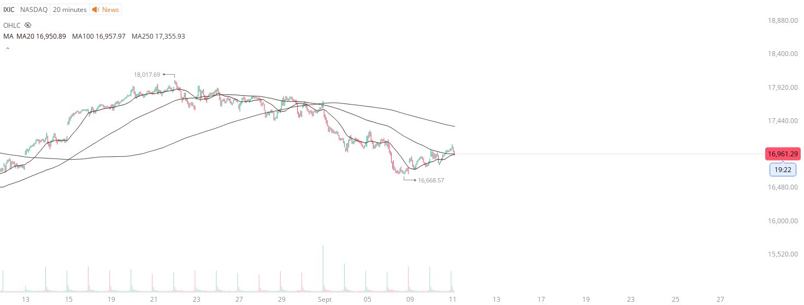

# Case Study #6 - Optimized Buying Algorithms

**Archived from:** https://x.com/rauItrades/status/1833869111249830387  
**Post ID:** `1833869111249830387`  
**Posted:** 2024-09-11T14:04:02.000Z  
**Author:** @UnfairMarket (Unfair Market)  
**Thread posts captured:** 1  
**Status:** PARTIAL - conversation reports 3 replies; the public embed endpoint exposes a post's ancestors but not its descendants, so the forward reply chain is not archived.

---

### 1. `1833869111249830387` - 2024-09-11T14:04:02.000Z

I was asked about why the S&amp;P still has support.
Even though the DJI dropped like a rock after it enabled a move higher in the major market this week.
Well right now, being tested, is the NASDAQ's 20M MA100.
That's a line in the sand on this drop for equities to go up. https://t.co/KGc2CjCUl6

metrics @capture - likes 1 / replies 0 / reposts 0 / quotes 0 / views 0

---
