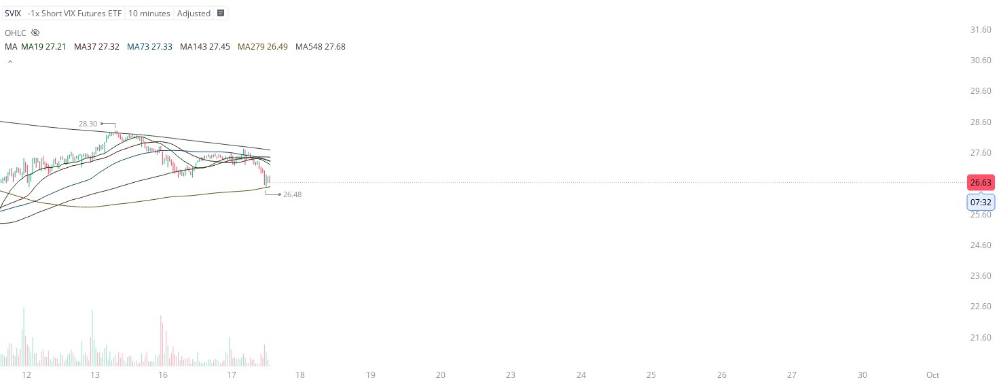

# Case Study #30 - Precision Buy Algorithm

**Archived from:** https://x.com/rauItrades/status/1836091941202858086  
**Post ID:** `1836091941202858086`  
**Posted:** 2024-09-17T17:16:46.000Z  
**Author:** @UnfairMarket (Unfair Market)  
**Thread posts captured:** 1  
**Status:** PARTIAL - conversation reports 3 replies; the public embed endpoint exposes a post's ancestors but not its descendants, so the forward reply chain is not archived.

---

### 1. `1836091941202858086` - 2024-09-17T17:16:46.000Z

This is the $SVIX operating on the 10M Waring's Problem SMA outfit on this volatile drop across the major market.
SVIX at 26.48.
SVIX -1X Short VIX Futures ETF 10m MA279.
MA279:26.47
Selection, SVIX 26.48.
[.01 difference to outperform detection systems]. https://t.co/ZSw07biFlC

metrics @capture - likes 0 / replies 0 / reposts 0 / quotes 0 / views 0

---
