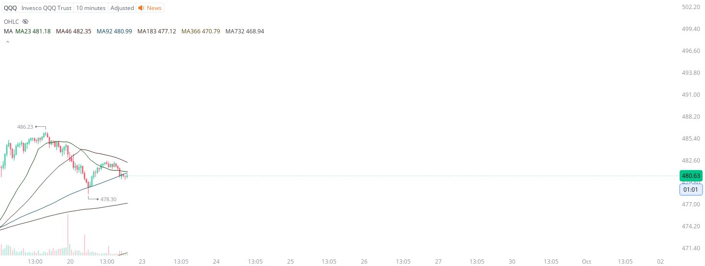

# Case Study #7 - Optimized Buying Algorithms

**Archived from:** https://x.com/rauItrades/status/1837202985765531734  
**Post ID:** `1837202985765531734`  
**Posted:** 2024-09-20T18:51:40.000Z  
**Author:** @UnfairMarket (Unfair Market)  
**Thread posts captured:** 1  
**Status:** PARTIAL - conversation reports 3 replies; the public embed endpoint exposes a post's ancestors but not its descendants, so the forward reply chain is not archived.

---

### 1. `1837202985765531734` - 2024-09-20T18:51:40.000Z

This is rather hard to organize and define for most people that only care about the visually concise and streamlined SMA outfit protocols that are bought on the exact drop.
But this volatile drop and on the [366] outfit is where banks are working the NASDAQ.
TQQQ @ 478.30 . https://t.co/fn1iptwgXh

metrics @capture - likes 0 / replies 0 / reposts 0 / quotes 0 / views 3

---
