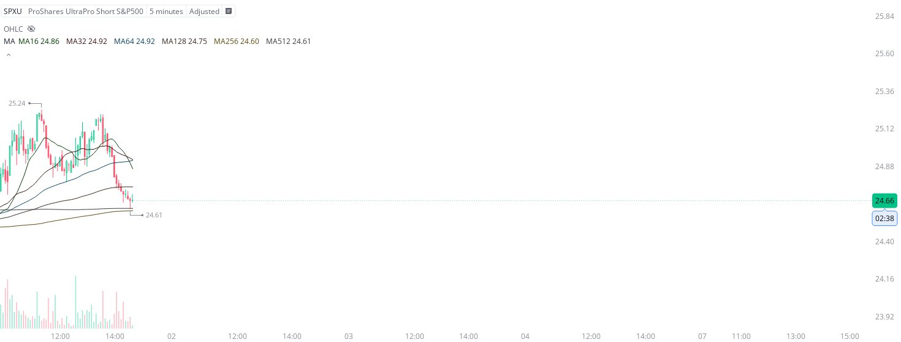

# Case Study #31 - Precision Buy Algorithm

**Archived from:** https://x.com/rauItrades/status/1841185720612110398  
**Post ID:** `1841185720612110398`  
**Posted:** 2024-10-01T18:37:38.000Z  
**Author:** @UnfairMarket (Unfair Market)  
**Thread posts captured:** 1  
**Status:** PARTIAL - conversation reports 5 replies; the public embed endpoint exposes a post's ancestors but not its descendants, so the forward reply chain is not archived.

---

### 1. `1841185720612110398` - 2024-10-01T18:37:38.000Z

SPXU 24.61  . 5M MA512 .
That's my risk. Think I found it. https://t.co/Zrf0GJDKoQ

metrics @capture - likes 0 / replies 0 / reposts 0 / quotes 0 / views 0

---
