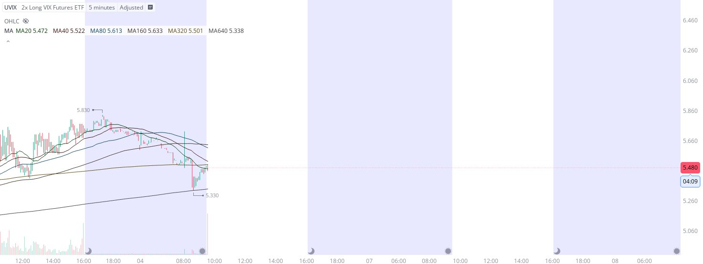

# Case Study #32 - Precision Buy Algorithm

**Archived from:** https://x.com/rauItrades/status/1842195776489066924  
**Post ID:** `1842195776489066924`  
**Posted:** 2024-10-04T13:31:14.000Z  
**Author:** @UnfairMarket (Unfair Market)  
**Thread posts captured:** 1  
**Status:** PARTIAL - conversation reports 2 replies; the public embed endpoint exposes a post's ancestors but not its descendants, so the forward reply chain is not archived.

---

### 1. `1842195776489066924` - 2024-10-04T13:31:14.000Z

NASDAQ's respective integer 20.
Extended hour session is recording the program on the UVIX in the extended hour session.
2x Long VIX Futures ETF.
I speculated long at 5.330 .
5M [20 40 80 160 320 640].
5.330 as risk. https://t.co/h14LsnW1Ca

metrics @capture - likes 0 / replies 0 / reposts 0 / quotes 0 / views 0

---
