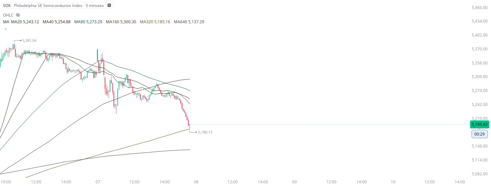

# Case Study #34 - Precision Buy Algorithm

**Archived from:** https://x.com/rauItrades/status/1876730644643877321  
**Post ID:** `1876730644643877321`  
**Posted:** 2025-01-07T20:40:28.000Z  
**Author:** @UnfairMarket (Unfair Market)  
**Thread posts captured:** 1  
**Status:** PARTIAL - conversation reports 2 replies; the public embed endpoint exposes a post's ancestors but not its descendants, so the forward reply chain is not archived.

---

### 1. `1876730644643877321` - 2025-01-07T20:40:28.000Z

I'm trading aggressively today. Picked up SOX on the IXIC, integer 20 outfit] 5M MA320]. 5186 as risk. I will cut on the singular point break. https://t.co/2Yy5aXzC1h

metrics @capture - likes 0 / replies 0 / reposts 0 / quotes 0 / views 0

---
