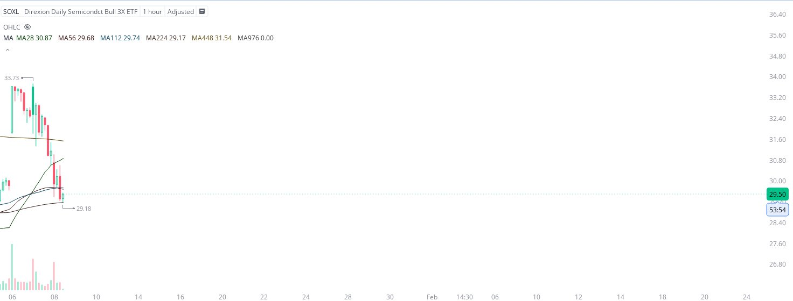

# Case Study #33 - Precision Buy Algorithm

**Archived from:** https://x.com/rauItrades/status/1877047004276080858  
**Post ID:** `1877047004276080858`  
**Posted:** 2025-01-08T17:37:34.000Z  
**Author:** @UnfairMarket (Unfair Market)  
**Thread posts captured:** 1  
**Status:** PARTIAL - conversation reports 2 replies; the public embed endpoint exposes a post's ancestors but not its descendants, so the forward reply chain is not archived.

---

### 1. `1877047004276080858` - 2025-01-08T17:37:34.000Z

Figured it out.
Tariffs report led into semiconductors and China.
This is the XI SMA Outfit, PRC.
28 56 112 224 448 976. SOXL at 29.18 . https://t.co/IjNDOxcsw6

metrics @capture - likes 0 / replies 0 / reposts 0 / quotes 0 / views 0

---
