# Case Study #8 - Optimized Buying Algorithms

**Archived from:** https://x.com/rauItrades/status/1878828879642779906  
**Post ID:** `1878828879642779906`  
**Posted:** 2025-01-13T15:38:06.000Z  
**Author:** @UnfairMarket (Unfair Market)  
**Thread posts captured:** 33  
**Status:** PARTIAL - conversation reports 2 replies; the public embed endpoint exposes a post's ancestors but not its descendants, so the forward reply chain is not archived.

---

### 1. `1877736761671172278` - 2025-01-10T15:18:25.000Z

Every program propping the U.S. Stock Market higher for the fortnight has slipped which means firms are adjusting their risk basis.
If you were to take a look at live time series data, you'd also see the QQQ 1H MA512 being selected.
I bought the NASDAQ's QQQ with 503.92 as risk. https://t.co/A6M5l2clJJ

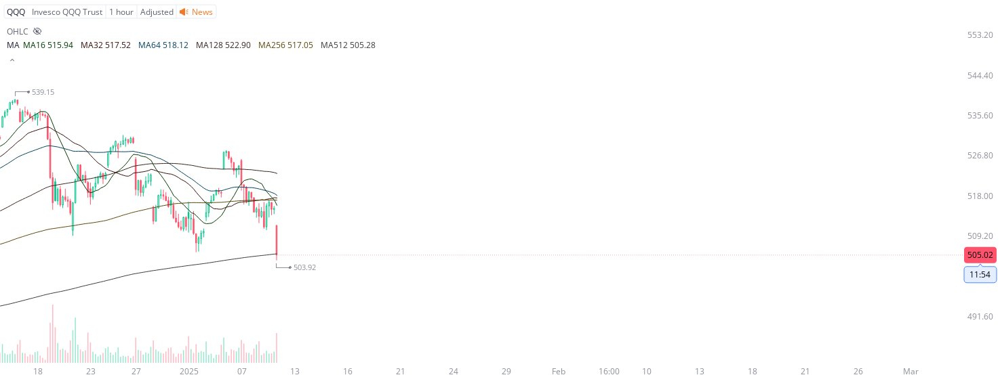

metrics @capture - likes 0 / replies 0 / reposts 0 / quotes 0 / views 0

---

### 2. `1877737411687387517` - 2025-01-10T15:21:00.000Z

The reason I bought the NASDAQ QQQ here with 503.92 as risk is because earlier equities traded down using the [1H] programs on the [Xi Outfit].
Fingers crossed it's all about real time, time series, analysis based on the [Same timeframe, 1H] on the [Binary outfit]. https://t.co/Z8QZ4YXMsK

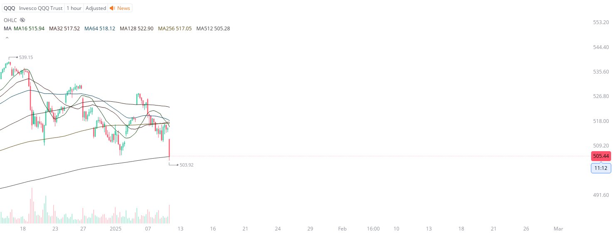

metrics @capture - likes 2 / replies 0 / reposts 0 / quotes 0 / views 0

---

### 3. `1877738067840143557` - 2025-01-10T15:23:36.000Z

The technical 'at a glance' aspect here is that the QQQ's live, and real time, price action traded disproportionately longer the [QQQ 1H MA512] parameter.
QQQ at 503.92 . https://t.co/sGCYSBnutM

metrics @capture - likes 0 / replies 0 / reposts 0 / quotes 0 / views 0

---

### 4. `1877738296924618828` - 2025-01-10T15:24:31.000Z

If you were to record and compartmentalize that specific data, rank it, the millisecond based time ranking would have recorded the integer 503.92 disproportionately.
That's what 'time series analysis' means here and why I bought the NASDAQ on the drop with 503.92 as risk. https://t.co/NeWGFkYYLe

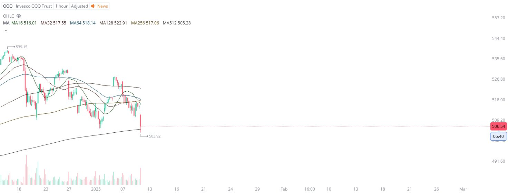

metrics @capture - likes 0 / replies 0 / reposts 0 / quotes 0 / views 0

---

### 5. `1877739064482541972` - 2025-01-10T15:27:34.000Z

In order, the correction looked like this:

- System test [major market]
- Price Outfit selections into the drop [individual equities]
- Time Series Program [now]

That's all going on here and it's part of a rotating, precise, organization model firms use to navigate equities. https://t.co/QeLoKlUm1C

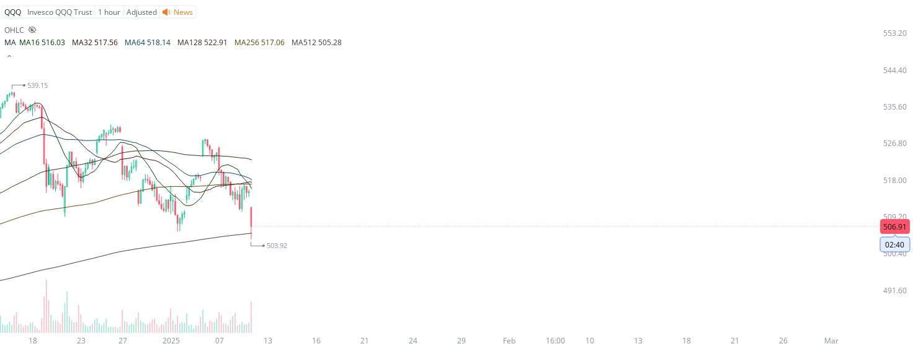

metrics @capture - likes 0 / replies 0 / reposts 0 / quotes 0 / views 0

---

### 6. `1877739503881949280` - 2025-01-10T15:29:19.000Z

My QQQ at 503.92 .

Every other trade I've made this week has washed out because of that ^ . It's just how the U.S. Stock Market is modeled and organized for only top notch, aggressive, firms to adequately capitalize on moves massive moves in the market. Not fair but it's real. https://t.co/4QKFr6WX49

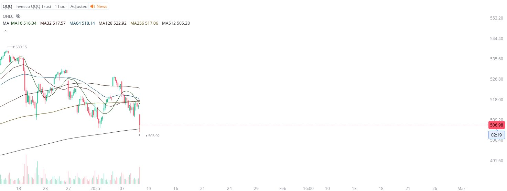

metrics @capture - likes 0 / replies 0 / reposts 0 / quotes 0 / views 2

---

### 7. `1877740120608067820` - 2025-01-10T15:31:46.000Z

The NASDAQ being selected/bought at 503.92 is because leading wealth firms covered their short, and live and in real time placed a time series signal on the [1H MA512] to let other firms know they were betting 'long' the QQQ. That is how firms creatively evade regulatory capture. https://t.co/O2UhJ3OhUg

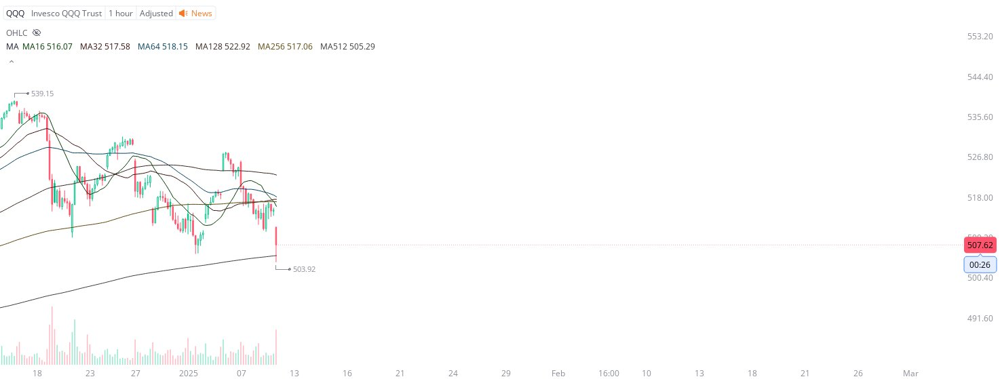

likes @capture 13

---

### 8. `1877740610347557127` - 2025-01-10T15:33:42.000Z

I think the info above is enough to get the technical points necessary to communicate this out of the way so I will not ramble. This is just the sequential part of what makes finance so well crafted, organized, and not just a massive guessing game of risk.

My QQQ at 503.92 . https://t.co/5yQUo0ZQMD

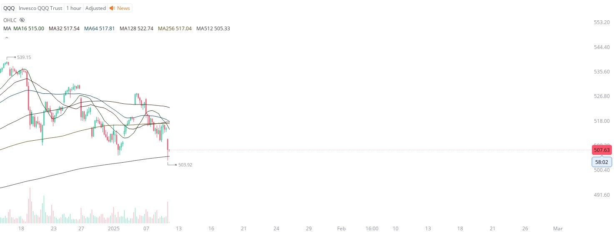

metrics @capture - likes 0 / replies 0 / reposts 0 / quotes 0 / views 0

---

### 9. `1877740727222108538` - 2025-01-10T15:34:10.000Z

https://t.co/3jNRNwaZZz

metrics @capture - likes 0 / replies 0 / reposts 0 / quotes 0 / views 0

---

### 10. `1877741458473783502` - 2025-01-10T15:37:05.000Z

So the U.S. Stock Market bounce.
Not much to go over than the order of things here.
The major market had its systems get tested, on the downtrot semiconductors and the Nasdaq operated on the one hour chart outfits, the Xi one because of the tariff report.
Then today, now, this. https://t.co/JS8cJzFXoX

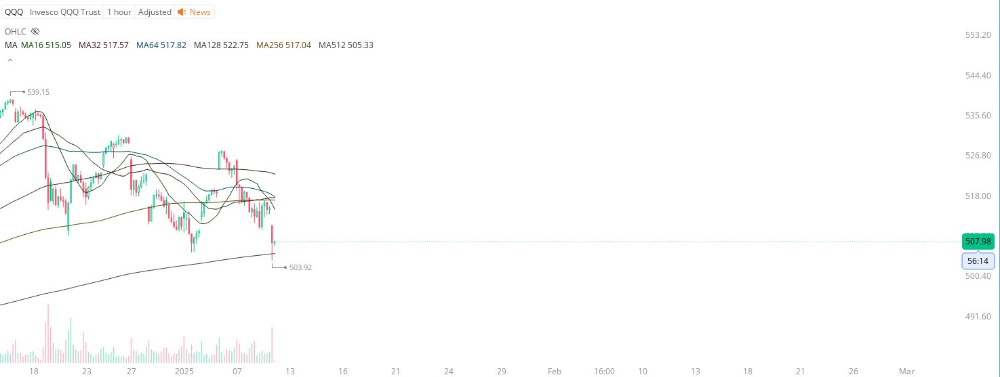

likes @capture 12

---

### 11. `1877742165335355789` - 2025-01-10T15:39:53.000Z

To really make sure I am communicating this information correctly, the 'signal' that firms were covering their short profit [in real time] was that the Nasdaq's QQQ ... what I am showing here ... recorded a disproportionate amount of time being recorded at the [1H MA512 505.28]. https://t.co/6FMEqQ3Wr7

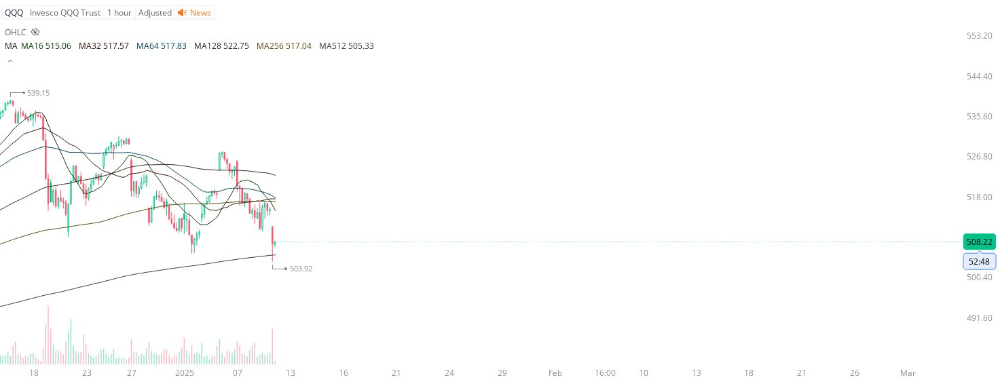

likes @capture 13

---

### 12. `1877742637014450607` - 2025-01-10T15:41:46.000Z

And only to those firms who tabulate that specific information, time-series analysis, would they have known to purchase the NASDAQ's QQQ at lows and place a hard-stop order, or risk, the price dropping down to 503.92 .

I think that's about as complicated as the market ever gets. https://t.co/HfxGskyQst

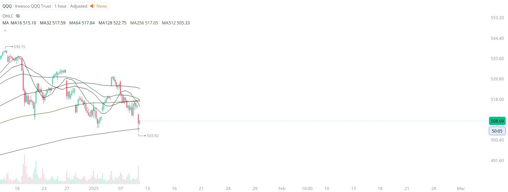

metrics @capture - likes 2 / replies 0 / reposts 0 / quotes 0 / views 0

---

### 13. `1877743098735870035` - 2025-01-10T15:43:36.000Z

This is my real time and threaded QQQ bet at 503.92 . https://t.co/4plee86qKw

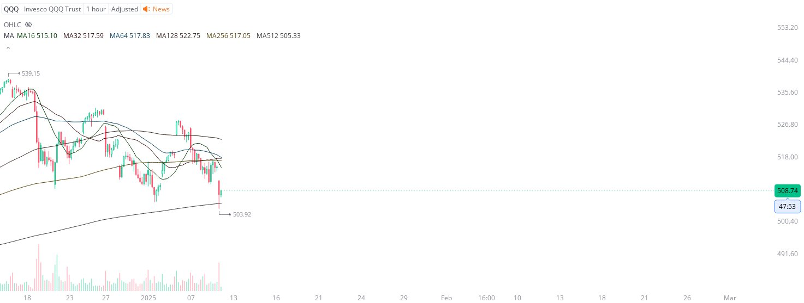

likes @capture 10

---

### 14. `1877744139925869033` - 2025-01-10T15:47:44.000Z

This is my real time and threaded, QQQ bet at 503.92 . https://t.co/y1FO7qY5CU

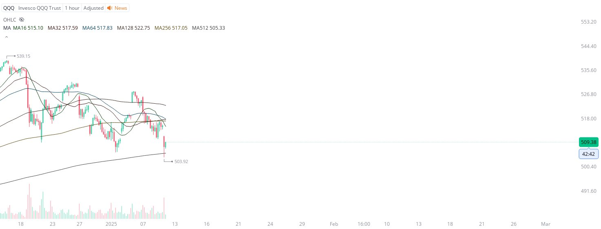

likes @capture 13

---

### 15. `1877755148006572512` - 2025-01-10T16:31:28.000Z

QQQ at 503.92 . https://t.co/T4MZB2vNil

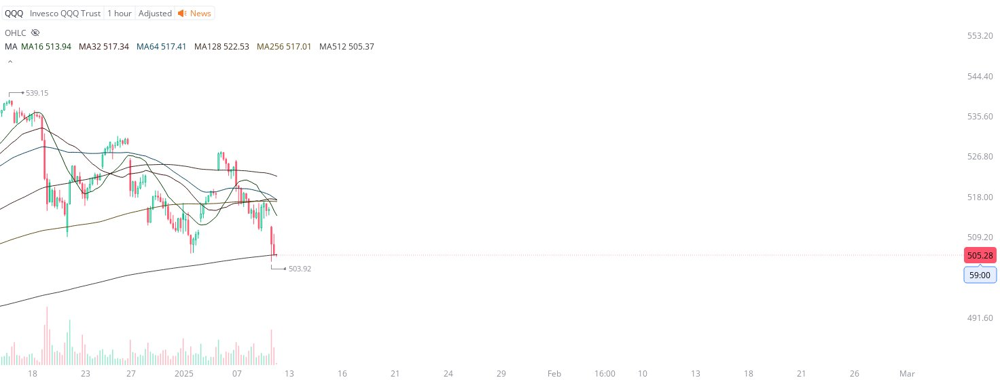

likes @capture 6

---

### 16. `1877755491507716211` - 2025-01-10T16:32:50.000Z

QQQ at 503.92 .
Tremendous volatility here at lows. https://t.co/aQmOYA5r2W

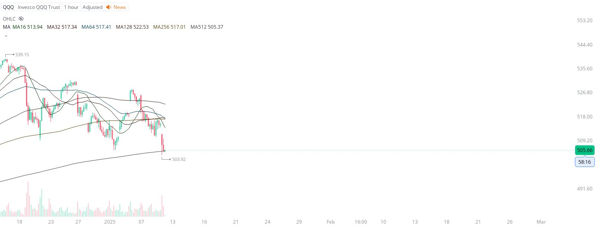

likes @capture 7

---

### 17. `1877757582305075557` - 2025-01-10T16:41:09.000Z

This is my QQQ bet at 503.92 . https://t.co/GIOAHEmYU5

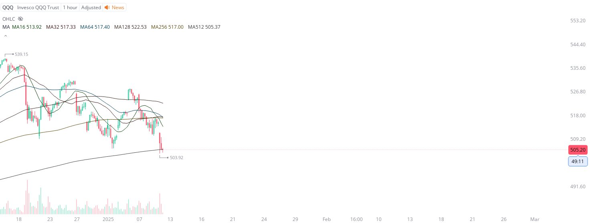

likes @capture 2

---

### 18. `1877757823159078943` - 2025-01-10T16:42:06.000Z

QQQ at 503.92 .
All of this information is threaded live and in real time. https://t.co/6l2NHwc6op

metrics @capture - likes 0 / replies 0 / reposts 0 / quotes 0 / views 0

---

### 19. `1877758560148304086` - 2025-01-10T16:45:02.000Z

This is my real time and threaded QQQ at 503.92 . https://t.co/t37UCJa6ku

likes @capture 6

---

### 20. `1877768827036905861` - 2025-01-10T17:25:50.000Z

So here is my threaded, real time QQQ call at 503.92. Things to recall.
- This entire program commenced at 503.92
- Banks, leading trading divisions, have had their hard stop order there on the singular penny break of 503.92
- The QQQ has survived its maker by holding higher. https://t.co/MY82qZFgDx

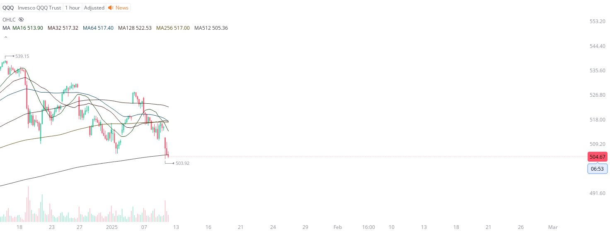

metrics @capture - likes 0 / replies 0 / reposts 0 / quotes 0 / views 0

---

### 21. `1877769412260106637` - 2025-01-10T17:28:09.000Z

If not for the NASDAQ's QQQ technical grit, firms using  basic arithmetic to calculate SMAs and apply somewhat complicated time-series ranking systems, I would not have been able to figure out ... live and in real time ... that banks have a trillion dollar bet on QQQ at 503.92. https://t.co/q7NFMqUMg1

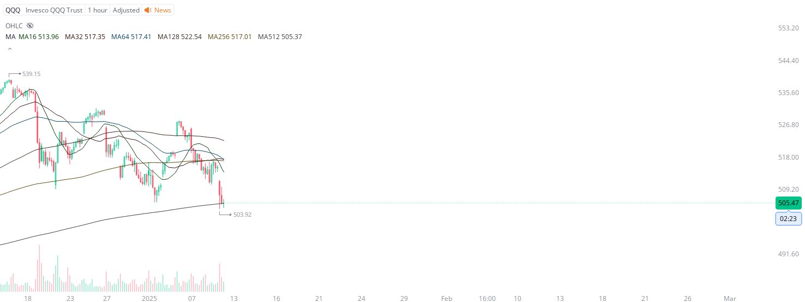

metrics @capture - likes 0 / replies 0 / reposts 0 / quotes 0 / views 0

---

### 22. `1877770689866031111` - 2025-01-10T17:33:14.000Z

Bulls are back and I figured that out the moment the NASDAQ dropped to 503.92 and banks disproportionately scored milliseconds of real time price operating on the 1H MA512 on its comeuppance.

That's how why I bought [QQQ@503.92] as risk moments after banks established the trade. https://t.co/SSn0zBNTqY

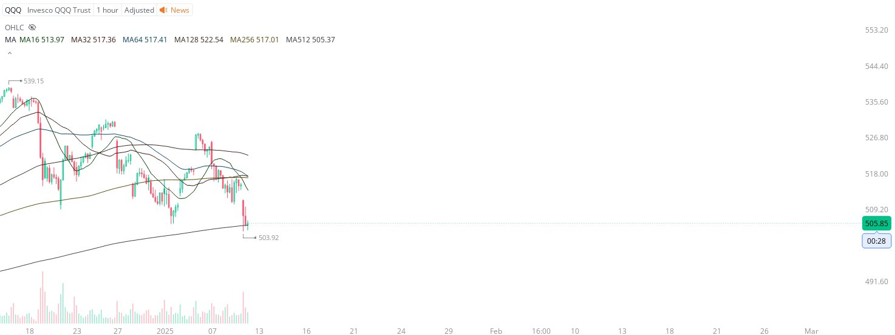

metrics @capture - likes 0 / replies 0 / reposts 0 / quotes 0 / views 0

---

### 23. `1877772756504445240` - 2025-01-10T17:41:27.000Z

This is the NASDAQ's QQQ operating on a blowout buying program that firms commenced at 503.92.

On the drop, because of live time-series analysis, this specific outfit on the [QQQ] was being operated since the QQQ traded [millisecond] disproportionately at the MA256 parameter. https://t.co/5puaSig442

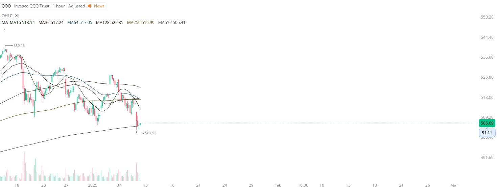

metrics @capture - likes 0 / replies 0 / reposts 0 / quotes 0 / views 0

---

### 24. `1877773140505379322` - 2025-01-10T17:42:58.000Z

This is my QQQ bet at 503.92 .

If not for the sequence of programs that led to the U.S. equity markets dropping [i.e. the PRC Xi outfit being operated, the 1H chart being used throughout each sequential drop], then this real time call would have been impossible. https://t.co/xs3vOgJScF

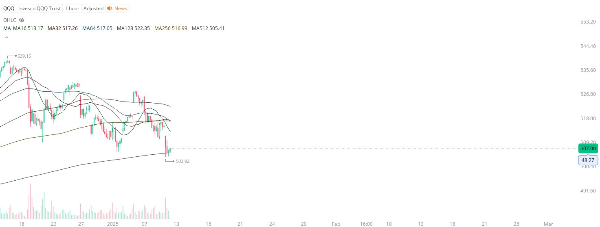

likes @capture 9

---

### 25. `1877775010787410006` - 2025-01-10T17:50:24.000Z

The big idea here is to understand that SMA Outfits effectively organize the U.S. equities and allow firms to mitigate risk without getting their asses handed to them by regulators or major losses.
I hope to hold this one, because it's 'technically' substantial.
QQQ @ 503.92 . https://t.co/Q9Te7TTcyI

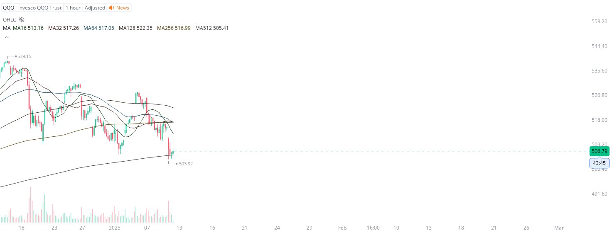

metrics @capture - likes 0 / replies 0 / reposts 0 / quotes 0 / views 0

---

### 26. `1877781105165885448` - 2025-01-10T18:14:37.000Z

QQQ at 503.92 . https://t.co/ptZVLjHuY5

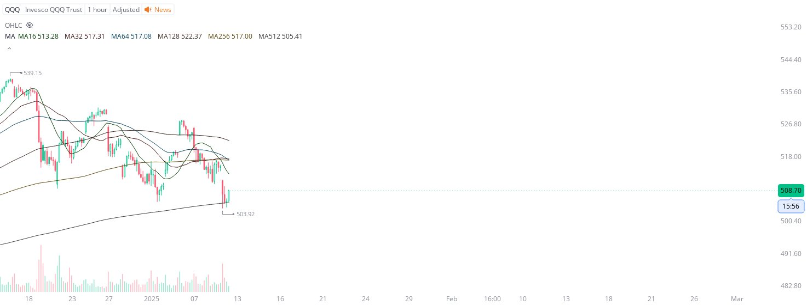

metrics @capture - likes 0 / replies 0 / reposts 0 / quotes 0 / views 0

---

### 27. `1877783765402976758` - 2025-01-10T18:25:11.000Z

This is my threaded and real time call of the NASDAQ's QQQ getting bought with a market-wide trillion dollar buying program at 503.92 . https://t.co/B0QssDdq1n

metrics @capture - likes 0 / replies 0 / reposts 0 / quotes 0 / views 0

---

### 28. `1877792669256348136` - 2025-01-10T19:00:34.000Z

This is my real time and threaded QQQ bet at 503.92 . https://t.co/2P1640eIL1

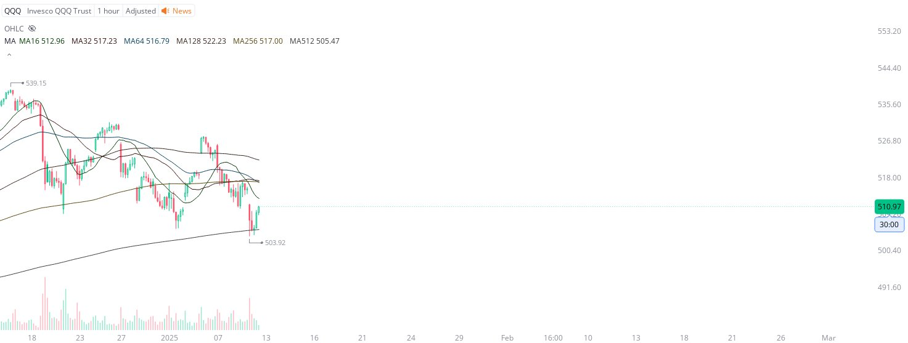

likes @capture 10

---

### 29. `1878811857605267886` - 2025-01-13T14:30:28.000Z

Even though the NASDAQ made a 6 point bounce, and it's down two points here at the open.
I have held the rest of my trade and will only cut the program on a candle close below the 1H MA512. https://t.co/l9OlLcxk0y

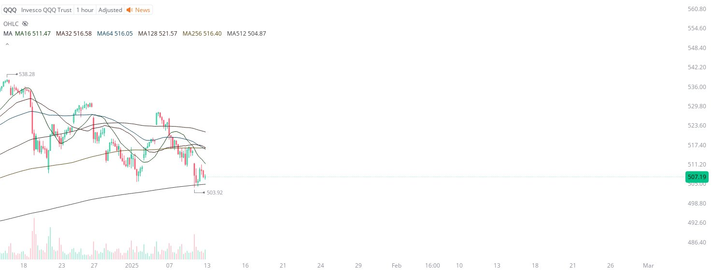

metrics @capture - likes 0 / replies 0 / reposts 0 / quotes 0 / views 0

---

### 30. `1878826995846639637` - 2025-01-13T15:30:37.000Z

This is real time automation in charge of dispersing capital throughout the U.S. Market.

Programs know that this Outfit program is operating on an Optimized Buying Algorithm on the [QQQ 1H MA512 {candle close below PARM:MA512, ignore +SMA Outfit]. https://t.co/tP7zG1lxeV

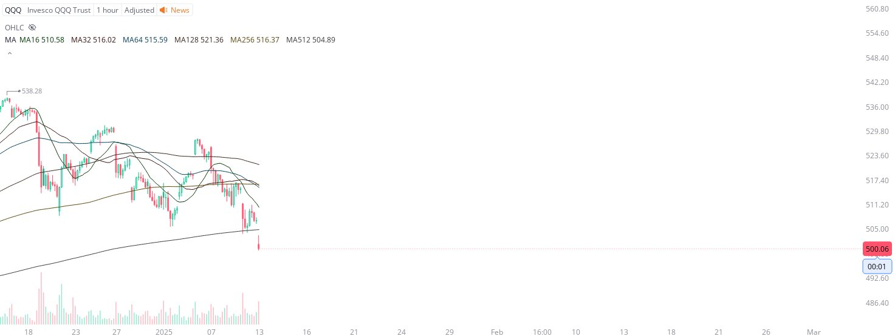

likes @capture 9

---

### 31. `1878827672312385908` - 2025-01-13T15:33:18.000Z

With that said I am holding the NASDAQ.
The parameter sequence is being held higher and operating on the parameter set [QQQ 1H MA512 {candle close below PARM:MA512, ignore +SMA Outfit].
And right now, the [16 32 64 128 256 548] is operating [positively] on the microterm charts. https://t.co/3NdxsSKUe8

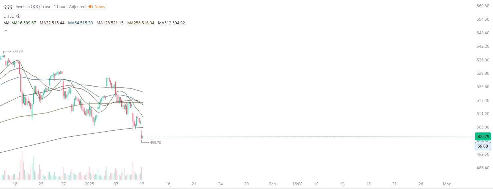

metrics @capture - likes 0 / replies 0 / reposts 0 / quotes 0 / views 0

---

### 32. `1878828529380741393` - 2025-01-13T15:36:43.000Z

Here is precisely what the collective parameter establishment of [QQQ 1H MA512 {candle close below PARM:MA512, ignore +SMA Outfit] looks like.

The microterm charts for this specific Outfit [5s/15s/30s, are recording a disproportionate amount of precise strikes, thus positive. https://t.co/Y1iDemDxfE

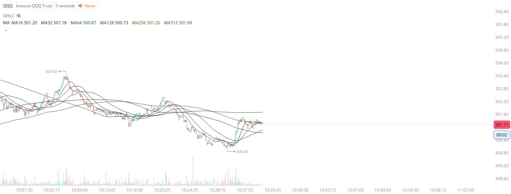

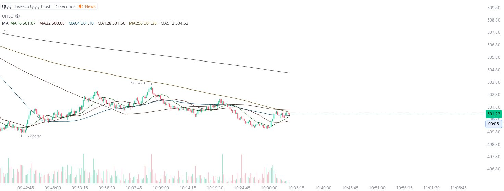

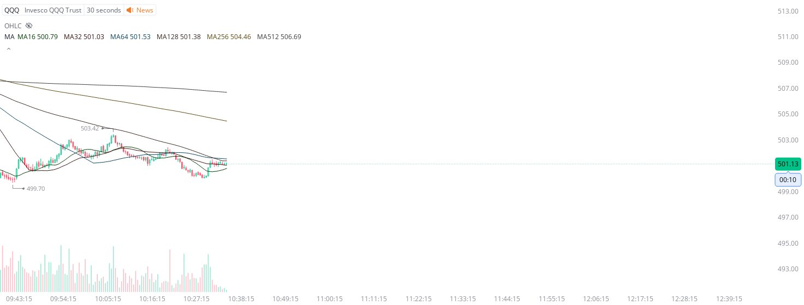

likes @capture 9

---

### 33. `1878828879642779906` - 2025-01-13T15:38:06.000Z

That information above might be sort of difficult to fully compartmentalize so the only thing that matters here is this real time sequencing holding the U.S. Market higher.

[QQQ 1H MA512 {candle close below PARM:MA512, ignore +SMA Outfit].

So this drop is bullish. https://t.co/5q5sKX9hMZ

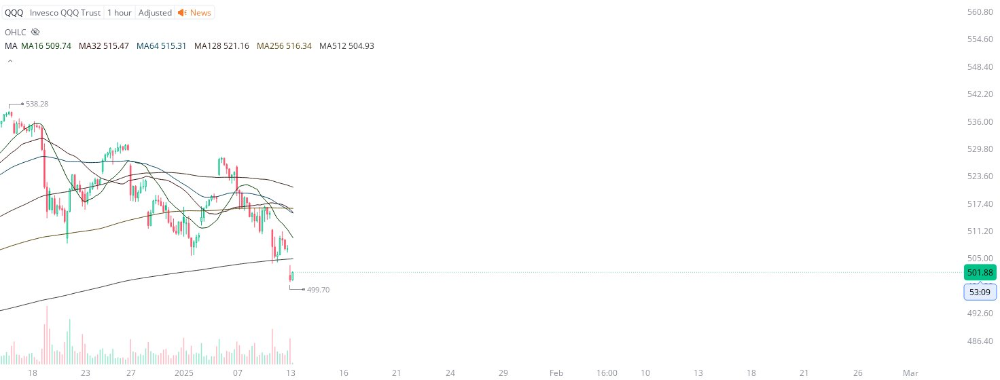

metrics @capture - likes 0 / replies 0 / reposts 0 / quotes 0 / views 0

---
