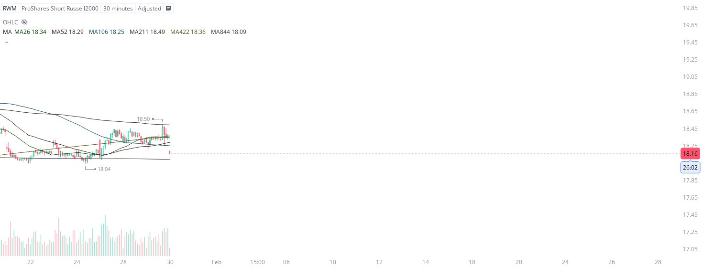

# Case Study #9 - Optimized Buying Algorithms

**Archived from:** https://x.com/rauItrades/status/1884973416471839009  
**Post ID:** `1884973416471839009`  
**Posted:** 2025-01-30T14:34:18.000Z  
**Author:** @UnfairMarket (Unfair Market)  
**Thread posts captured:** 1  
**Status:** PARTIAL - conversation reports 5 replies; the public embed endpoint exposes a post's ancestors but not its descendants, so the forward reply chain is not archived.

---

### 1. `1884973416471839009` - 2025-01-30T14:34:18.000Z

I've purchased the RWM.
18.04 is the computer program's established risk.
There's a magnetized buying algorithm on the 30M SVIX Outfit.
MA26 MA52 MA116 MA211 MA422 MA844 https://t.co/sMWJiDslZc

metrics @capture - likes 0 / replies 0 / reposts 0 / quotes 0 / views 0

---
