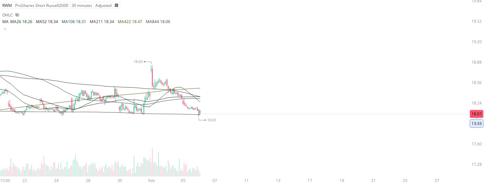

# Case Study #10 - Optimized Buying Algorithms

**Archived from:** https://x.com/rauItrades/status/1887521789670269384  
**Post ID:** `1887521789670269384`  
**Posted:** 2025-02-06T15:20:37.000Z  
**Author:** @UnfairMarket (Unfair Market)  
**Thread posts captured:** 1  
**Status:** PARTIAL - conversation reports 6 replies; the public embed endpoint exposes a post's ancestors but not its descendants, so the forward reply chain is not archived.

---

### 1. `1887521789670269384` - 2025-02-06T15:20:37.000Z

I've purchased the RWM.
18.03 is the computer program's established risk. There's a magnetized buying algorithm on the 30M SVIX Outfit.
MA26 MA52 MA116 MA211 MA422 [MA844].*
The arbitration has transitioned to outperform the last program so I jumped on board just incase. https://t.co/eBDYo0PaB1

metrics @capture - likes 0 / replies 0 / reposts 0 / quotes 0 / views 0

---
