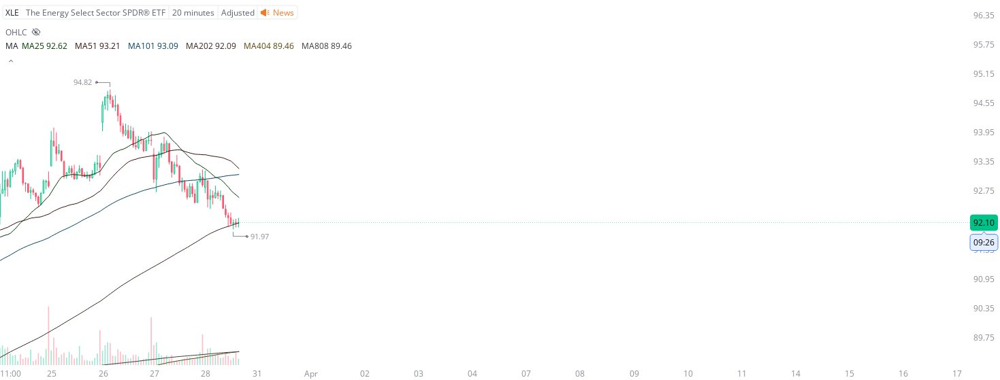

# Case Study #3 - Singular Point Hard Stop Order

**Archived from:** https://x.com/rauItrades/status/1905679351645176076  
**Post ID:** `1905679351645176076`  
**Posted:** 2025-03-28T17:52:17.000Z  
**Author:** @UnfairMarket (Unfair Market)  
**Thread posts captured:** 1  
**Status:** PARTIAL - conversation reports 5 replies; the public embed endpoint exposes a post's ancestors but not its descendants, so the forward reply chain is not archived.

---

### 1. `1905679351645176076` - 2025-03-28T17:52:17.000Z

I picked up XLE. 91.97 .
The Energy Select Sector SPDR ETF.
I will cut the trade on a singular penny break of 91.97.
404 SMA Outfit. [25 51 101 202 404 808] https://t.co/JIN6ez1OLh

metrics @capture - likes 0 / replies 0 / reposts 0 / quotes 0 / views 0

---
