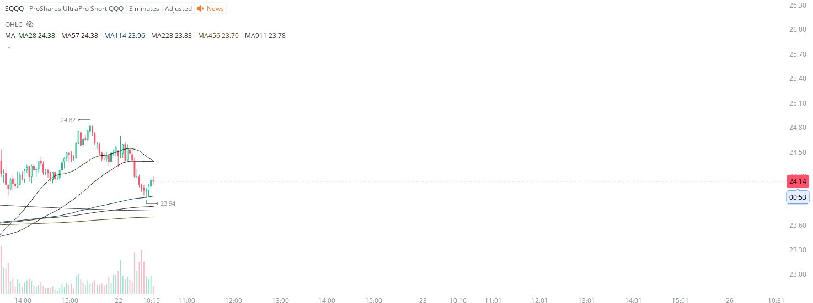

# Case Study #4 - Singular Point Hard Stop Order

**Archived from:** https://x.com/rauItrades/status/1925556780178055173  
**Post ID:** `1925556780178055173`  
**Posted:** 2025-05-22T14:18:06.000Z  
**Author:** @UnfairMarket (Unfair Market)  
**Thread posts captured:** 1  
**Status:** PARTIAL - conversation reports 5 replies; the public embed endpoint exposes a post's ancestors but not its descendants, so the forward reply chain is not archived.

---

### 1. `1925556780178055173` - 2025-05-22T14:18:06.000Z

I've very speculatively picked up the SQQQ because of this sequence at SQQQ MA114, world trade outfit at 23.94 .
I have a hard stop order on a singular penny break of the program as 'risk management', sifugred I shoot the shot with the systems negative. https://t.co/4N6GTsz5AG

metrics @capture - likes 0 / replies 0 / reposts 0 / quotes 0 / views 0

---
