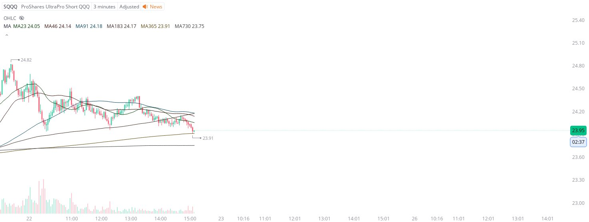

# Case Study #36 - Precision Buy Algorithm

**Archived from:** https://x.com/rauItrades/status/1925629925949579475  
**Post ID:** `1925629925949579475`  
**Posted:** 2025-05-22T19:08:45.000Z  
**Author:** @UnfairMarket (Unfair Market)  
**Thread posts captured:** 1  
**Status:** PARTIAL - conversation reports 4 replies; the public embed endpoint exposes a post's ancestors but not its descendants, so the forward reply chain is not archived.

---

### 1. `1925629925949579475` - 2025-05-22T19:08:45.000Z

Transitioning from the last program.
SQQQ 3M MA365 .
[MA23 MA46 MA91 MA183 MA365 MA730]
23.91 . I will cut the trade on a singular penny break of the operation with the S&amp;P 500's System still negative. https://t.co/FMlTfjkSCK

likes @capture 47

---
