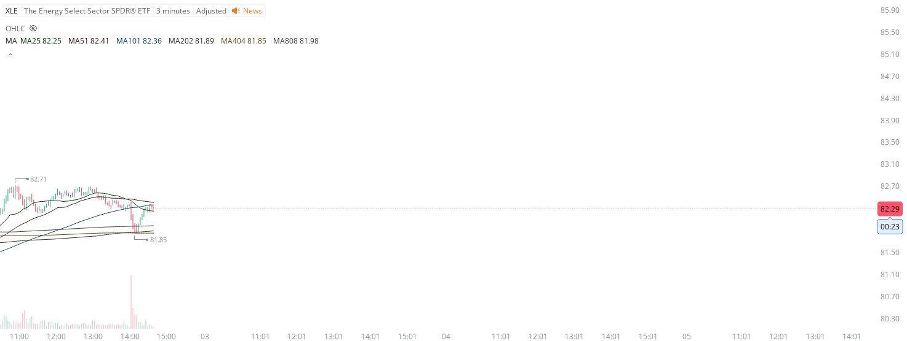

# Case Study #5 - Singular Point Hard Stop Order

**Archived from:** https://x.com/rauItrades/status/1929608902343381373  
**Post ID:** `1929608902343381373`  
**Posted:** 2025-06-02T18:39:47.000Z  
**Author:** @UnfairMarket (Unfair Market)  
**Thread posts captured:** 1  
**Status:** PARTIAL - conversation reports 9 replies; the public embed endpoint exposes a post's ancestors but not its descendants, so the forward reply chain is not archived.

---

### 1. `1929608902343381373` - 2025-06-02T18:39:47.000Z

XLE The Energy Select Sector.

XLE at 81.85 .

The conditional if then is that, if the program breaches 81.85 by a singular penny, the hard stop order liquidates any orders.
So I've picked up XLE.
3M 404 Outfit with the S&amp;P 500's system positive. https://t.co/lG0g07oQwT

metrics @capture - likes 0 / replies 0 / reposts 0 / quotes 0 / views 0

---
