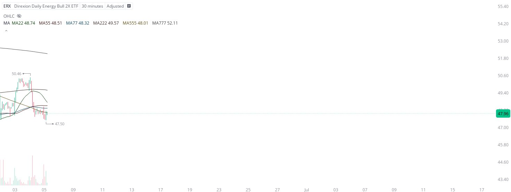

# Case Study #6 - Singular Point Hard Stop Order

**Archived from:** https://x.com/rauItrades/status/1930648319723766134  
**Post ID:** `1930648319723766134`  
**Posted:** 2025-06-05T15:30:03.000Z  
**Author:** @UnfairMarket (Unfair Market)  
**Thread posts captured:** 1  
**Status:** PARTIAL - conversation reports 3 replies; the public embed endpoint exposes a post's ancestors but not its descendants, so the forward reply chain is not archived.

---

### 1. `1930648319723766134` - 2025-06-05T15:30:03.000Z

Since this buy algorithm on Energy is fully intact I've also purchased the ERX Direxion Daily Energy Bull 2X ETF.
I will cut the trade on a singular penny break of that capitular low of 47.50 in order to protect myself on a highly volatile ultiplied ETF.
$ERX at 47.50 . https://t.co/BcIiAJW5tN

metrics @capture - likes 0 / replies 0 / reposts 0 / quotes 0 / views 0

---
