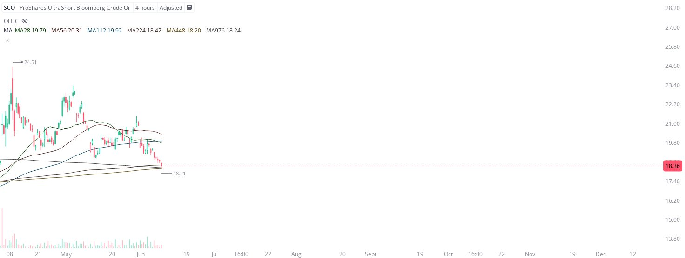

# Case Study #7 - Singular Point Hard Stop Order

**Archived from:** https://x.com/rauItrades/status/1932466222467285249  
**Post ID:** `1932466222467285249`  
**Posted:** 2025-06-10T15:53:45.000Z  
**Author:** @UnfairMarket (Unfair Market)  
**Thread posts captured:** 1  
**Status:** PARTIAL - conversation reports 7 replies; the public embed endpoint exposes a post's ancestors but not its descendants, so the forward reply chain is not archived.

---

### 1. `1932466222467285249` - 2025-06-10T15:53:45.000Z

I've purchased SCO at 18.21 for a day trade.
SCO Proshares ultrashort  Bloomberg Crude Oil.
[MA28 MA56 MA112 MA224 MA448 MA976] 4H Xi outfit.
[Hard stop order at MA448 18.20].
This is real time and threaded arbitrage operating on Crude oil as talks are in effect. https://t.co/5i0Sqsm8j5

metrics @capture - likes 0 / replies 0 / reposts 0 / quotes 0 / views 1

---
