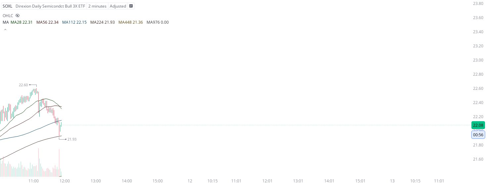

# Case Study #8 - Singular Point Hard Stop Order

**Archived from:** https://x.com/rauItrades/status/1932828618344051095  
**Post ID:** `1932828618344051095`  
**Posted:** 2025-06-11T15:53:47.000Z  
**Author:** @UnfairMarket (Unfair Market)  
**Thread posts captured:** 1  
**Status:** PARTIAL - conversation reports 2 replies; the public embed endpoint exposes a post's ancestors but not its descendants, so the forward reply chain is not archived.

---

### 1. `1932828618344051095` - 2025-06-11T15:53:47.000Z

I picked up $SOXL at 21.93 .
Cinese bankers placed a hard stop order at the 
[2M MA224 at 21.92] so that's my risk. https://t.co/BTQtNBxfM1

metrics @capture - likes 0 / replies 0 / reposts 0 / quotes 0 / views 0

---
