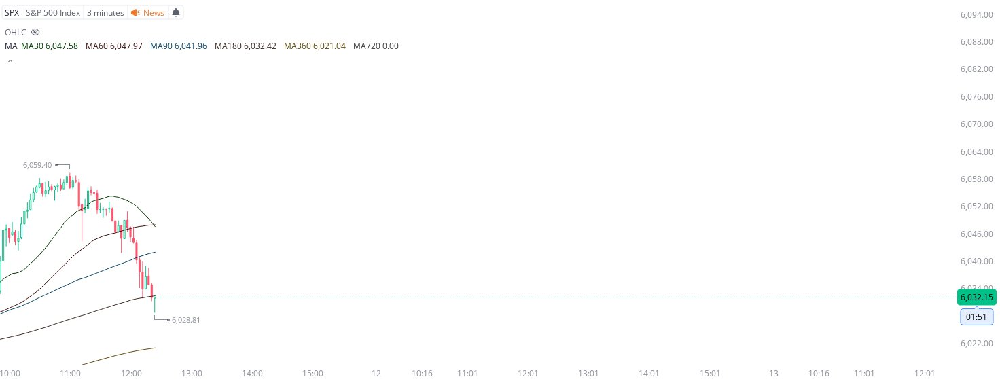

# Case Study #14 - Optimized Buying Algorithms

**Archived from:** https://x.com/rauItrades/status/1932836814257336587  
**Post ID:** `1932836814257336587`  
**Posted:** 2025-06-11T16:26:21.000Z  
**Author:** @UnfairMarket (Unfair Market)  
**Thread posts captured:** 1  
**Status:** PARTIAL - conversation reports 7 replies; the public embed endpoint exposes a post's ancestors but not its descendants, so the forward reply chain is not archived.

---

### 1. `1932836814257336587` - 2025-06-11T16:26:21.000Z

For visual clarity I'll start the thread here.
Banks are using precise 'time-series analysis' to trigger the UK PM SMA Outfit at MA[SPX 3M MA180].
I'm holding the S&amp;P 500's 'long' vehicles, (i.e. UPRO, SPY] because banks will manufacture the S&amp;P 500 higher from here.
SPX at 6028. https://t.co/yYBhkAbqys

metrics @capture - likes 0 / replies 0 / reposts 0 / quotes 0 / views 0

---
