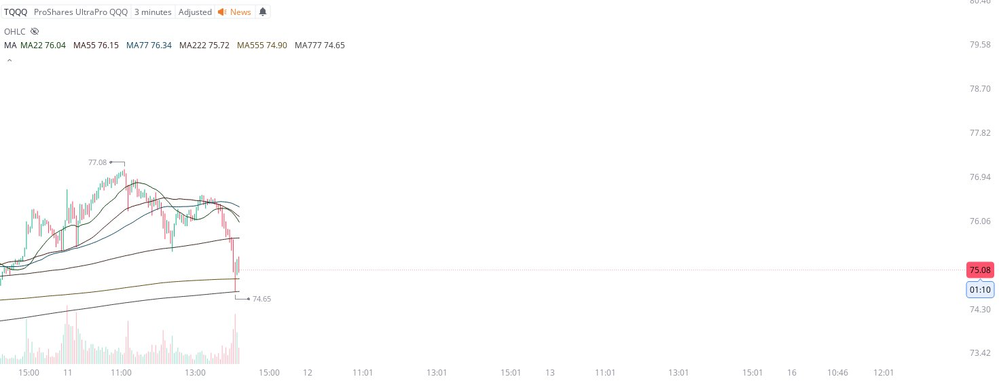

# Case Study #9 - Singular Point Hard Stop Order

**Archived from:** https://x.com/rauItrades/status/1932863224170607030  
**Post ID:** `1932863224170607030`  
**Posted:** 2025-06-11T18:11:18.000Z  
**Author:** @UnfairMarket (Unfair Market)  
**Thread posts captured:** 1  
**Status:** PARTIAL - conversation reports 3 replies; the public embed endpoint exposes a post's ancestors but not its descendants, so the forward reply chain is not archived.

---

### 1. `1932863224170607030` - 2025-06-11T18:11:18.000Z

All of that rapid arbitrage on the move down was operated specifically to move on from Xi's outfit to the originals.
I bought TQQQ at 74.65 .
There's a hard stop order at the [3M MA777 at 74.64]..
MA22 MA55 MA77 MA222 MA555 MA777. https://t.co/Md2GTf5WY2

likes @capture 25

---
