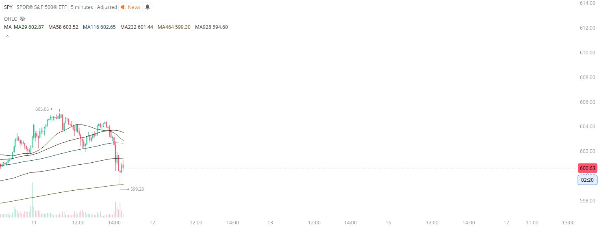

# Case Study #37 - Precision Buy Algorithm

**Archived from:** https://x.com/rauItrades/status/1932867631956263205  
**Post ID:** `1932867631956263205`  
**Posted:** 2025-06-11T18:28:49.000Z  
**Author:** @UnfairMarket (Unfair Market)  
**Thread posts captured:** 1  
**Status:** PARTIAL - conversation reports 10 replies; the public embed endpoint exposes a post's ancestors but not its descendants, so the forward reply chain is not archived.

---

### 1. `1932867631956263205` - 2025-06-11T18:28:49.000Z

SPY at 599.28, MA464.ISMA Outfit.
[SPY 5M MA29 MA58 MA116 MA232 MA464 MA928]
Sir Keir Starmer 58ᵗʰ Prime Minister of the United Kingdom
Bought: SPY at 599.28, MA464. 
I'll cut the trade on a singular penny break of the program. https://t.co/BR9AYKlf45

likes @capture 32

---
