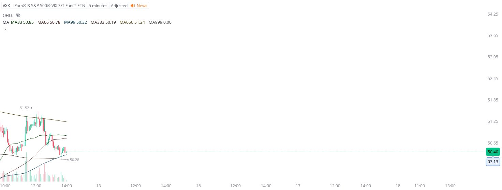

# Case Study #38 - Precision Buy Algorithm

**Archived from:** https://x.com/rauItrades/status/1933222790502781333  
**Post ID:** `1933222790502781333`  
**Posted:** 2025-06-12T18:00:05.000Z  
**Author:** @UnfairMarket (Unfair Market)  
**Thread posts captured:** 1  
**Status:** PARTIAL - conversation reports 6 replies; the public embed endpoint exposes a post's ancestors but not its descendants, so the forward reply chain is not archived.

---

### 1. `1933222790502781333` - 2025-06-12T18:00:05.000Z

VXX at 50.28 .
MA33 MA66 MA99 MA333 MA666 MA999.
I've bought the VXX at 50.28.
There's a hard stop order at the 3M MA99 at 50.27, I';; cut the trade on a singular penny break of 50.28. https://t.co/c2V2YFx8WB

metrics @capture - likes 0 / replies 0 / reposts 0 / quotes 0 / views 0

---
