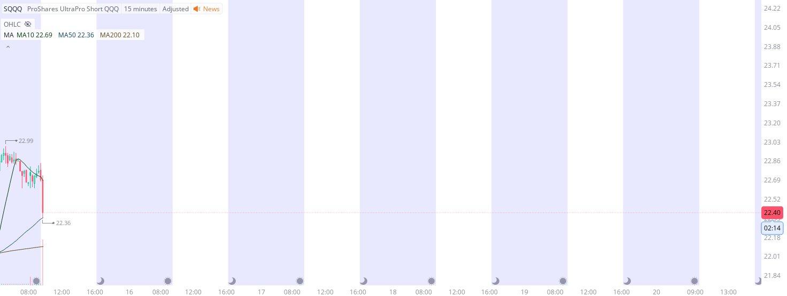

# Case Study #10 - Singular Point Hard Stop Order

**Archived from:** https://x.com/rauItrades/status/1933520636426793325  
**Post ID:** `1933520636426793325`  
**Posted:** 2025-06-13T13:43:37.000Z  
**Author:** @UnfairMarket (Unfair Market)  
**Thread posts captured:** 1  
**Status:** COMPLETE

---

### 1. `1933520636426793325` - 2025-06-13T13:43:37.000Z

I've picked up SQQQ at 22.36 .
S&amp;P System 10/50/200.
MA50 at 22.36 .
I will cut the trade on a singular penny break of that buying protocol, I figure the risk is minimal even if banks break the program lower and force me to cut the trade. https://t.co/uiE4oS8GXi

metrics @capture - likes 0 / replies 0 / reposts 0 / quotes 0 / views 0

---
